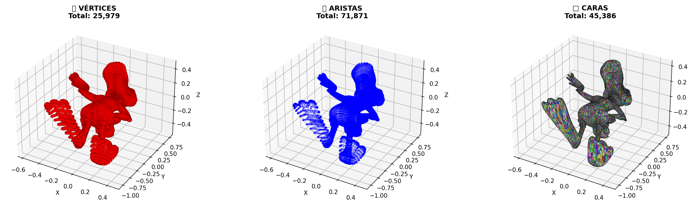
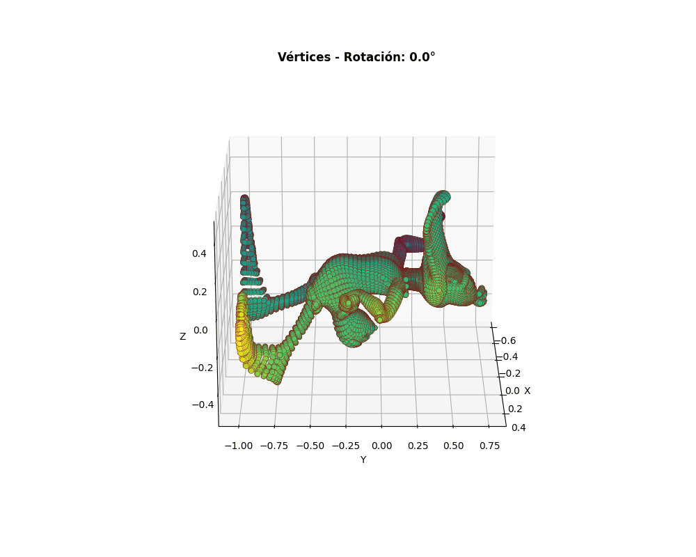
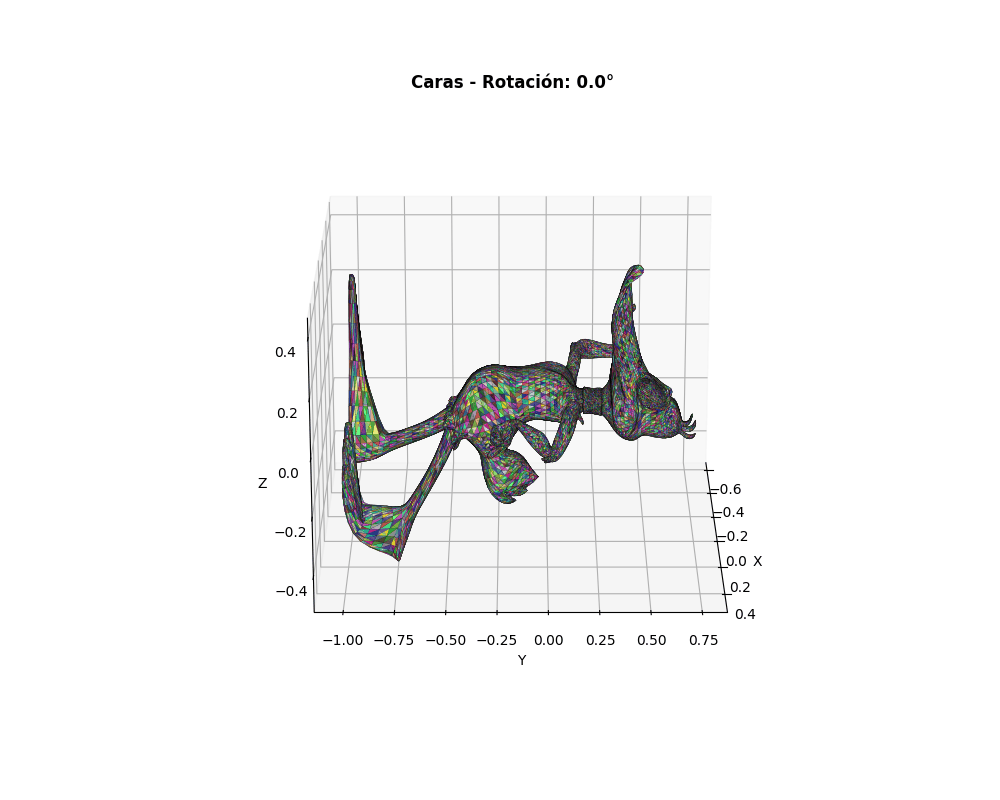

# 📊 Resultados Python - Visualización 3D

Archivos generados por el notebook Jupyter `model_visualization.ipynb`.

---

## 📸 Visualizaciones Estáticas

### modelo_completo.png


**Descripción**: Visualización integral del modelo en 6 perspectivas diferentes:
- **Fila 1**: 
  - Vista normal del modelo renderizado en color cian
  - Visualización de vértices en rojo (25,979 puntos)
  - Visualización de aristas en azul (71,871 líneas)
- **Fila 2**:
  - Visualización de caras en color cian
  - Vista wireframe mostrando estructura triangular
  - Tabla de estadísticas con información numérica

**Especificaciones**:
- Resolución: 150 DPI
- Formato: PNG (1.3 MB)
- Dimensiones: Aproximadamente 1400x900 píxeles

---

### vertices_edges_faces.png



**Descripción**: Desglose detallado de los tres componentes fundamentales de una malla 3D:
- **Izquierda**: 🔴 **Vértices** - 25,979 puntos en rojo mostrando los nodos de la malla
- **Centro**: 🔗 **Aristas** - 71,871 líneas en azul mostrando las conexiones entre vértices
- **Derecha**: □ **Caras** - 45,386 triángulos coloreados aleatoriamente formando la superficie

**Especificaciones**:
- Resolución: 150 DPI
- Formato: PNG (597 KB)
- Dimensiones: Aproximadamente 1500x500 píxeles

**Utilidad**: Permite entender visualmente cómo una malla poligonal se compone de estos tres elementos.

---

## 🎬 Animaciones GIF

### modelo_rotacion.gif


**Descripción**: Animación que muestra el modelo 3D completo (renderizado en cian) rotando continuamente alrededor del eje vertical. Permite visualizar la geometría desde todos los ángulos.

**Especificaciones**:
- Frames: 36
- Duración por frame: 0.1 segundos
- Duración total: 3.6 segundos
- Tamaño: 3.0 MB
- Ángulos: 0° a 360°

**Utilidad**: Ver la forma completa del modelo desde perspectivas diferentes.

---

### vertices_rotation.gif



**Descripción**: Visualización animada que muestra todos los 25,979 vértices del modelo con un gradiente de colores basado en la coordenada X (viridis colormap). El modelo rota continuamente permitiendo ver la distribución espacial de los vértices.

**Especificaciones**:
- Frames: 36
- Duración por frame: 0.1 segundos
- Duración total: 3.6 segundos
- Tamaño: 2.9 MB
- Colormap: Viridis (azul → amarillo)

**Utilidad**: Entender cómo se distribuyen los vértices en la malla y su densidad en diferentes regiones.

---

### faces_rotation.gif



**Descripción**: Animación que muestra todas las 45,386 caras triangulares del modelo coloreadas aleatoriamente. Rotando continuamente, permite visualizar cómo se distribuyen las caras que forman la superficie 3D.

**Especificaciones**:
- Frames: 36
- Duración por frame: 0.1 segundos
- Duración total: 3.6 segundos
- Tamaño: 3.0 MB
- Colores: Aleatorios por cara

**Utilidad**: Apreciar la complejidad de la malla poligonal y cómo se cubre la geometría.

---

## 📊 Información del Modelo

| Propiedad               | Valor                  |
| ----------------------- | ---------------------- |
| **Vértices**            | 25,979                 |
| **Aristas**             | 71,871                 |
| **Caras (triángulos)**  | 45,386                 |
| **Volumen**             | 0.0 u³ (malla abierta) |
| **Área Superficial**    | 2.44 u²                |
| **Válido (watertight)** | No                     |

---

## 💡 Cómo interpretar estos resultados

### Relaciones estructurales

- **Aristas por vértice (promedio)**: 5.53
- **Vértices por cara**: 3.0 (siempre: triángulos)
- **Relación V/E**: 0.36
- **Relación E/F**: 1.58

### Características de la malla

- La malla NO es cerrada (watertight = False)
- Característica de Euler: -506 (indica topología abierta)
- El modelo tiene una estructura consistente de triángulos

---

## 🔗 Referencias

- [Volver Atrás](../)
- [Notebook Python](../python/model_visualization.ipynb)

## ⚙️ Parámetros personalizables

En el notebook, puedes modificar:

```python
# Para la visualización PNG
visualize_mesh_matplotlib(mesh, filename='custom_name.png')

# Para el GIF
create_rotating_animation_gif(mesh, num_frames=240, filename='custom.gif')

# Para el MP4
create_rotating_animation_mp4(mesh, num_frames=180, fps=60, filename='custom.mp4')
```

## 📝 Notas

- Los archivos se **sobrescriben** cada vez que se ejecuta el notebook
- Para conservar versiones, renombra los archivos antes de ejecutar nuevamente
- Las rutas se muestran en la salida del notebook
- Requiere las librerías: `trimesh`, `matplotlib`, `imageio`, `numpy`

---

**Última actualización**: Febrero 2026
