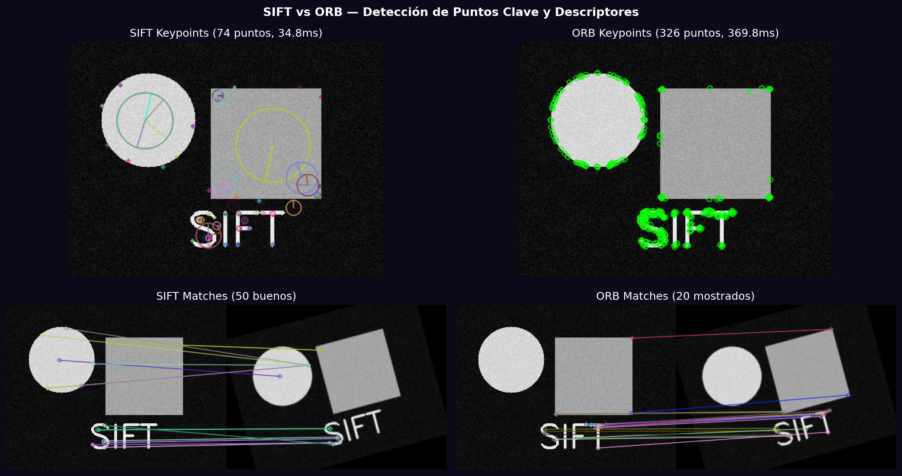
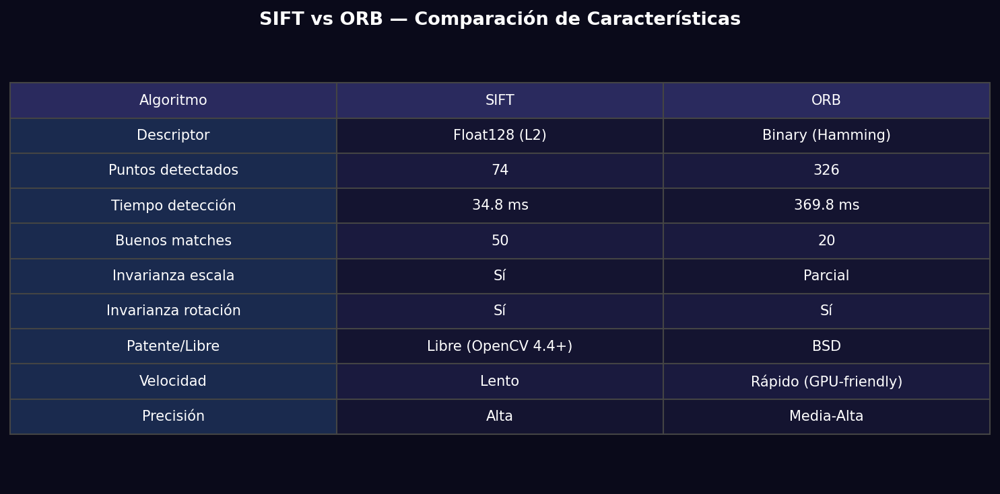

# Taller - Extracción de Características con SIFT y ORB

## Nombre del estudiante
Gabriel Andrés Anzola Tachak

## Fecha de entrega
`2026-05-29`

---

## Descripción breve

Comparación de dos algoritmos de detección de puntos clave y descriptores: **SIFT** (Scale-Invariant Feature Transform) y **ORB** (Oriented FAST and Rotated BRIEF). Se detectan keypoints en dos imágenes (original + rotada/escalada), se calculan descriptores, y se realiza matching con BFMatcher (L2 para SIFT, Hamming para ORB) con filtro Lowe ratio test. La tabla comparativa evalúa velocidad, cantidad de puntos y calidad del matching.

---

## Implementaciones

### Python

**Herramientas:** `opencv-contrib-python`, `numpy`, `matplotlib`

| Función | Descripción |
|---|---|
| `cv2.SIFT_create()` | Detector SIFT con descriptores de 128 dimensiones float |
| `cv2.ORB_create(nfeatures=500)` | Detector ORB con descriptores binarios de 256 bits |
| `sift.detectAndCompute()` | Detecta keypoints y calcula descriptores en un paso |
| `cv2.BFMatcher(cv2.NORM_L2)` | Brute Force Matcher para SIFT (distancia euclidiana) |
| `cv2.BFMatcher(cv2.NORM_HAMMING)` | BFMatcher para ORB (distancia Hamming binaria) |
| Lowe ratio test | Filtrar matches: m.distance < 0.75 * n.distance |

---

## Resultados visuales

### Python - Implementación


Keypoints detectados por SIFT y ORB en la imagen original, y matches encontrados entre imagen original y rotada.


Tabla comparativa de características técnicas, rendimiento y precisión entre SIFT y ORB.

---

## Código relevante

```python
# SIFT
sift = cv2.SIFT_create()
kp, des = sift.detectAndCompute(gray, None)

# ORB
orb = cv2.ORB_create(nfeatures=500)
kp, des = orb.detectAndCompute(gray, None)

# Matching con Lowe ratio test (SIFT)
bf = cv2.BFMatcher(cv2.NORM_L2)
matches = bf.knnMatch(des1, des2, k=2)
good = [m for m, n in matches if m.distance < 0.75 * n.distance]

# Matching ORB (crossCheck=True)
bf_orb = cv2.BFMatcher(cv2.NORM_HAMMING, crossCheck=True)
matches = sorted(bf_orb.match(des1, des2), key=lambda x: x.distance)
```

---

## Prompts utilizados

- "Compare SIFT vs ORB feature detectors in OpenCV: keypoint count, detection time, descriptor type, matching quality with Lowe ratio test"

---

## Aprendizajes y dificultades

### Aprendizajes
- SIFT es invariante a escala y rotación con descriptores gradiente de 128 floats; ORB usa descriptores binarios 10x más rápidos.
- El Lowe ratio test (m < 0.75·n) elimina matches ambiguos reteniendo solo los distinctivos.
- SIFT requiere `opencv-contrib-python` (era patentado hasta 2020).

### Dificultades
- ORB tiene menos invarianza de escala que SIFT — falla más en transformaciones perspectivas grandes.

### Mejoras futuras
- Comparar con AKAZE y BRISK para una evaluación más completa.
- Benchmarking con datasets estándar (Oxford/Paris buildings).

---

## Contribuciones grupales
Taller realizado de forma individual.

---

## Estructura del proyecto

```
semana_10_1_extraccion_caracteristicas_sift_orb/
├── python/
│   ├── semana_10_1.ipynb
│   └── generate_media.py
├── media/
│   ├── sift_orb_comparison.png
│   └── sift_orb_table.png
└── README.md
```

---

## Referencias
- SIFT paper (Lowe 2004): https://link.springer.com/article/10.1023/B:VISI.0000029664.99615.94
- ORB paper: https://ieeexplore.ieee.org/document/6126544
- OpenCV feature detection: https://docs.opencv.org/4.x/d7/d66/tutorial_feature_detection.html

---

## Checklist
- [x] Carpeta con nombre semana_10_1_extraccion_caracteristicas_sift_orb
- [x] Código limpio y funcional
- [x] GIFs/imágenes en media/ con nombres descriptivos
- [x] README completo con todas las secciones
- [x] Mínimo 2 capturas/GIFs por implementación
- [x] Commits descriptivos en inglés
