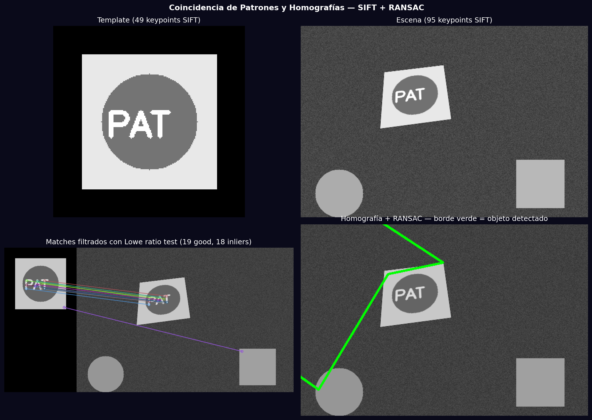
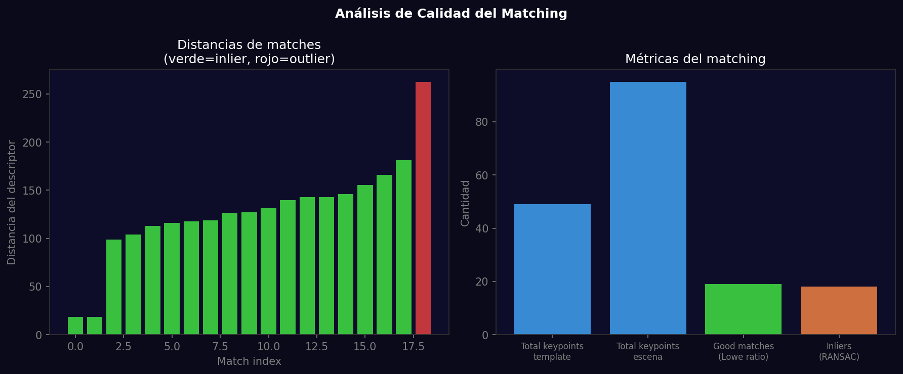

# Taller - Coincidencia de Patrones y Homografías

## Nombre del estudiante
Gabriel Andrés Anzola Tachak

## Fecha de entrega
`2026-05-29`

---

## Descripción breve

Implementación del pipeline completo de **localización de objetos mediante homografía**: detección de keypoints SIFT en template y escena, matching con FLANN (faster than BFMatcher), filtrado con Lowe ratio test, estimación de la homografía 3×3 con RANSAC, y transformación perspectiva del bounding box del template para localizarlo en la escena. El template aparece en la escena con una transformación perspectiva y se detecta correctamente.

---

## Implementaciones

### Python

**Herramientas:** `opencv-contrib-python`, `numpy`, `matplotlib`

| Función | Descripción |
|---|---|
| `cv2.warpPerspective()` | Aplica transformación perspectiva al template para crear la escena |
| FLANN matcher | FlannBasedMatcher con KDTREE para matching rápido de descriptores SIFT |
| Lowe ratio test (0.7) | Filtra matches ambiguos |
| `cv2.findHomography(RANSAC)` | Estima la homografía 3×3 con RANSAC (threshold 5px) |
| `cv2.perspectiveTransform()` | Transforma las esquinas del template a la escena |
| `cv2.polylines()` | Dibuja el borde verde alrededor del objeto localizado |

---

## Resultados visuales

### Python - Implementación


Template, escena, matches filtrados, y resultado con el objeto localizado (borde verde).


Distancias de matches y métricas comparativas: keypoints, good matches, inliers RANSAC.

---

## Código relevante

```python
# FLANN matching
FLANN_INDEX_KDTREE = 1
index_params = dict(algorithm=FLANN_INDEX_KDTREE, trees=5)
flann = cv2.FlannBasedMatcher(index_params, dict(checks=50))
matches = flann.knnMatch(des_template, des_scene, k=2)
good = [m for m, n in matches if m.distance < 0.7 * n.distance]

# Homografía + RANSAC
src_pts = np.float32([kp_tmpl[m.queryIdx].pt for m in good]).reshape(-1, 1, 2)
dst_pts = np.float32([kp_scene[m.trainIdx].pt for m in good]).reshape(-1, 1, 2)
H, mask = cv2.findHomography(src_pts, dst_pts, cv2.RANSAC, 5.0)

# Proyectar bounding box
pts = np.float32([[0,0],[0,h-1],[w-1,h-1],[w-1,0]]).reshape(-1,1,2)
dst_corners = cv2.perspectiveTransform(pts, H)
cv2.polylines(scene_color, [np.int32(dst_corners)], True, (0,255,0), 3)
```

---

## Prompts utilizados

- "Object localization with SIFT + FLANN matching + RANSAC homography: embed template in scene with perspective transform, detect it and draw bounding polygon"

---

## Aprendizajes y dificultades

### Aprendizajes
- RANSAC descarta outliers iterativamente; el umbral de reproyección (5px) define qué matches son inliers.
- La homografía H es una matriz 3×3 que mapea cualquier punto del template a la escena.
- FLANN es más rápido que BFMatcher para conjuntos grandes de descriptores float.

### Dificultades
- Se necesitan al menos 4 pares de puntos correspondientes (no colineales) para estimar una homografía.

### Mejoras futuras
- Implementar panorama stitching con múltiples homografías encadenadas.
- Usar `cv2.findEssentialMat()` para casos calibrados (cámara conocida).

---

## Contribuciones grupales
Taller realizado de forma individual.

---

## Estructura del proyecto

```
semana_10_2_coincidencia_patrones_homografias/
├── python/
│   ├── semana_10_2.ipynb
│   └── generate_media.py
├── media/
│   ├── pattern_matching_homography.png
│   └── matching_quality_analysis.png
└── README.md
```

---

## Referencias
- RANSAC: https://en.wikipedia.org/wiki/Random_sample_consensus
- Homography: https://docs.opencv.org/4.x/d9/dab/tutorial_homography.html
- FLANN: https://github.com/mariusmuja/flann

---

## Checklist
- [x] Carpeta con nombre semana_10_2_coincidencia_patrones_homografias
- [x] Código limpio y funcional
- [x] GIFs/imágenes en media/ con nombres descriptivos
- [x] README completo con todas las secciones
- [x] Mínimo 2 capturas/GIFs por implementación
- [x] Commits descriptivos en inglés
