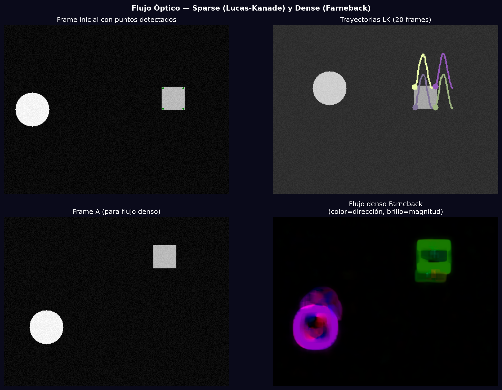
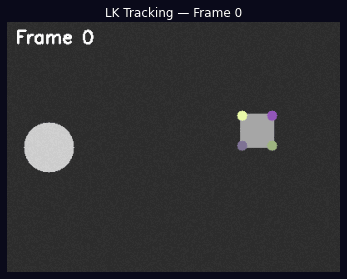

# Taller - Flujo Óptico y Tracking de Movimiento

## Nombre del estudiante
Gabriel Andrés Anzola Tachak

## Fecha de entrega
`2026-05-29`

---

## Descripción breve

Implementación de dos algoritmos de flujo óptico: **Lucas-Kanade disperso** para tracking de puntos clave y **Farneback denso** para estimar el campo de movimiento completo. Se genera una secuencia sintética de 50 frames con dos objetos en movimiento (círculo y rectángulo), se detectan puntos con `goodFeaturesToTrack`, y se rastrean con `calcOpticalFlowPyrLK`. El flujo denso colorea cada píxel según la dirección (hue) y magnitud (value) del movimiento.

---

## Implementaciones

### Python

**Herramientas:** `opencv-python`, `numpy`, `matplotlib`, `PIL`

| Función | Descripción |
|---|---|
| `cv2.goodFeaturesToTrack()` | Detecta esquinas de Shi-Tomasi como puntos de tracking |
| `cv2.calcOpticalFlowPyrLK()` | Lucas-Kanade piramidal: estima movimiento de puntos entre frames |
| `cv2.calcOpticalFlowFarneback()` | Calcula flujo denso completo (un vector por píxel) |
| `cv2.cartToPolar()` | Convierte (vx, vy) a (magnitud, ángulo) para colorear el flujo |
| GIF animado | 13 frames mostrando las trayectorias de tracking acumulándose |

---

## Resultados visuales

### Python - Implementación


Frame inicial con puntos, trayectorias LK en 20 frames, y flujo denso Farneback con codificación HSV.


Animación mostrando el tracking de puntos a lo largo de 25 frames con trayectorias de colores.

---

## Código relevante

```python
# Lucas-Kanade sparse optical flow
lk_params = dict(winSize=(15,15), maxLevel=2,
                 criteria=(cv2.TERM_CRITERIA_EPS|cv2.TERM_CRITERIA_COUNT, 10, 0.03))
p0 = cv2.goodFeaturesToTrack(old_frame, maxCorners=50, qualityLevel=0.3, minDistance=7)
p1, st, err = cv2.calcOpticalFlowPyrLK(old_frame, new_frame, p0, None, **lk_params)
good_new = p1[st == 1]  # solo puntos rastreados exitosamente

# Dense optical flow (Farneback)
flow = cv2.calcOpticalFlowFarneback(frame_a, frame_b, None, 0.5, 3, 15, 3, 5, 1.2, 0)
mag, ang = cv2.cartToPolar(flow[..., 0], flow[..., 1])
# Codificar como HSV: hue=dirección, value=magnitud
hsv[..., 0] = ang * 180 / np.pi / 2
hsv[..., 2] = cv2.normalize(mag, None, 0, 255, cv2.NORM_MINMAX)
```

---

## Prompts utilizados

- "Implement sparse Lucas-Kanade optical flow with goodFeaturesToTrack and dense Farneback flow with HSV color encoding, track points over 25 synthetic frames"

---

## Aprendizajes y dificultades

### Aprendizajes
- Lucas-Kanade asume movimiento local pequeño y constante dentro de una ventana; la pirámide de imágenes extiende el rango de movimiento detectable.
- El flujo denso da un campo vectorial completo pero es mucho más costoso computacionalmente.
- La codificación HSV del flujo denso (hue=dirección, value=magnitud) es la visualización estándar (rainbow wheel).

### Dificultades
- Los puntos perdidos (oclusión o salida del frame) tienen `st=0`; hay que filtrarlos con `p1[st==1]`.
- Re-detectar puntos cuando quedan pocos es necesario para tracking robusto a largo plazo.

### Mejoras futuras
- Implementar CSRT o KCF tracker (`cv2.legacy.TrackerCSRT_create()`) para bounding boxes.
- Calcular magnitud media del flujo como indicador de movimiento en la escena.

---

## Contribuciones grupales
Taller realizado de forma individual.

---

## Estructura del proyecto

```
semana_10_3_flujo_optico_tracking/
├── python/
│   ├── semana_10_3.ipynb
│   └── generate_media.py
├── media/
│   ├── optical_flow_comparison.png
│   └── optical_flow_tracking.gif
└── README.md
```

---

## Referencias
- Lucas-Kanade: https://docs.opencv.org/4.x/d4/dee/tutorial_optical_flow.html
- Farneback: https://docs.opencv.org/4.x/dc/d6b/group__video__track.html
- Optical flow visualization: https://en.wikipedia.org/wiki/Optical_flow

---

## Checklist
- [x] Carpeta con nombre semana_10_3_flujo_optico_tracking
- [x] Código limpio y funcional
- [x] GIFs/imágenes en media/ con nombres descriptivos
- [x] README completo con todas las secciones
- [x] Mínimo 2 capturas/GIFs por implementación
- [x] Commits descriptivos en inglés
