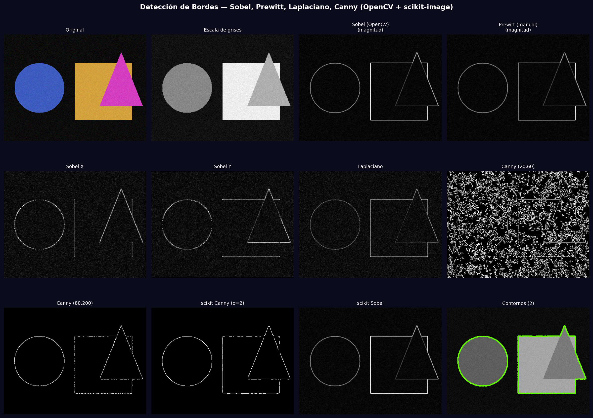
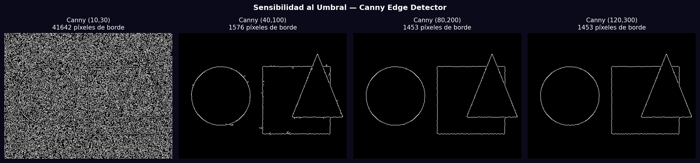

# Taller - Detección de Bordes y Contornos

## Nombre del estudiante
Gabriel Andrés Anzola Tachak

## Fecha de entrega
`2026-05-29`

---

## Descripción breve

Comparación exhaustiva de detectores de bordes: Sobel, Prewitt (kernel manual), Laplaciano, Canny con múltiples umbrales, y detectores de scikit-image (Canny σ=2, Sobel). Se analiza la sensibilidad al umbral de Canny (4 configuraciones), se comparan los resultados de OpenCV vs scikit-image, y se cuantifican los píxeles de borde detectados en cada configuración.

---

## Implementaciones

### Python

**Herramientas:** `opencv-python`, `scikit-image`, `numpy`, `matplotlib`

| Función | Descripción |
|---|---|
| `cv2.Sobel(CV_64F)` | Gradiente X e Y en float64; magnitud = √(Gx²+Gy²) |
| Prewitt manual | Kernel `[[-1,0,1],[-1,0,1],[-1,0,1]]` aplicado con `cv2.filter2D` |
| `cv2.Laplacian(CV_64F)` | Segunda derivada; sensible a todo cambio brusco de intensidad |
| `cv2.Canny(t1, t2)` | Histeresis: borde si ≥t2, descartado si <t1, conectado si entre ambos |
| `skimage.feature.canny(sigma)` | Canny con suavizado gaussiano integrado (σ=2) |
| `skimage.filters.sobel()` | Sobel normalizado de scikit-image |

---

## Resultados visuales

### Python - Implementación


Comparación de 11 métodos: Sobel X/Y/magnitud, Prewitt, Laplaciano, Canny (2 configs), scikit-image Canny/Sobel, y contornos finales.


Efecto de 4 configuraciones de umbral Canny mostrando la variación en píxeles de borde detectados.

---

## Código relevante

```python
# Sobel (OpenCV)
sobel_x = cv2.Sobel(gray, cv2.CV_64F, 1, 0, ksize=3)
sobel_y = cv2.Sobel(gray, cv2.CV_64F, 0, 1, ksize=3)
sobel_mag = np.sqrt(sobel_x**2 + sobel_y**2)

# Prewitt (kernel manual)
kernel_px = np.array([[-1,0,1],[-1,0,1],[-1,0,1]], np.float32)
prewitt_x = cv2.filter2D(gray.astype(np.float32), -1, kernel_px)

# Canny con análisis de sensibilidad
for t1, t2 in [(10,30), (40,100), (80,200), (120,300)]:
    edges = cv2.Canny(gray, t1, t2)
    n_edge_pixels = np.sum(edges > 0)

# scikit-image
from skimage import filters, feature
sk_canny = feature.canny(gray_float, sigma=2.0)
sk_sobel = filters.sobel(gray_float)
```

---

## Prompts utilizados

- "Compare edge detectors in OpenCV and scikit-image: Sobel XY, Prewitt manual, Laplacian, Canny with 4 threshold pairs, skimage Canny sigma=2, quantify edge pixel count"

---

## Aprendizajes y dificultades

### Aprendizajes
- Canny es más robusto que Sobel porque incorpora NMS (Non-Maximum Suppression) y histeresis, produciendo bordes más finos y completos.
- Un umbral Canny t1 bajo detecta más bordes (incluyendo ruido); t2 alto reduce los false positives.
- scikit-image integra el suavizado gaussiano en su Canny; OpenCV requiere aplicarlo explícitamente antes.

### Dificultades
- Prewitt y Sobel son equivalentes en práctica pero Sobel pondera más el píxel central — más robusto al ruido.

### Mejoras futuras
- Implementar Structured Edge detector (Dollar 2015) para bordes semánticamente significativos.
- Usar Canny con σ adaptativo según nivel de ruido de la imagen.

---

## Contribuciones grupales
Taller realizado de forma individual.

---

## Estructura del proyecto

```
semana_10_4_deteccion_bordes_contornos/
├── python/
│   ├── semana_10_4.ipynb
│   └── generate_media.py
├── media/
│   ├── edge_detection_comparison.png
│   └── canny_threshold_sensitivity.png
└── README.md
```

---

## Referencias
- Canny edge detector: https://docs.opencv.org/4.x/da/d22/tutorial_py_canny.html
- scikit-image filters: https://scikit-image.org/docs/stable/api/skimage.filters.html
- Prewitt operator: https://en.wikipedia.org/wiki/Prewitt_operator

---

## Checklist
- [x] Carpeta con nombre semana_10_4_deteccion_bordes_contornos
- [x] Código limpio y funcional
- [x] GIFs/imágenes en media/ con nombres descriptivos
- [x] README completo con todas las secciones
- [x] Mínimo 2 capturas/GIFs por implementación
- [x] Commits descriptivos en inglés
