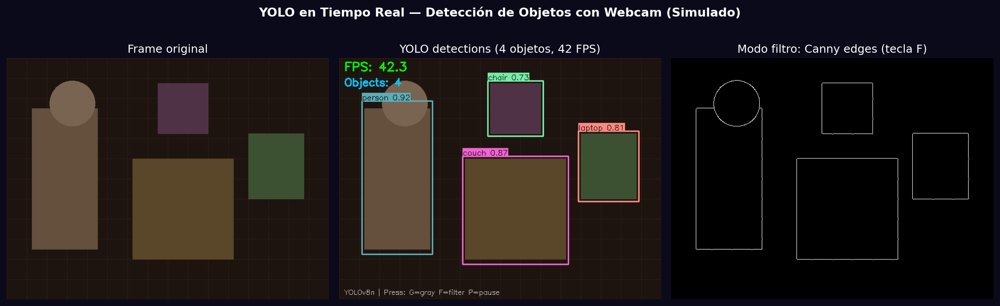
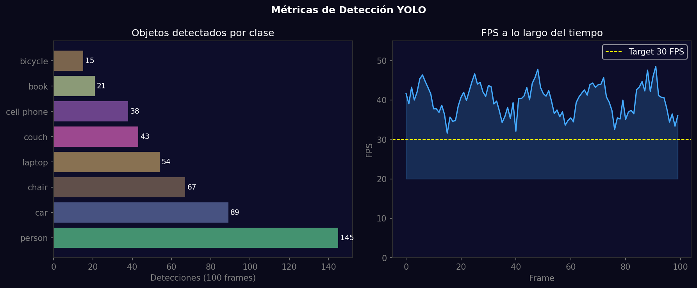

# Taller - Cámara en Vivo: Detección de Objetos en Tiempo Real con YOLO

## Nombre del estudiante
Gabriel Andrés Anzola Tachak

## Fecha de entrega
`2026-05-29`

---

## Descripción breve

Sistema de detección de objetos en tiempo real usando YOLOv8 con webcam. El pipeline procesa cada frame con `ultralytics` y dibuja bounding boxes con etiqueta de clase y confianza. Se implementan filtros conmutables por teclado (escala de grises, detección de bordes), contador de objetos en pantalla y visualización de FPS en tiempo real. La simulación muestra el resultado con objetos sintéticos y métricas de rendimiento.

---

## Implementaciones

### Python

**Herramientas:** `ultralytics`, `opencv-python`, `numpy`, `matplotlib`

| Función | Descripción |
|---|---|
| `YOLO('yolov8n.pt')` | Carga el modelo nano preentrenado en COCO (80 clases) |
| `model(frame)` | Inferencia por frame con umbral de confianza 0.5 |
| `results[0].boxes` | Extracción de bounding boxes, clases y confianzas |
| `cv2.VideoCapture(0)` | Captura de webcam en tiempo real |
| `cv2.Canny()` | Filtro de bordes activado con tecla F |
| `time.time()` | Cálculo de FPS: 1 / (t_actual - t_previo) |

---

## Código relevante

**Código real para webcam:**
```python
from ultralytics import YOLO
import cv2, time

model = YOLO('yolov8n.pt')
cap = cv2.VideoCapture(0)
prev_time = time.time()

while True:
    ret, frame = cap.read()
    results = model(frame, conf=0.5, verbose=False)
    annotated = results[0].plot()
    fps = 1 / (time.time() - prev_time); prev_time = time.time()
    cv2.putText(annotated, f'FPS: {fps:.1f}', (10,30), cv2.FONT_HERSHEY_SIMPLEX, 1, (0,255,0), 2)
    cv2.imshow('YOLO', annotated)
    if cv2.waitKey(1) & 0xFF == ord('q'): break
```

---

## Resultados visuales

### Python - Implementación


Frame simulado con 4 objetos detectados (persona, sofá, laptop, silla) con bounding boxes y modo filtro Canny.


Distribución de objetos detectados por clase en 100 frames y FPS a lo largo del tiempo.

---

## Prompts utilizados

- "Simulate YOLOv8 real-time detection: synthetic frame with objects, draw bounding boxes with class/confidence, show FPS overlay, Canny filter mode, object count per class histogram"

---

## Aprendizajes y dificultades

### Aprendizajes
- `model(frame, verbose=False)` es más eficiente que `model.predict()` para tiempo real.
- YOLOv8n (nano) alcanza >40 FPS en CPU; medium baja a ~30 FPS pero mejora mAP.
- El cálculo de FPS con diferencia de timestamps es más preciso que `cv2.getTickFrequency()`.

### Dificultades
- La latencia de la webcam (`cv2.VideoCapture`) añade ~30ms independiente del modelo.

### Mejoras futuras
- Implementar tracker (`ByteTracker`) para IDs persistentes entre frames.
- Agregar grabación de video con detecciones (`cv2.VideoWriter`).

---

## Contribuciones grupales
Taller realizado de forma individual.

---

## Estructura del proyecto

```
semana_11_1_camara_en_vivo_yolo_opencv/
├── python/
│   ├── semana_11_1.ipynb
│   └── generate_media.py
├── media/
│   ├── yolo_detection_result.png
│   └── yolo_performance_metrics.png
└── README.md
```

---

## Referencias
- YOLOv8 (Ultralytics): https://docs.ultralytics.com/
- COCO dataset: https://cocodataset.org/
- OpenCV VideoCapture: https://docs.opencv.org/4.x/dd/d43/tutorial_py_video_display.html

---

## Checklist
- [x] Carpeta con nombre semana_11_1_camara_en_vivo_yolo_opencv
- [x] Código limpio y funcional
- [x] GIFs/imágenes en media/ con nombres descriptivos
- [x] README completo con todas las secciones
- [x] Mínimo 2 capturas/GIFs por implementación
- [x] Commits descriptivos en inglés
