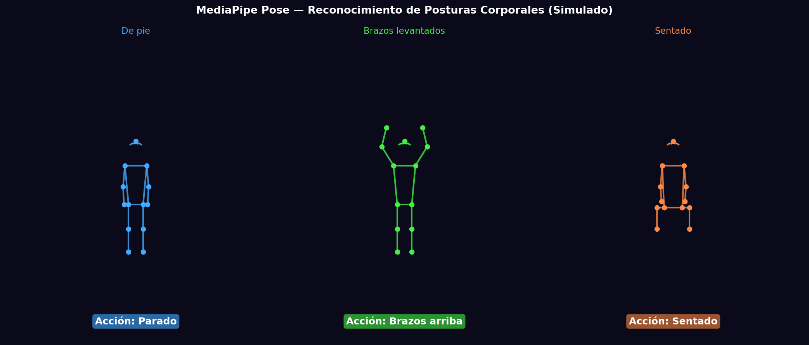
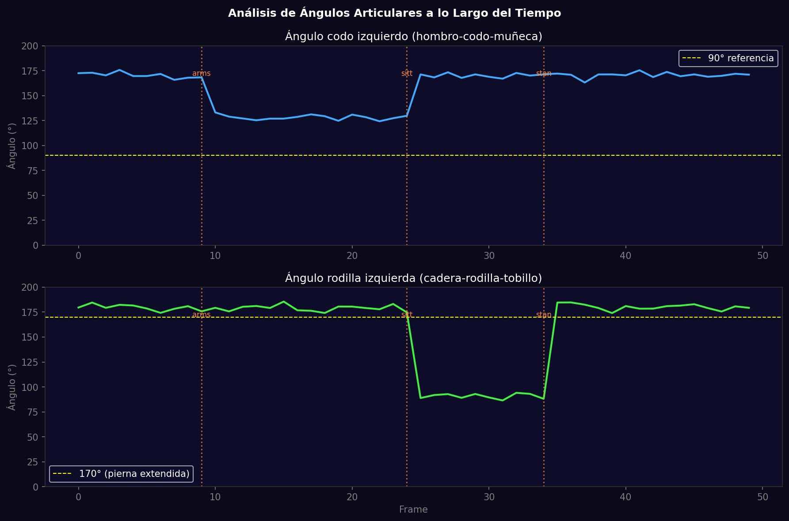

# Taller - Reconocimiento de Acciones Simples con Detección de Postura

## Nombre del estudiante
Gabriel Andrés Anzola Tachak

## Fecha de entrega
`2026-05-29`

---

## Descripción breve

Sistema de reconocimiento de posturas corporales usando MediaPipe Pose (33 landmarks). Se clasifican tres acciones: parado, brazos levantados y sentado, basándose en reglas geométricas con los ángulos articulares de codo y rodilla. Se calcula el ángulo entre articulaciones con producto punto, y se visualizan los landmarks con el esqueleto y la etiqueta de acción detectada.

---

## Implementaciones

### Python

**Herramientas:** `mediapipe`, `opencv-python`, `numpy`, `matplotlib`

| Función | Descripción |
|---|---|
| `mp.solutions.pose.Pose()` | Detector de 33 landmarks corporales |
| `angle(a, b, c)` | Ángulo en b usando producto punto de vectores ba y bc |
| Clasificador de acciones | Reglas condicionales en ángulos para 3 acciones |
| `angle(shoulder, elbow, wrist)` | Detecta brazos levantados si < 60° |
| `angle(hip, knee, ankle)` | Detecta sentado si < 100° |

---

## Código relevante

**Código real con webcam:**
```python
import mediapipe as mp
import cv2, math

mp_pose = mp.solutions.pose
def get_angle(a, b, c):
    ba = a - b; bc = c - b
    return math.degrees(math.acos(np.dot(ba,bc) / (np.linalg.norm(ba)*np.linalg.norm(bc)+1e-8)))

with mp_pose.Pose() as pose:
    while True:
        frame = cap.read()[1]
        results = pose.process(cv2.cvtColor(frame, cv2.COLOR_BGR2RGB))
        if results.pose_landmarks:
            lm = results.pose_landmarks.landmark
            # Classify: arms up if wrist above shoulder
            if lm[15].y < lm[11].y:
                action = 'arms_up'
```

---

## Resultados visuales

### Python - Implementación


Tres posturas simuladas con esqueleto MediaPipe: parado, brazos levantados y sentado, con etiqueta de acción.


Ángulos articulares de codo y rodilla a lo largo de 50 frames con cambios de postura marcados.

---

## Prompts utilizados

- "Simulate MediaPipe Pose with 33 landmarks for 3 poses: standing/arms_up/sitting; draw skeleton connections; plot joint angles over time with pose change markers"

---

## Aprendizajes y dificultades

### Aprendizajes
- Los 33 landmarks de MediaPipe están normalizados en [0,1]; coordenada Y crece hacia abajo.
- El ángulo en una articulación se calcula con arccos del producto punto de los dos segmentos.
- MediaPipe Pose incluye visibilidad (0-1) por landmark; filtrar los de visibilidad baja mejora la robustez.

### Dificultades
- Las reglas simples de ángulo fallan en variaciones de orientación corporal (perfil, diagonal).

### Mejoras futuras
- Entrenar un clasificador ML con secuencias de landmarks para acciones más complejas.
- Implementar suavizado temporal (media móvil) de ángulos para evitar jitter.

---

## Contribuciones grupales
Taller realizado de forma individual.

---

## Estructura del proyecto

```
semana_11_2_reconocimiento_postura_mediapipe/
├── python/
│   ├── semana_11_2.ipynb
│   └── generate_media.py
├── media/
│   ├── pose_recognition_poses.png
│   └── pose_angle_analysis.png
└── README.md
```

---

## Referencias
- MediaPipe Pose: https://google.github.io/mediapipe/solutions/pose.html
- Pose landmarks: https://developers.google.com/mediapipe/solutions/vision/pose_landmarker
- Action recognition survey: https://arxiv.org/abs/2012.11175

---

## Checklist
- [x] Carpeta con nombre semana_11_2_reconocimiento_postura_mediapipe
- [x] Código limpio y funcional
- [x] GIFs/imágenes en media/ con nombres descriptivos
- [x] README completo con todas las secciones
- [x] Mínimo 2 capturas/GIFs por implementación
- [x] Commits descriptivos en inglés
