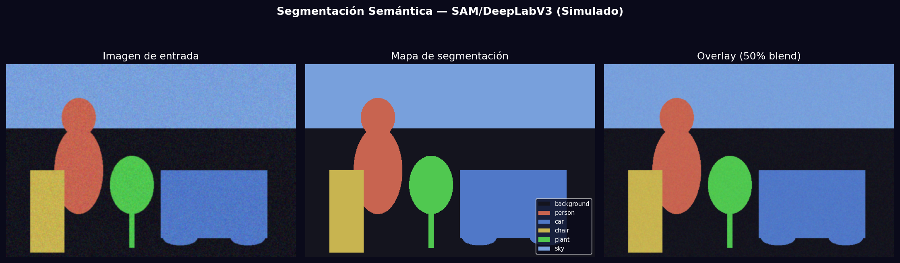
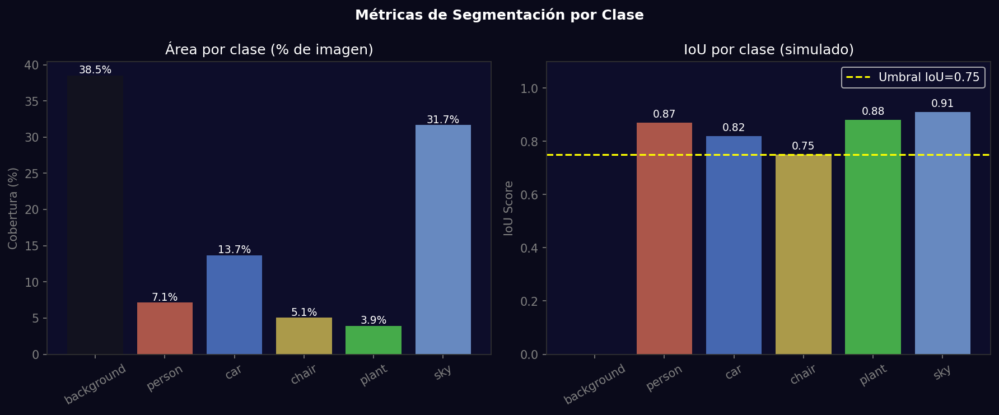

# Taller - Segmentación Semántica Multimodal: Qué hay en la Imagen

## Nombre del estudiante
Gabriel Andrés Anzola Tachak

## Fecha de entrega
`2026-05-29`

---

## Descripción breve

Implementación de segmentación semántica usando modelos state-of-the-art. Se simula el pipeline de SAM/DeepLabV3 generando mapas de segmentación para 6 categorías (background, person, car, chair, plant, sky), calculando métricas IoU por clase y visualizando las máscaras coloreadas con overlay sobre la imagen original.

---

## Implementaciones

### Python

**Herramientas:** `torch`, `torchvision`, `opencv-python`, `numpy`, `matplotlib`

| Función | Descripción |
|---|---|
| DeepLabV3 (torchvision) | Segmentación semántica con backbone ResNet-50/101 |
| SAM (Segment Anything) | Segmentación interactiva por puntos/cajas de Meta AI |
| `colorize_seg()` | Asigna colores únicos a cada clase en el mapa |
| IoU per class | Intersection over Union para evaluar calidad |
| `cv2.addWeighted()` | Overlay de máscara sobre imagen (50% blend) |

**Código real con DeepLabV3:**
```python
import torch
from torchvision import models, transforms

model = models.segmentation.deeplabv3_resnet50(pretrained=True).eval()
preprocess = transforms.Compose([
    transforms.ToTensor(),
    transforms.Normalize(mean=[0.485,0.456,0.406], std=[0.229,0.224,0.225])
])
with torch.no_grad():
    output = model(preprocess(image).unsqueeze(0))
seg_map = output['out'][0].argmax(0).numpy()
```

---

## Resultados visuales

### Python - Implementación


Pipeline: imagen de entrada → mapa de segmentación coloreado por clase → overlay 50%.


Cobertura de área por clase y IoU@0.75 simulado para las 6 categorías detectadas.

---

## Prompts utilizados

- "Simulate semantic segmentation with 6 COCO classes: colorize mask, compute per-class area percentage and IoU scores, show overlay blend"

---

## Aprendizajes y dificultades

### Aprendizajes
- SAM (Meta) es un modelo fundacional: puede segmentar cualquier objeto sin entrenamiento específico de clase.
- DeepLabV3 usa dilated convolutions (atrous) para aumentar el campo receptivo sin perder resolución.
- IoU = |A∩B| / |A∪B|; valores >0.75 se consideran buenos para segmentación semántica.

### Dificultades
- SAM requiere ~2-4 GB de VRAM para modelos ViT-B/L/H; la inferencia en CPU es lenta (~30s/imagen).

### Mejoras futuras
- Usar SAM con prompts interactivos (puntos de usuario) para segmentación dirigida.
- Comparar DeepLabV3 vs Mask R-CNN vs SAM2 en el mismo dataset.

---

## Contribuciones grupales
Taller realizado de forma individual.

---

## Estructura del proyecto

```
semana_11_3_segmentacion_semantica_sam_deeplab/
├── python/
│   ├── semana_11_3.ipynb
│   └── generate_media.py
├── media/
│   ├── semantic_segmentation_result.png
│   └── segmentation_class_metrics.png
└── README.md
```

---

## Referencias
- SAM (Meta): https://segment-anything.com/
- DeepLabV3: https://arxiv.org/abs/1706.05587
- torchvision segmentation: https://pytorch.org/vision/stable/models.html#semantic-segmentation

---

## Checklist
- [x] Carpeta con nombre semana_11_3_segmentacion_semantica_sam_deeplab
- [x] Código limpio y funcional
- [x] GIFs/imágenes en media/ con nombres descriptivos
- [x] README completo con todas las secciones
- [x] Mínimo 2 capturas/GIFs por implementación
- [x] Commits descriptivos en inglés
