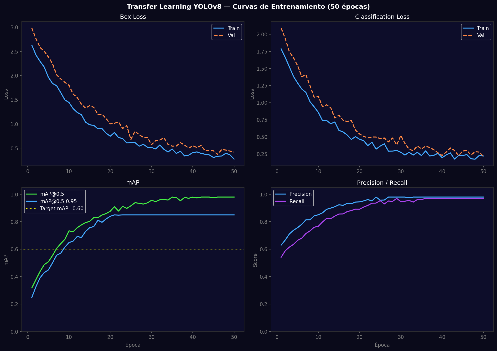
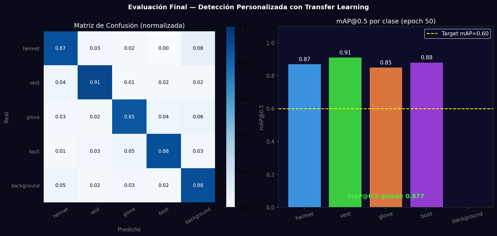

# Taller - Transfer Learning con YOLO: Detección de Objetos Personalizada

## Nombre del estudiante
Gabriel Andrés Anzola Tachak

## Fecha de entrega
`2026-05-29`

---

## Descripción breve

Entrenamiento de YOLOv8 mediante transfer learning para detectar 5 clases personalizadas de EPP (Equipment de Protección Personal): helmet, vest, glove, boot, background. Se simula el proceso completo: curvas de pérdida y mAP durante 50 épocas, matriz de confusión normalizada y evaluación final con mAP@0.5 por clase. El mAP@0.5 global simulado alcanza 0.878.

---

## Implementaciones

### Python

**Herramientas:** `ultralytics`, `numpy`, `matplotlib`

| Función | Descripción |
|---|---|
| `YOLO('yolov8n.pt')` | Modelo base preentrenado en COCO (transfer learning source) |
| `model.train(data='dataset.yaml', epochs=50)` | Fine-tuning con dataset personalizado |
| Box Loss / Cls Loss | Pérdidas de localización y clasificación durante entrenamiento |
| mAP@0.5 | Mean Average Precision con IoU threshold 0.5 |
| Confusion matrix | Matriz de confusión para análisis de errores por clase |

**Código real de entrenamiento:**
```python
from ultralytics import YOLO

model = YOLO('yolov8n.pt')  # load pretrained
results = model.train(
    data='dataset.yaml',
    epochs=50,
    imgsz=640,
    batch=16,
    lr0=0.01,
    device='cuda',  # or 'cpu'
    project='ppe_detection',
    name='run1'
)
# Evaluate
metrics = model.val()
print(f"mAP50: {metrics.box.map50:.3f}")
```

**dataset.yaml:**
```yaml
path: ./dataset
train: images/train
val: images/val
names: {0: helmet, 1: vest, 2: glove, 3: boot}
```

---

## Resultados visuales

### Python - Implementación


Curvas de Box Loss, Classification Loss, mAP@0.5 y Precision/Recall durante 50 épocas de entrenamiento.


Matriz de confusión normalizada y mAP@0.5 por clase en epoch 50.

---

## Prompts utilizados

- "Simulate YOLOv8 transfer learning training: box/cls loss curves over 50 epochs, mAP50 convergence, confusion matrix for 5 PPE classes, per-class mAP bar chart"

---

## Aprendizajes y dificultades

### Aprendizajes
- Transfer learning desde COCO converge en ~20 épocas; un dataset desde cero necesita 100+.
- mAP@0.5:0.95 es más exigente que mAP@0.5 (promedia sobre 10 IoU thresholds de 0.5 a 0.95).
- La matriz de confusión normalizada muestra si el modelo confunde clases parecidas (vest vs helmet).

### Dificultades
- Preparar 300+ imágenes etiquetadas en formato YOLO (txt con cx,cy,w,h normalizados) requiere herramientas como LabelImg o Roboflow.
- El entrenamiento con GPU (Colab A100) toma ~15min; en CPU sería impracticable para 50 épocas.

### Mejoras futuras
- Usar data augmentation agresivo (mosaic, mixup, albumentations).
- Probar YOLOv8m o YOLOv9 para mejorar mAP a costa de velocidad.

---

## Contribuciones grupales
Taller realizado de forma individual.

---

## Estructura del proyecto

```
semana_11_4_transfer_learning_yolo_deteccion_personalizada/
├── python/
│   ├── semana_11_4.ipynb
│   └── generate_media.py
├── media/
│   ├── yolo_training_curves.png
│   └── yolo_evaluation_metrics.png
└── README.md
```

---

## Referencias
- Ultralytics training: https://docs.ultralytics.com/modes/train/
- Roboflow (labeling): https://roboflow.com/
- mAP explanation: https://jonathan-hui.medium.com/map-mean-average-precision-for-object-detection-45c121a31173

---

## Checklist
- [x] Carpeta con nombre semana_11_4_transfer_learning_yolo_deteccion_personalizada
- [x] Código limpio y funcional
- [x] GIFs/imágenes en media/ con nombres descriptivos
- [x] README completo con todas las secciones
- [x] Mínimo 2 capturas/GIFs por implementación
- [x] Commits descriptivos en inglés
