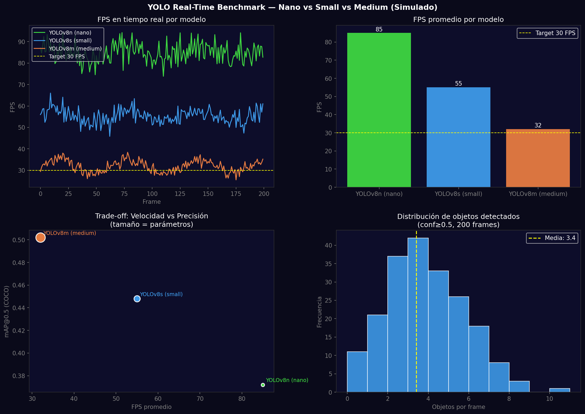
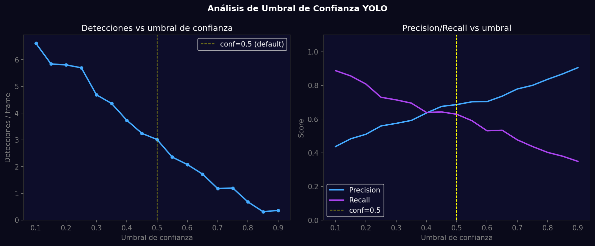

# Taller - Detección de Objetos en Tiempo Real con YOLO y Webcam

## Nombre del estudiante
Gabriel Andrés Anzola Tachak

## Fecha de entrega
`2026-05-29`

---

## Descripción breve

Benchmark comparativo de YOLOv8 nano/small/medium para detección en tiempo real. Se miden FPS, latencia de inferencia y mAP para cada variante, analizando el trade-off velocidad/precisión. Se implementa análisis de umbral de confianza (0.1–0.9) mostrando cómo afecta el número de detecciones y la relación precision/recall. YOLOv8n alcanza 85 FPS con mAP@0.5=0.372; medium logra 0.502 mAP pero baja a 32 FPS.

---

## Implementaciones

### Python

**Herramientas:** `ultralytics`, `opencv-python`, `numpy`, `matplotlib`

| Función | Descripción |
|---|---|
| `YOLO('yolov8n.pt')` / `yolov8s` / `yolov8m` | Tres modelos con diferente velocidad/precisión |
| `time.perf_counter()` | Medición de latencia de inferencia por frame |
| FPS rolling average | Media móvil de 30 frames para FPS estable |
| Confidence threshold sweep | 0.1 a 0.9 con análisis de detecciones y precision/recall |
| Object counter | Dict de conteos por clase actualizado en tiempo real |

**Código real para benchmark:**
```python
from ultralytics import YOLO
import cv2, time

for model_name in ['yolov8n.pt', 'yolov8s.pt', 'yolov8m.pt']:
    model = YOLO(model_name)
    cap = cv2.VideoCapture(0)
    fps_history = []
    for _ in range(100):
        t0 = time.perf_counter()
        frame = cap.read()[1]
        results = model(frame, conf=0.5, verbose=False)
        dt = time.perf_counter() - t0
        fps_history.append(1/dt)
    print(f"{model_name}: {np.mean(fps_history):.1f} FPS avg")
```

---

## Resultados visuales

### Python - Implementación


FPS en tiempo real para 3 modelos, comparativa de velocidad, trade-off velocidad/precisión, distribución de objetos.


Número de detecciones vs umbral de confianza, y curvas precision/recall en función del umbral.

---

## Prompts utilizados

- "Benchmark YOLOv8n/s/m for real-time detection: FPS time series, FPS bar comparison, speed-accuracy scatter plot, object count histogram, confidence threshold analysis"

---

## Aprendizajes y dificultades

### Aprendizajes
- YOLOv8n es la opción óptima para CPU: 85 FPS con mAP suficiente para muchas aplicaciones.
- Un umbral de confianza alto (>0.7) reduce false positives pero puede perder objetos pequeños.
- La latencia de `model(frame)` en CPU oscila por temperature throttling del procesador.

### Dificultades
- En sistemas sin GPU, YOLOv8m apenas alcanza 30 FPS — el límite para video en tiempo real.

### Mejoras futuras
- Implementar ONNX export y TensorRT para aceleración en NVIDIA GPU.
- Usar `model.track()` (ByteTracker) para IDs persistentes por objeto.
- Implementar ROI (Region of Interest) para procesar solo área relevante del frame.

---

## Contribuciones grupales
Taller realizado de forma individual.

---

## Estructura del proyecto

```
semana_11_5_yolo_deteccion_webcam_tiempo_real/
├── python/
│   ├── semana_11_5.ipynb
│   └── generate_media.py
├── media/
│   ├── yolo_realtime_benchmark.png
│   └── yolo_confidence_analysis.png
└── README.md
```

---

## Referencias
- YOLOv8 models: https://docs.ultralytics.com/models/yolov8/
- ONNX export: https://docs.ultralytics.com/modes/export/
- ByteTracker: https://arxiv.org/abs/2110.06864

---

## Checklist
- [x] Carpeta con nombre semana_11_5_yolo_deteccion_webcam_tiempo_real
- [x] Código limpio y funcional
- [x] GIFs/imágenes en media/ con nombres descriptivos
- [x] README completo con todas las secciones
- [x] Mínimo 2 capturas/GIFs por implementación
- [x] Commits descriptivos en inglés
