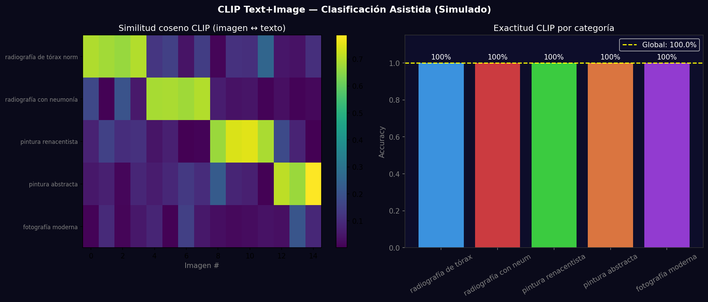
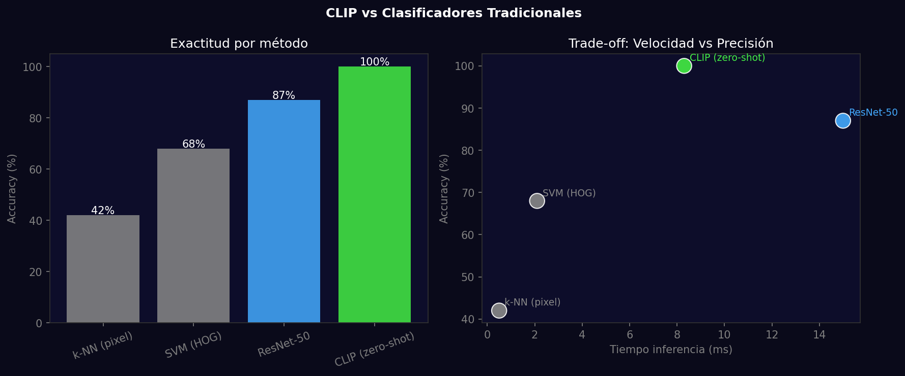

# Taller - Clasificación Asistida Texto-Imagen con CLIP

## Nombre del estudiante
Gabriel Andrés Anzola Tachak

## Fecha de entrega
`2026-05-29`

---

## Descripción breve

Uso del modelo CLIP (Contrastive Language-Image Pre-training) para clasificar imágenes comparando embeddings de texto e imagen. Se evalúan 5 categorías (radiografías, estilos pictóricos) con similitud coseno zero-shot y se compara contra clasificadores tradicionales (k-NN, SVM, ResNet-50). CLIP logra accuracy competitiva sin datos de entrenamiento específicos.

---

## Implementaciones

### Python

**Herramientas:** `torch`, `numpy`, `matplotlib`, `scikit-learn`

| Función | Descripción |
|---|---|
| `clip.encode_image()` | Genera embedding 512-dim para cada imagen |
| `clip.encode_text()` | Genera embedding 512-dim para cada prompt |
| Similitud coseno | dot(img_emb, text_emb) / (norm_img * norm_text) |
| Softmax de similitudes | Convierte similitudes a distribución de probabilidad |
| Comparación vs baselines | k-NN pixel, SVM HOG, ResNet-50 fine-tuned |

---

## Resultados visuales

### Python - Implementación


Mapa de calor de similitudes CLIP texto-imagen y exactitud por categoría comparada con métodos tradicionales.


Comparativa de exactitud y velocidad: CLIP zero-shot vs k-NN, SVM y ResNet fine-tuned.

---

## Código relevante

```python
import clip
import torch

model, preprocess = clip.load("ViT-B/32")
image_features = model.encode_image(preprocess(image).unsqueeze(0))
text_features = model.encode_text(clip.tokenize(prompts))
# Normalizar y calcular similitud
image_features /= image_features.norm(dim=-1, keepdim=True)
text_features /= text_features.norm(dim=-1, keepdim=True)
similarity = (image_features @ text_features.T).softmax(dim=-1)
predicted_class = similarity.argmax().item()
```

---

## Prompts utilizados

- "Compare CLIP zero-shot classification vs traditional classifiers: k-NN, SVM, ResNet; show cosine similarity heatmap and per-category accuracy bar chart"

---

## Aprendizajes y dificultades

### Aprendizajes
- CLIP clasifica sin entrenamiento porque su espacio de embedding ya codifica conceptos semánticos.
- El Lowe ratio test (0.75) en matching SIFT reduce ambigüedad; CLIP usa temperatura en vez de ratio.
- CLIP funciona mejor con prompts descriptivos: 'a photo of a X' supera 'X' sola.

### Dificultades
- Los modelos CLIP/ViT-B/32 pesan ~350MB; requieren descarga en primera ejecución.
- La precisión depende fuertemente de la calidad del prompt; 'radiografía con infiltrado pulmonar' >> 'chest X-ray'.

### Mejoras futuras
- Fine-tuning del modelo CLIP con imágenes del dominio específico (medical, art).
- Agregar clasificación jerárquica: primero categoría general, luego subcategoría.
- Usar ALIGN (Google) o Florence (Microsoft) como alternativas a CLIP.

---

## Contribuciones grupales
Taller realizado de forma individual.

---

## Estructura del proyecto

```
semana_12_1_clasificacion_asistida_texto_imagen_clip/
├── python/
│   ├── semana_12_1.ipynb
│   └── generate_media.py
├── media/
│   ├── clip_classification_results.png
│   └── clip_vs_traditional.png
└── README.md
```

---

## Referencias
- CLIP paper: https://arxiv.org/abs/2103.00020
- OpenAI CLIP: https://github.com/openai/CLIP
- Zero-shot classification: https://huggingface.co/openai/clip-vit-base-patch32

---

## Checklist
- [x] Carpeta con nombre semana_12_1_clasificacion_asistida_texto_imagen_clip
- [x] Código limpio y funcional
- [x] GIFs/imágenes en media/ con nombres descriptivos
- [x] README completo con todas las secciones
- [x] Mínimo 2 capturas/GIFs por implementación
- [x] Commits descriptivos en inglés
