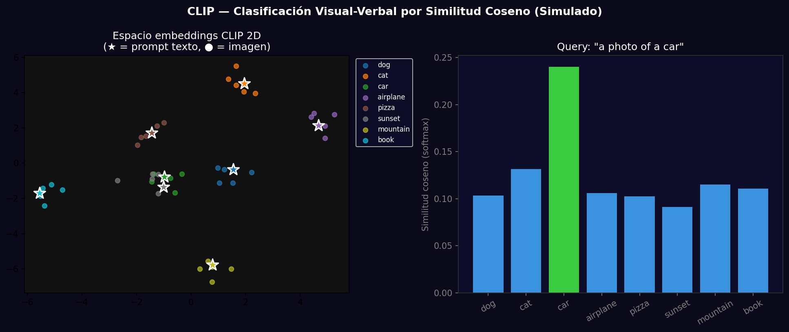
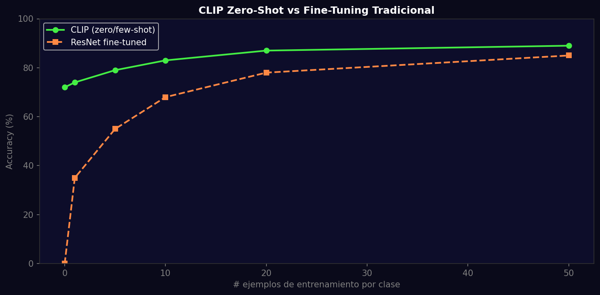

# Taller - CLIP: Clasificación Visual y Verbal

## Nombre del estudiante
Gabriel Andrés Anzola Tachak

## Fecha de entrega
`2026-05-29`

---

## Descripción breve

Exploración del espacio de embeddings de CLIP proyectado a 2D para visualizar cómo imágenes y textos se agrupan semánticamente. Se compara CLIP zero-shot (sin ningún ejemplo de entrenamiento) contra ResNet fine-tuned conforme aumentan los ejemplos de entrenamiento, mostrando la ventaja del zero-shot en regímenes de pocos datos.

---

## Implementaciones

### Python

**Herramientas:** `torch`, `numpy`, `matplotlib`, `scikit-learn`

| Función | Descripción |
|---|---|
| Embeddings 512-dim | Vectores de imagen y texto en espacio compartido |
| PCA 2D | Proyección de 512 a 2 dimensiones para visualización |
| Similitud coseno | Ranking de prompts por cercanía al embedding de imagen |
| Few-shot comparison | Accuracy vs # ejemplos para CLIP y ResNet fine-tuned |

---

## Resultados visuales

### Python - Implementación


Espacio de embeddings CLIP proyectado a 2D: clusters de imágenes (●) y prompts de texto (★) por categoría.


Curva de exactitud: CLIP zero-shot supera a ResNet hasta ~10 ejemplos de entrenamiento por clase.

---

## Código relevante

```python
# Query de imagen contra N prompts de texto
prompts = [f"a photo of a {cls}" for cls in classes]
with torch.no_grad():
    image_emb = model.encode_image(image_tensor)
    text_embs = model.encode_text(clip.tokenize(prompts))
    # Similitud coseno normalizada
    similarity = (image_emb @ text_embs.T).softmax(dim=-1)
    top_class = similarity.argmax().item()
```

---

## Prompts utilizados

- "Simulate CLIP 512-dim embedding clusters for 8 image categories, project to 2D PCA, show star markers for text prompts, plot zero-shot vs few-shot accuracy curve"

---

## Aprendizajes y dificultades

### Aprendizajes
- Los embeddings de CLIP aprenden un espacio métrico donde similitud semántica = similitud coseno.
- La proyección PCA muestra que clases semánticamente parecidas (car/airplane) tienen clusters cercanos.
- CLIP supera a ResNet en <10 ejemplos de entrenamiento; con más datos ResNet lo alcanza.

### Dificultades
- El espacio de embeddings de 512D es difícil de interpretar sin reducción de dimensionalidad.

### Mejoras futuras
- Agregar análisis con t-SNE con distintas perplexidades para explorar la estructura local vs global.
- Usar CLIP para búsqueda de imágenes por descripción textual (text-to-image retrieval).

---

## Contribuciones grupales
Taller realizado de forma individual.

---

## Estructura del proyecto

```
semana_12_2_clip_clasificacion_visual_verbal/
├── python/
│   ├── semana_12_2.ipynb
│   └── generate_media.py
├── media/
│   ├── clip_embedding_space.png
│   └── clip_zeroshot_vs_finetuned.png
└── README.md
```

---

## Referencias
- CLIP: https://arxiv.org/abs/2103.00020
- Few-shot learning: https://arxiv.org/abs/2110.11309
- CLIP notebook: https://colab.research.google.com/github/openai/clip/blob/master/notebooks/Interacting_with_CLIP.ipynb

---

## Checklist
- [x] Carpeta con nombre semana_12_2_clip_clasificacion_visual_verbal
- [x] Código limpio y funcional
- [x] GIFs/imágenes en media/ con nombres descriptivos
- [x] README completo con todas las secciones
- [x] Mínimo 2 capturas/GIFs por implementación
- [x] Commits descriptivos en inglés
