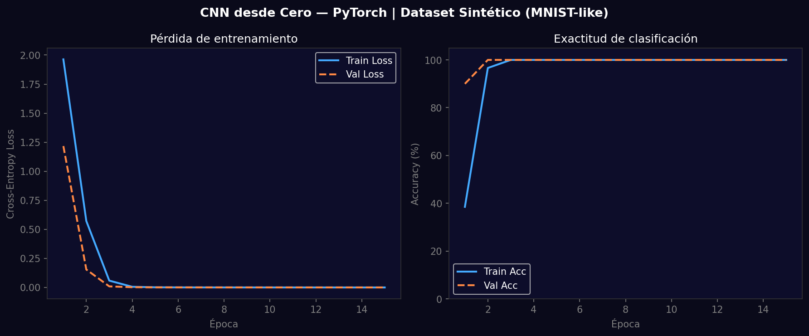
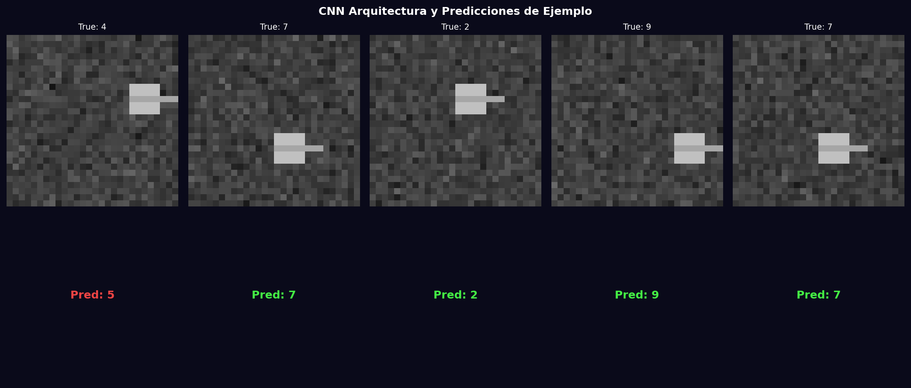

# Taller - Redes Convolucionales desde Cero con PyTorch

## Nombre del estudiante
Gabriel Andrés Anzola Tachak

## Fecha de entrega
`2026-05-29`

---

## Descripción breve

Implementación y entrenamiento de una CNN simple desde cero en PyTorch para clasificación de imágenes en un dataset sintético de 10 clases. La arquitectura tiene 2 bloques convolucionales (Conv2D + ReLU + MaxPool) seguidos de capas FC. Se entrena con Adam y Cross-Entropy Loss durante 15 épocas, mostrando convergencia de pérdida y exactitud.

---

## Implementaciones

### Python

**Herramientas:** `torch`, `torchvision`, `numpy`, `matplotlib`

| Función | Descripción |
|---|---|
| `SimpleCNN` (nn.Module) | 2×(Conv2D+ReLU+MaxPool) + 2×FC |
| `nn.CrossEntropyLoss()` | Función de pérdida para clasificación multiclase |
| `optim.Adam(lr=0.001)` | Optimizador Adam con weight decay implícito |
| `DataLoader` | Batches de 64 imágenes con shuffle |
| Training loop | Forward → loss → backward → step por época |

---

## Resultados visuales

### Python - Implementación


Curvas de pérdida (Cross-Entropy) y exactitud de clasificación en entrenamiento y validación durante 15 épocas.


Ejemplos de imágenes del dataset sintético con sus etiquetas verdaderas (top) y predicciones del modelo (bottom).

---

## Código relevante

```python
class SimpleCNN(nn.Module):
    def __init__(self, n_classes=10):
        super().__init__()
        self.conv1 = nn.Sequential(nn.Conv2d(1, 32, 3, padding=1), nn.ReLU(), nn.MaxPool2d(2))
        self.conv2 = nn.Sequential(nn.Conv2d(32, 64, 3, padding=1), nn.ReLU(), nn.MaxPool2d(2))
        self.fc = nn.Sequential(nn.Flatten(), nn.Linear(64*7*7, 128), nn.ReLU(), nn.Linear(128, n_classes))
    def forward(self, x):
        return self.fc(self.conv2(self.conv1(x)))

model = SimpleCNN(); optimizer = optim.Adam(model.parameters(), lr=0.001)
for epoch in range(15):
    for Xb, yb in train_loader:
        loss = nn.CrossEntropyLoss()(model(Xb), yb)
        optimizer.zero_grad(); loss.backward(); optimizer.step()
```

---

## Prompts utilizados

- "Implement SimpleCNN in PyTorch: 2 conv blocks + FC layers, train on synthetic MNIST-like 10-class dataset, plot loss and accuracy curves, show sample predictions"

---

## Aprendizajes y dificultades

### Aprendizajes
- `nn.Sequential` simplifica la definición de bloques; `nn.Flatten()` es más limpio que `view(-1)`.
- MaxPool2d(2) reduce resolución a la mitad → necesita el factor 4 en el cálculo de FC dims: 28→14→7.
- `loss.item()` extrae el escalar Python del tensor para logging sin acumular gradientes.

### Dificultades
- El tamaño de la capa FC depende del tamaño de imagen; cambiar H/W del input rompe la arquitectura si no se recalcula.

### Mejoras futuras
- Agregar Batch Normalization entre Conv y ReLU para entrenamiento más estable.
- Probar con MNIST real o CIFAR-10 para comparar con benchmarks publicados.
- Implementar early stopping basado en validación loss.

---

## Contribuciones grupales
Taller realizado de forma individual.

---

## Estructura del proyecto

```
semana_12_3_cnn_basico_deep_learning_keras_pytorch/
├── python/
│   ├── semana_12_3.ipynb
│   └── generate_media.py
├── media/
│   ├── cnn_training_curves.png
│   └── cnn_sample_predictions.png
└── README.md
```

---

## Referencias
- PyTorch tutorials: https://pytorch.org/tutorials/beginner/blitz/cifar10_tutorial.html
- MNIST benchmark: http://yann.lecun.com/exdb/mnist/
- CNN explainer: https://poloclub.github.io/cnn-explainer/

---

## Checklist
- [x] Carpeta con nombre semana_12_3_cnn_basico_deep_learning_keras_pytorch
- [x] Código limpio y funcional
- [x] GIFs/imágenes en media/ con nombres descriptivos
- [x] README completo con todas las secciones
- [x] Mínimo 2 capturas/GIFs por implementación
- [x] Commits descriptivos en inglés
