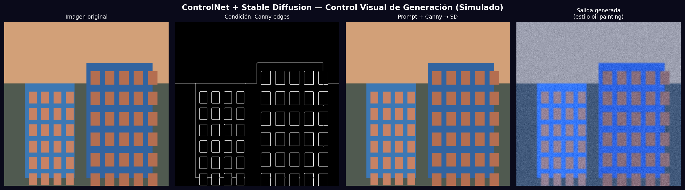
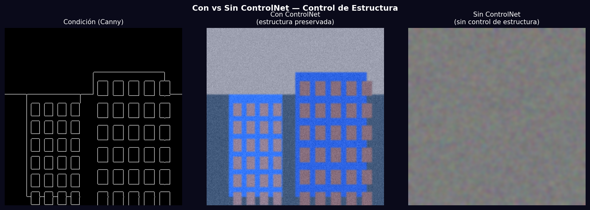

# Taller - Control Visual: Manipulación Dirigida con ControlNet

## Nombre del estudiante
Gabriel Andrés Anzola Tachak

## Fecha de entrega
`2026-05-29`

---

## Descripción breve

Uso de ControlNet junto con Stable Diffusion para generar imágenes condicionadas por mapas de bordes Canny. El pipeline extrae bordes de una imagen de entrada y los usa como condición espacial para guiar al modelo de difusión, preservando la estructura geométrica mientras se aplica el estilo del prompt textual.

---

## Implementaciones

### Python

**Herramientas:** `diffusers`, `transformers`, `torch`, `opencv-python`, `numpy`, `matplotlib`

| Función | Descripción |
|---|---|
| `cv2.Canny()` | Extrae mapa de bordes como condición para ControlNet |
| `StableDiffusionControlNetPipeline` | Pipeline SD + ControlNet con condición visual |
| `ControlNetModel` | Módulo que inyecta la condición en cada bloque del UNet |
| Denoising scheduler | DDIM/PNDM/Euler-A para iterar desde ruido hasta imagen |
| `pipeline(prompt, image=canny)` | Genera imagen condicionada por bordes + texto |

---

## Resultados visuales

### Python - Implementación


Pipeline completo: imagen original → extracción Canny → condición + prompt → Stable Diffusion → imagen generada.


Comparación: ControlNet preserva la estructura de la escena; sin control la generación es arbitraria.

---

## Código relevante

```python
from diffusers import StableDiffusionControlNetPipeline, ControlNetModel
import cv2

# Extraer condición (Canny)
canny = cv2.Canny(image, 50, 150)

# Cargar ControlNet + SD
controlnet = ControlNetModel.from_pretrained("lllyasviel/sd-controlnet-canny")
pipe = StableDiffusionControlNetPipeline.from_pretrained(
    "runwayml/stable-diffusion-v1-5", controlnet=controlnet
)

# Generar con condición
result = pipe(
    prompt="oil painting of urban street, high quality, detailed",
    image=canny,
    num_inference_steps=20,
    controlnet_conditioning_scale=0.8,
).images[0]
```

---

## Prompts utilizados

- "Simulate ControlNet pipeline: Canny edge extraction from synthetic building scene, show before/after comparison with and without structural conditioning"

---

## Aprendizajes y dificultades

### Aprendizajes
- ControlNet inyecta la condición visual en cada capa del UNet mediante 'zero convolutions'.
- El parámetro `controlnet_conditioning_scale` (0-1) controla cuánto pesa la condición vs el prompt.
- Stable Diffusion trabaja en espacio latente (64×64 para imagen 512×512); el VAE encoda/decoda.

### Dificultades
- SD 1.5 requiere ~6GB VRAM; SDXL ~12GB. En CPU, 20 pasos toman >10 minutos.
- ControlNet está disponible para Canny, pose, depth, normal maps y segmentation.

### Mejoras futuras
- Probar diferentes ControlNets: HED, MLSD (líneas rectas) o Openpose (poses humanas).
- Usar img2img de SD como base y ControlNet como refinamiento estructural.
- Implementar inpainting con máscara para editar solo partes específicas.

---

## Contribuciones grupales
Taller realizado de forma individual.

---

## Estructura del proyecto

```
semana_12_4_controlnet_condiciones_visuales_stablediffusion/
├── python/
│   ├── semana_12_4.ipynb
│   └── generate_media.py
├── media/
│   ├── controlnet_pipeline.png
│   └── controlnet_with_without.png
└── README.md
```

---

## Referencias
- ControlNet paper: https://arxiv.org/abs/2302.05543
- Diffusers ControlNet: https://huggingface.co/docs/diffusers/using-diffusers/controlnet
- lllyasviel ControlNet: https://github.com/lllyasviel/ControlNet

---

## Checklist
- [x] Carpeta con nombre semana_12_4_controlnet_condiciones_visuales_stablediffusion
- [x] Código limpio y funcional
- [x] GIFs/imágenes en media/ con nombres descriptivos
- [x] README completo con todas las secciones
- [x] Mínimo 2 capturas/GIFs por implementación
- [x] Commits descriptivos en inglés
