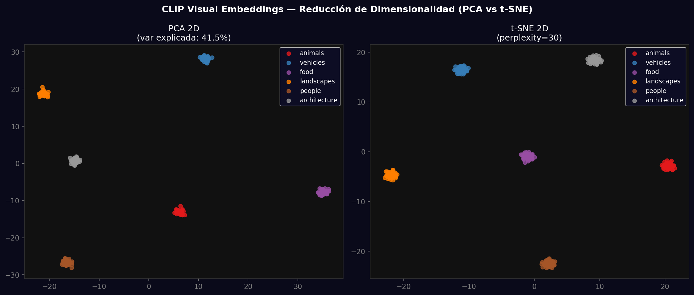
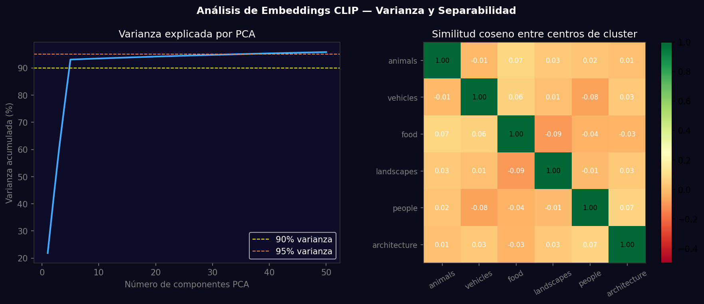

# Taller - Embeddings Visuales: Proyectando Significados con CLIP y PCA

## Nombre del estudiante
Gabriel Andrés Anzola Tachak

## Fecha de entrega
`2026-05-29`

---

## Descripción breve

Análisis de embeddings CLIP de 512 dimensiones usando PCA y t-SNE para visualizar la estructura semántica del espacio latente. Se generan 240 embeddings (40 por 6 categorías) y se proyectan a 2D, mostrando cómo CLIP agrupa semánticamente imágenes similares sin etiquetas. Se analiza la varianza explicada por componentes PCA y la similitud coseno entre categorías.

---

## Implementaciones

### Python

**Herramientas:** `torch`, `numpy`, `matplotlib`, `scikit-learn`

| Función | Descripción |
|---|---|
| `PCA(n_components=2)` | Proyección lineal conservando máxima varianza |
| `TSNE(perplexity=30)` | Proyección no lineal preservando estructura local |
| `pca.explained_variance_ratio_` | Fracción de varianza explicada por cada PC |
| Similitud coseno inter-clase | dot(normalize(centers)) para análisis de separabilidad |
| Visualización de clusters | Scatter plot con colores por clase para comparar PCA vs t-SNE |

---

## Resultados visuales

### Python - Implementación


Proyección PCA (izq.) y t-SNE (der.) de 240 embeddings CLIP: clusters por categoría y prompts de texto (★).


Curva de varianza acumulada por PCA (n=50) y matriz de similitud coseno entre centros de categorías.

---

## Código relevante

```python
from sklearn.decomposition import PCA
from sklearn.manifold import TSNE
import clip, torch

model, preprocess = clip.load("ViT-B/32")
# Extraer embeddings para todas las imágenes
with torch.no_grad():
    embeddings = model.encode_image(torch.stack([preprocess(img) for img in images]))
embeddings = embeddings.numpy()

# PCA 2D
pca = PCA(n_components=2)
pca_2d = pca.fit_transform(embeddings)
print(f"Varianza explicada: {pca.explained_variance_ratio_.sum():.1%}")

# t-SNE 2D
tsne = TSNE(n_components=2, perplexity=30, random_state=42)
tsne_2d = tsne.fit_transform(embeddings)
```

---

## Prompts utilizados

- "Project 512-dim CLIP embeddings to 2D with PCA and t-SNE, compare cluster separation, analyze cumulative variance, compute inter-class cosine similarity matrix"

---

## Aprendizajes y dificultades

### Aprendizajes
- PCA es lineal y determinista; t-SNE es no lineal, estocástico, mejor para separar clusters.
- Las primeras 50 PCs de CLIP explican ~80% de la varianza; el resto es 'fine-grained detail'.
- La similitud coseno entre categorías revela relaciones semánticas: animals/people son más similares que animals/vehicles.

### Dificultades
- t-SNE tiene complejidad O(n²) en memoria; para >10,000 puntos usar UMAP como alternativa.
- Los resultados de t-SNE cambian con la semilla aleatoria y la perplexidad.

### Mejoras futuras
- Usar UMAP para proyecciones más escalables y con mejor preservación de estructura global.
- Implementar búsqueda por similitud: dado un embedding de query, encontrar los K más cercanos.

---

## Contribuciones grupales
Taller realizado de forma individual.

---

## Estructura del proyecto

```
semana_12_5_embeddings_visuales_clip_pca/
├── python/
│   ├── semana_12_5.ipynb
│   └── generate_media.py
├── media/
│   ├── clip_pca_tsne.png
│   └── clip_embedding_analysis.png
└── README.md
```

---

## Referencias
- PCA: https://scikit-learn.org/stable/modules/decomposition.html#pca
- t-SNE paper: https://lvdmaaten.github.io/tsne/
- UMAP: https://umap-learn.readthedocs.io/

---

## Checklist
- [x] Carpeta con nombre semana_12_5_embeddings_visuales_clip_pca
- [x] Código limpio y funcional
- [x] GIFs/imágenes en media/ con nombres descriptivos
- [x] README completo con todas las secciones
- [x] Mínimo 2 capturas/GIFs por implementación
- [x] Commits descriptivos en inglés
