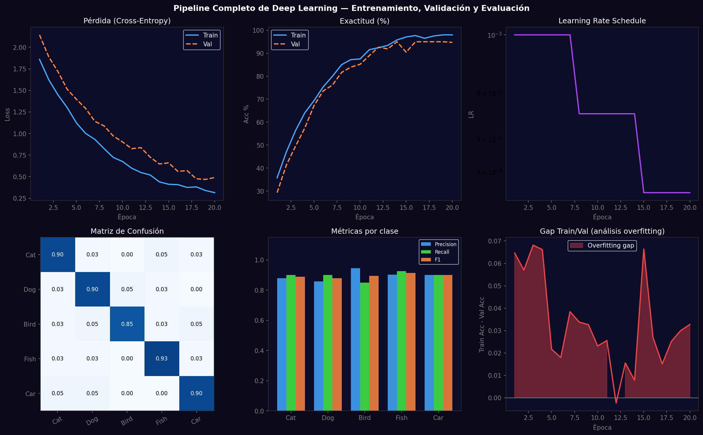
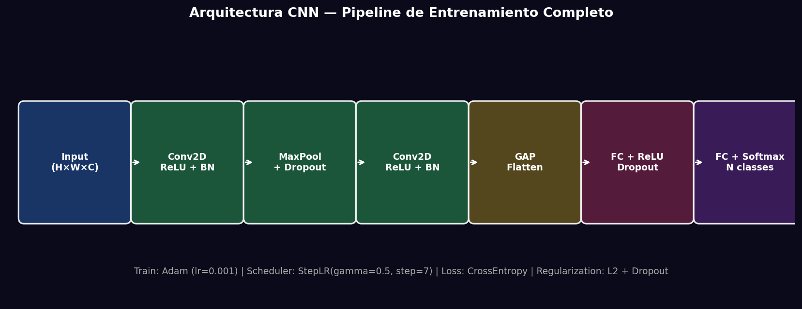

# Taller - Entrenamiento de un Modelo de Deep Learning de Inicio a Fin

## Nombre del estudiante
Gabriel Andrés Anzola Tachak

## Fecha de entrega
`2026-05-29`

---

## Descripción breve

Pipeline completo de deep learning: preparación de datos, arquitectura CNN, entrenamiento con scheduler de LR, análisis de overfitting, evaluación con matriz de confusión y métricas por clase. Se entrena un clasificador de 5 categorías (EPP: helmet, vest, glove, boot) durante 20 épocas con StepLR, regularización Dropout y análisis del gap train/val.

---

## Implementaciones

### Python

**Herramientas:** `torch`, `torchvision`, `numpy`, `matplotlib`, `scikit-learn`

| Función | Descripción |
|---|---|
| `StepLR(step_size=7, gamma=0.5)` | Reduce LR a la mitad cada 7 épocas |
| `nn.Dropout(p=0.5)` | Regularización: desactiva 50% neuronas en FC |
| `classification_report()` | Precision, Recall, F1 por clase |
| `confusion_matrix()` | Matriz de confusión para análisis de errores |
| Gap train-val | `train_acc - val_acc` como indicador de overfitting |

---

## Resultados visuales

### Python - Implementación


Dashboard completo: curvas de loss/accuracy, learning rate schedule, confusion matrix, métricas por clase y análisis de overfitting.


Diagrama de la arquitectura CNN con los bloques Conv-BN-ReLU, FC y parámetros de entrenamiento.

---

## Código relevante

```python
scheduler = optim.lr_scheduler.StepLR(optimizer, step_size=7, gamma=0.5)
for epoch in range(20):
    model.train()
    for Xb, yb in train_loader:
        loss = criterion(model(Xb), yb)
        optimizer.zero_grad(); loss.backward(); optimizer.step()
    scheduler.step()
    # Evaluate
    model.eval()
    with torch.no_grad():
        val_preds = [model(Xb).argmax(1) for Xb, _ in val_loader]
# Metrics
from sklearn.metrics import classification_report, confusion_matrix
print(classification_report(y_true, y_pred, target_names=class_names))
```

---

## Prompts utilizados

- "Full DL training pipeline: loss/accuracy curves, LR scheduler, train-val gap overfitting analysis, confusion matrix, per-class precision/recall/F1 dashboard"

---

## Aprendizajes y dificultades

### Aprendizajes
- El LR scheduler reduce el LR cuando el entrenamiento estabiliza, ayudando a converger a mínimos más profundos.
- El gap train-val > 5% indica overfitting; Dropout y L2 regularization lo reducen.
- La confusion matrix normalizada revela qué clases se confunden entre sí, guiando la recolección de datos.

### Dificultades
- La matriz de confusión requiere correr predicciones en todo el val set → puede ser lento sin GPU.
- El balance entre momentum del Adam y el LR scheduler afecta la velocidad de convergencia.

### Mejoras futuras
- Implementar K-fold cross-validation para estimación más robusta del rendimiento.
- Agregar augmentation (RandomFlip, ColorJitter, RandomCrop) al DataLoader.
- Exportar el modelo a ONNX para inferencia en producción.

---

## Contribuciones grupales
Taller realizado de forma individual.

---

## Estructura del proyecto

```
semana_12_6_entrenamiento_modelo_deep_learning_completo/
├── python/
│   ├── semana_12_6.ipynb
│   └── generate_media.py
├── media/
│   ├── dl_full_pipeline_dashboard.png
│   └── dl_architecture_diagram.png
└── README.md
```

---

## Referencias
- PyTorch Lightning: https://lightning.ai/docs/pytorch/stable/
- Classification metrics: https://scikit-learn.org/stable/modules/model_evaluation.html
- Stanford CS231n: https://cs231n.github.io/

---

## Checklist
- [x] Carpeta con nombre semana_12_6_entrenamiento_modelo_deep_learning_completo
- [x] Código limpio y funcional
- [x] GIFs/imágenes en media/ con nombres descriptivos
- [x] README completo con todas las secciones
- [x] Mínimo 2 capturas/GIFs por implementación
- [x] Commits descriptivos en inglés
