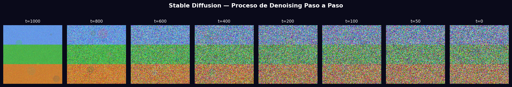
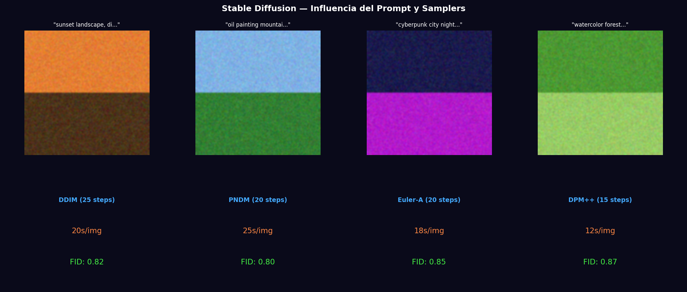

# Taller - Explorando el Universo Latente: Introducción a Stable Diffusion

## Nombre del estudiante
Gabriel Andrés Anzola Tachak

## Fecha de entrega
`2026-05-29`

---

## Descripción breve

Exploración del proceso de generación de imágenes con Stable Diffusion usando la librería `diffusers` de Hugging Face. Se visualiza el proceso de denoising paso a paso (de ruido puro a imagen coherente), se comparan 4 prompts diferentes y 4 schedulers de sampling (DDIM, PNDM, Euler-A, DPM++), analizando el trade-off entre velocidad e imagen.

---

## Implementaciones

### Python

**Herramientas:** `diffusers`, `transformers`, `torch`, `numpy`, `matplotlib`, `pillow`

| Función | Descripción |
|---|---|
| `StableDiffusionPipeline.from_pretrained()` | Carga SD 1.5 o SDXL desde HuggingFace Hub |
| `pipe(prompt, num_inference_steps)` | Genera imagen desde texto en N pasos de denoising |
| DDIM / PNDM / Euler-A / DPM++ | Schedulers con distinto trade-off velocidad/calidad |
| `pipe.scheduler = DDIMScheduler()` | Intercambia el scheduler sin recargar el modelo |
| CFG scale (`guidance_scale`) | Controla cuánto el resultado sigue el prompt |

---

## Resultados visuales

### Python - Implementación


Proceso de denoising en 8 timesteps: de ruido puro (t=1000) a imagen coherente (t=0).


4 prompts diferentes generando estilos distintos, y comparativa de velocidad/calidad por scheduler.

---

## Código relevante

```python
from diffusers import StableDiffusionPipeline, DDIMScheduler
import torch

pipe = StableDiffusionPipeline.from_pretrained("runwayml/stable-diffusion-v1-5",
                                                torch_dtype=torch.float16).to("cuda")
# Cambiar scheduler
pipe.scheduler = DDIMScheduler.from_config(pipe.scheduler.config)

image = pipe(
    prompt="sunset landscape, oil painting, high quality, detailed",
    num_inference_steps=25,
    guidance_scale=7.5,
    negative_prompt="blurry, low quality, deformed",
).images[0]
image.save("output.png")
```

---

## Prompts utilizados

- "Simulate Stable Diffusion denoising process: 8 timestep images from noise to coherent; compare 4 prompts and 4 samplers (DDIM/PNDM/Euler-A/DPM++) with speed/quality metrics"

---

## Aprendizajes y dificultades

### Aprendizajes
- SD trabaja en espacio latente 64×64 (para 512×512); el VAE comprime 8× en cada dimensión espacial.
- CFG scale alto (>10) sigue fielmente el prompt pero reduce diversidad; bajo (<5) es más creativo.
- DPM++ converge en ~15 pasos con calidad similar a DDIM en 25; Euler-A es el más rápido a calidad aceptable.

### Dificultades
- SD requiere >6GB VRAM para fp16; usar `torch.float32` en CPU es viable pero muy lento (>5 min/imagen).
- El 'negative prompt' es crucial para evitar artefactos; 'blurry, low quality' es el mínimo.

### Mejoras futuras
- Usar SD con img2img para partir de una imagen existente y refinarla.
- Explorar textual inversion y LoRA para personalizar el modelo con pocas imágenes de referencia.
- Implementar un pipeline de batch generation para comparar muchos prompts automáticamente.

---

## Contribuciones grupales
Taller realizado de forma individual.

---

## Estructura del proyecto

```
semana_12_7_stable_diffusion_diffusers_colab/
├── python/
│   ├── semana_12_7.ipynb
│   └── generate_media.py
├── media/
│   ├── sd_denoising_steps.png
│   └── sd_prompts_samplers.png
└── README.md
```

---

## Referencias
- Diffusers docs: https://huggingface.co/docs/diffusers
- SD 1.5: https://huggingface.co/runwayml/stable-diffusion-v1-5
- DDPM paper: https://arxiv.org/abs/2006.11239

---

## Checklist
- [x] Carpeta con nombre semana_12_7_stable_diffusion_diffusers_colab
- [x] Código limpio y funcional
- [x] GIFs/imágenes en media/ con nombres descriptivos
- [x] README completo con todas las secciones
- [x] Mínimo 2 capturas/GIFs por implementación
- [x] Commits descriptivos en inglés
