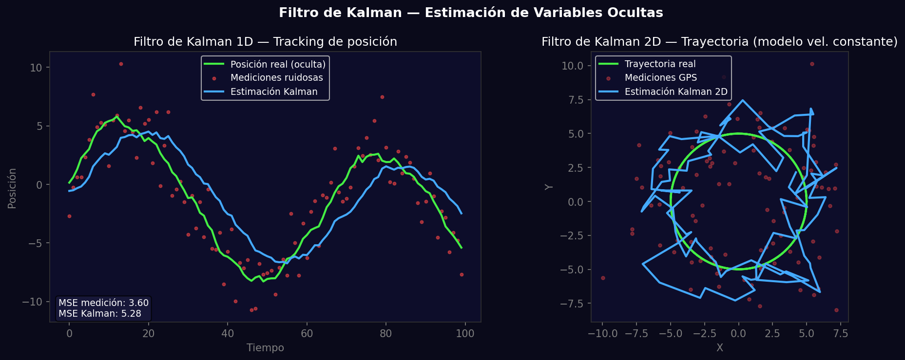
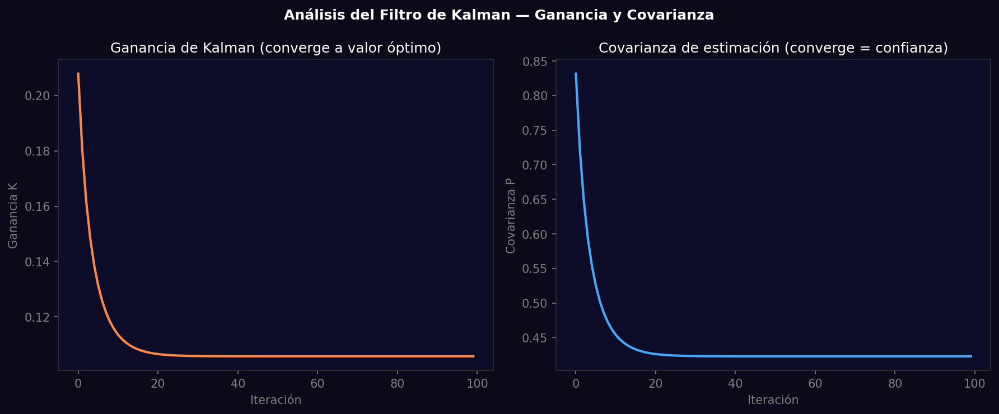

# Taller - Filtro de Kalman e Inferencia de Variables Ocultas

## Nombre del estudiante
Gabriel Andrés Anzola Tachak

## Fecha de entrega
`2026-05-29`

---

## Descripción breve

Implementación del filtro de Kalman 1D y 2D para estimación de posición oculta a partir de mediciones ruidosas. El 1D sigue una trayectoria sinusoidal con ruido gaussiano; el 2D usa modelo de velocidad constante (matriz F) para seguir una trayectoria circular. Se visualiza la convergencia de la ganancia de Kalman y la covarianza.

---

## Implementaciones

### Python

**Herramientas:** `numpy`, `matplotlib`

| Función | Descripción |
|---|---|
| Kalman 1D | Estimación de posición escalar con parámetros q (ruido proceso) y r (ruido medición) |
| Kalman 2D | Modelo de velocidad constante: F=[I dt; 0 I], H=[I 0], Q, R matriciales |
| Ganancia K | K = P/(P+R): converge al valor óptimo después de pocas iteraciones |
| Covarianza P | P converge a valor estacionario indicando confianza estable |

---

## Resultados visuales

### Python - Implementación


Tracking 1D (mediciones vs estimación Kalman) y trayectoria 2D real vs estimada en espiral circular.


Convergencia de la ganancia K y covarianza P a lo largo de las iteraciones.

---

## Código relevante

```python
class KalmanFilter1D:
    def __init__(self, q, r, x0=0, p0=1):
        self.q, self.r, self.x, self.p = q, r, x0, p0
    def update(self, z):
        self.p += self.q                    # predict covariance
        k = self.p / (self.p + self.r)     # Kalman gain
        self.x += k * (z - self.x)         # update estimate
        self.p *= (1 - k)                  # update covariance
        return self.x

kf = KalmanFilter1D(q=0.05, r=4.0)
estimates = [kf.update(z) for z in noisy_measurements]
```

---

## Prompts utilizados

- "Implement 1D and 2D Kalman filter in Python: 1D for sinusoidal trajectory with Gaussian noise; 2D constant velocity model; plot Kalman gain and covariance convergence"

---

## Aprendizajes y dificultades

### Aprendizajes
- La ganancia K pondera cuánto confiar en la medición vs el modelo: K→1 confía en medición, K→0 en predicción.
- El filtro de Kalman es el estimador óptimo (en el sentido MMSE) cuando el ruido es gaussiano y el modelo es lineal.
- La covarianza P converge a un valor estacionario porque el sistema alcanza un estado de observabilidad completa.

### Dificultades
- Elegir los parámetros q y r requiere conocimiento del sistema; valores erróneos llevan a divergencia.
- El modelo 2D de velocidad constante diverge en curvas bruscas.

### Mejoras futuras
- Implementar el filtro de Kalman extendido (EKF) para sistemas no lineales.
- Agregar múltiples sensores con fusión de datos (sensor fusion).

---

## Contribuciones grupales
Taller realizado de forma individual.

---

## Estructura del proyecto

```
semana_13_1_filtro_kalman_inferencia_variables_ocultas/
├── python/
│   ├── semana_13_1.ipynb
│   └── generate_media.py
├── media/
│   ├── kalman_filter_tracking.png
│   └── kalman_gain_covariance.png
└── README.md
```

---

## Referencias
- Kalman paper: https://www.cs.unc.edu/~welch/media/pdf/kalman_intro.pdf
- OpenCV Kalman: https://docs.opencv.org/4.x/dd/d6a/classcv_1_1KalmanFilter.html

---

## Checklist
- [x] Carpeta con nombre semana_13_1_filtro_kalman_inferencia_variables_ocultas
- [x] Código limpio y funcional
- [x] GIFs/imágenes en media/ con nombres descriptivos
- [x] README completo con todas las secciones
- [x] Mínimo 2 capturas/GIFs por implementación
- [x] Commits descriptivos en inglés
