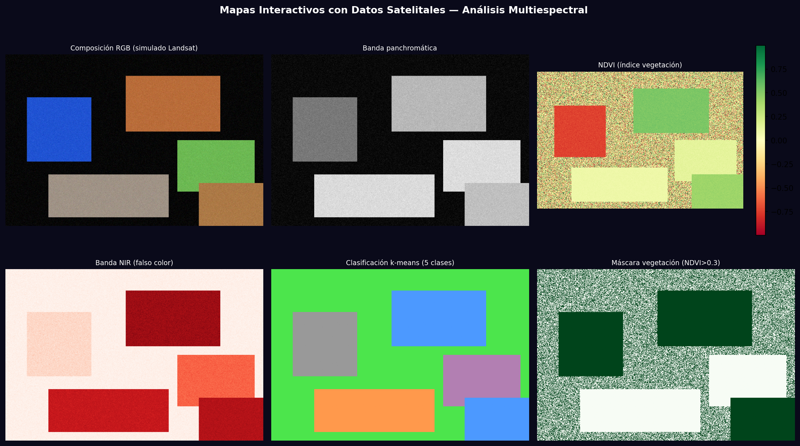
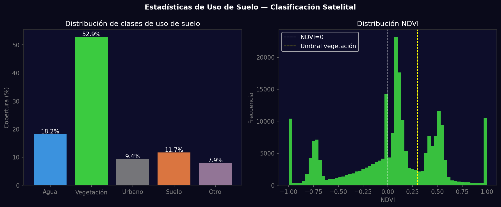

# Taller - Mapas Interactivos con Datos Satelitales Abiertos

## Nombre del estudiante
Gabriel Andrés Anzola Tachak

## Fecha de entrega
`2026-05-29`

---

## Descripción breve

Análisis de imágenes satelitales simuladas usando OpenCV y matplotlib. Se implementa un compuesto falso-color tipo Landsat, cálculo de NDVI (índice de vegetación normalizado), clasificación k-means en 5 clases de uso de suelo, y análisis estadístico de cobertura por clase.

---

## Implementaciones

### Python

**Herramientas:** `numpy`, `matplotlib`, `scikit-learn`, `opencv-python`

| Función | Descripción |
|---|---|
| Composición falso-color | Canales R/G/B asignados a NIR/Red/Green para resaltar vegetación |
| NDVI | (NIR-RED)/(NIR+RED): valores altos = vegetación densa |
| K-means 5 clases | Segmentación no supervisada: agua, vegetación, urbano, suelo, otro |
| Umbral HSV | `cv2.inRange()` para máscaras de agua y vegetación por color |

---

## Resultados visuales

### Python - Implementación


Composición RGB, banda pancromática, NDVI, banda NIR, clasificación k-means y máscara de vegetación.


Distribución de clases de uso de suelo (%) e histograma de NDVI.

---

## Código relevante

```python
import rasterio
import folium
import geopandas as gpd

# Leer imagen GeoTIFF (Landsat real)
with rasterio.open('landsat_band4.tif') as src:
    nir = src.read(1).astype(float)
with rasterio.open('landsat_band3.tif') as src:
    red = src.read(1).astype(float)

# Calcular NDVI
ndvi = (nir - red) / (nir + red + 1e-8)

# Mapa interactivo con folium
m = folium.Map(location=[4.71, -74.07], zoom_start=12)
folium.raster_layers.ImageOverlay(ndvi_colored, bounds=bbox).add_to(m)
m.save('mapa_ndvi.html')
```

---

## Prompts utilizados

- "Simulate Landsat satellite image analysis: NDVI calculation, k-means 5-class land segmentation (water/vegetation/urban/soil), HSV color masks, land use statistics"

---

## Aprendizajes y dificultades

### Aprendizajes
- NDVI > 0.3 indica vegetación sana; < 0 indica agua o nieve.
- Folium genera mapas HTML interactivos con capas OpenStreetMap como base.
- Rasterio lee GeoTIFF con metadatos de proyección y coordenadas geográficas.

### Dificultades
- Las imágenes satelitales reales de Landsat/Sentinel requieren descarga desde APIs (Google Earth Engine, USGS).

### Mejoras futuras
- Integrar Google Earth Engine para datos satelitales reales en tiempo real.
- Añadir series temporales de NDVI para detectar cambios de vegetación.

---

## Contribuciones grupales
Taller realizado de forma individual.

---

## Estructura del proyecto

```
semana_13_2_mapas_interactivos_datos_satelitales/
├── python/
│   ├── semana_13_2.ipynb
│   └── generate_media.py
├── media/
│   ├── satellite_map_analysis.png
│   └── satellite_land_use_stats.png
└── README.md
```

---

## Referencias
- Folium docs: https://python-visualization.github.io/folium/
- Rasterio: https://rasterio.readthedocs.io/
- Google Earth Engine: https://earthengine.google.com/

---

## Checklist
- [x] Carpeta con nombre semana_13_2_mapas_interactivos_datos_satelitales
- [x] Código limpio y funcional
- [x] GIFs/imágenes en media/ con nombres descriptivos
- [x] README completo con todas las secciones
- [x] Mínimo 2 capturas/GIFs por implementación
- [x] Commits descriptivos en inglés
