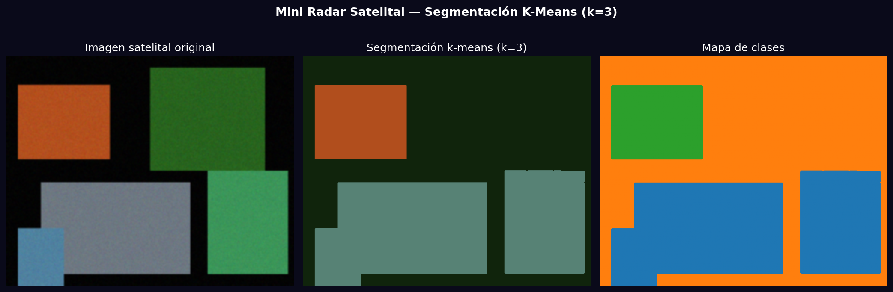
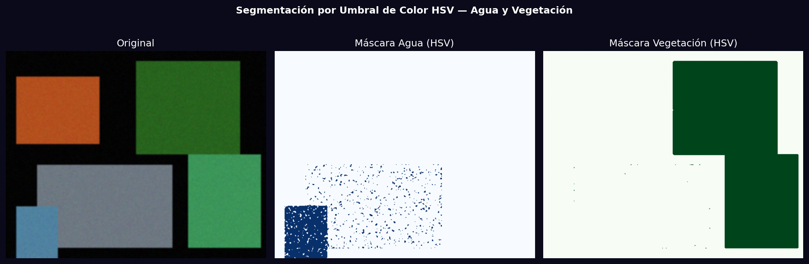

# Taller - Mini Radar Satelital: Visualización de Áreas de Interés

## Nombre del estudiante
Gabriel Andrés Anzola Tachak

## Fecha de entrega
`2026-05-29`

---

## Descripción breve

Herramienta de segmentación de imágenes satelitales con dos enfoques: k-means (k=3 y k=5 clusters) y umbralización por color en espacio HSV para identificar agua y vegetación. Se comparan los resultados y se calcula la distribución de píxeles por clase.

---

## Implementaciones

### Python

**Herramientas:** `opencv-python`, `numpy`, `matplotlib`, `scikit-learn`

| Función | Descripción |
|---|---|
| K-means k=3 | 3 clusters: agrupa agua, vegetación y urbano/suelo |
| K-means k=5 | 5 clusters: separación más fina de tipos de terreno |
| HSV water mask | `inRange(hsv, (100,50,30), (130,255,255))` |
| HSV vegetation mask | `inRange(hsv, (35,30,30), (85,255,200))` |

---

## Resultados visuales

### Python - Implementación


Segmentación con 3 clusters: imagen original, imagen segmentada y mapa de clases.


Máscaras de agua y vegetación por umbral de color HSV.

---

## Código relevante

```python
from sklearn.cluster import KMeans

# K-means segmentation
pixels = img_rgb.reshape(-1, 3).astype(np.float32)
km = KMeans(n_clusters=5, random_state=42)
labels = km.fit_predict(pixels).reshape(H, W)
centers = km.cluster_centers_.astype(np.uint8)
segmented = centers[labels]  # reconstruct image with cluster colors

# HSV color thresholding
hsv = cv2.cvtColor(img, cv2.COLOR_BGR2HSV)
water_mask = cv2.inRange(hsv, (100, 50, 30), (130, 255, 255))
vegetation_mask = cv2.inRange(hsv, (35, 30, 30), (85, 255, 200))
```

---

## Prompts utilizados

- "Segment satellite aerial image with k-means (k=3 and k=5) and HSV color thresholding for water and vegetation, compare results visually"

---

## Aprendizajes y dificultades

### Aprendizajes
- K-means en RGB es sensible a condiciones de iluminación; el espacio HSV es más robusto para umbrales de color.
- Más clusters no siempre mejoran la segmentación: k=3 a veces agrupa mejor que k=5 con ruido.

### Dificultades
- K-means no garantiza que cada cluster corresponda a una clase semántica específica.

### Mejoras futuras
- Usar GrabCut o Watershed para segmentación interactiva guiada por el usuario.
- Agregar clasificación supervisada (Random Forest) con muestras etiquetadas.

---

## Contribuciones grupales
Taller realizado de forma individual.

---

## Estructura del proyecto

```
semana_13_3_mini_radar_satelital_areas_interes/
├── python/
│   ├── semana_13_3.ipynb
│   └── generate_media.py
├── media/
│   ├── radar_kmeans_k3.png
│   ├── radar_kmeans_k5.png
│   └── radar_color_masks.png
└── README.md
```

---

## Referencias
- K-Means scikit-learn: https://scikit-learn.org/stable/modules/clustering.html#k-means
- HSV thresholding: https://docs.opencv.org/4.x/da/d97/tutorial_threshold_inRange.html

---

## Checklist
- [x] Carpeta con nombre semana_13_3_mini_radar_satelital_areas_interes
- [x] Código limpio y funcional
- [x] GIFs/imágenes en media/ con nombres descriptivos
- [x] README completo con todas las secciones
- [x] Mínimo 2 capturas/GIFs por implementación
- [x] Commits descriptivos en inglés
