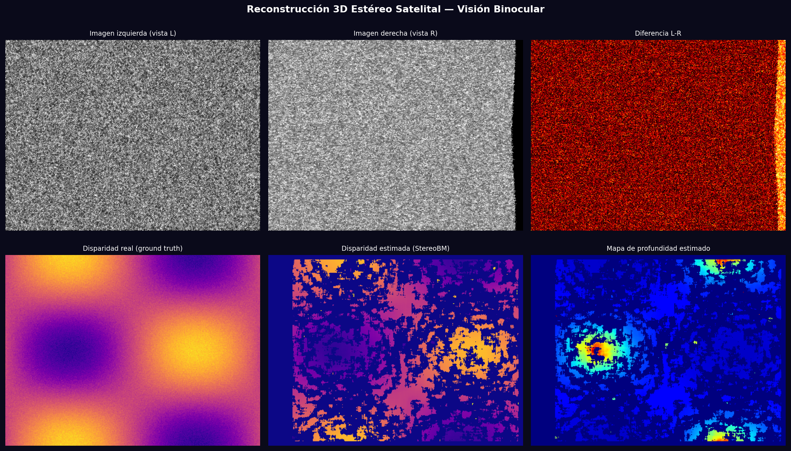
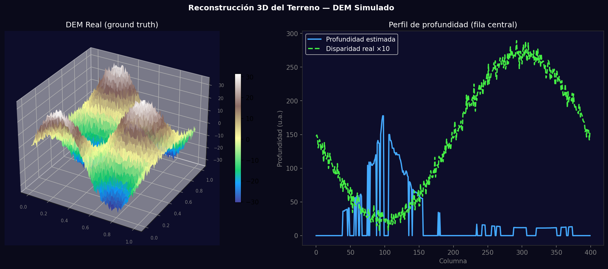

# Taller - Visión desde el Cielo: Reconstrucción 3D Estéreo Satelital

## Nombre del estudiante
Gabriel Andrés Anzola Tachak

## Fecha de entrega
`2026-05-29`

---

## Descripción breve

Simulación del pipeline de visión estéreo para generar un mapa de elevación (DEM) a partir de dos vistas de la misma escena con desplazamiento horizontal. Se usa StereoBM de OpenCV para calcular la disparidad, y se convierte a profundidad con la fórmula depth = f·B/d. Se visualiza el DEM resultante como superficie 3D.

---

## Implementaciones

### Python

**Herramientas:** `opencv-python`, `numpy`, `matplotlib`

| Función | Descripción |
|---|---|
| Par estéreo sintético | Imagen izquierda + imagen derecha desplazada por disparidad |
| `cv2.StereoBM_create()` | Block matching para estimar mapa de disparidad |
| depth = f·B/d | Conversión de disparidad a profundidad (f=focal, B=baseline) |
| `plot_surface()` | Visualización 3D del DEM estimado |

---

## Resultados visuales

### Python - Implementación


Pipeline completo: imágenes L/R, diferencia, disparidad real vs estimada, mapa de profundidad.


Superficie 3D del DEM real y perfil de profundidad estimado vs real en la fila central.

---

## Código relevante

```python
stereo = cv2.StereoBM_create(numDisparities=32, blockSize=15)
disparity = stereo.compute(left_gray, right_gray).astype(np.float32) / 16.0

# depth from disparity
focal = 300.0; baseline = 1.0
depth = focal * baseline / (disparity + 1e-8)
depth[disparity <= 0] = 0

# 3D point cloud
xx, yy = np.meshgrid(range(W), range(H))
X_3d = (xx - W/2) * depth / focal
Y_3d = (yy - H/2) * depth / focal
Z_3d = depth
```

---

## Prompts utilizados

- "Simulate stereo 3D reconstruction: generate left/right image pair from height map, compute disparity with StereoBM, convert to depth, visualize as 3D surface"

---

## Aprendizajes y dificultades

### Aprendizajes
- StereoBM funciona bien con textura; zonas homogéneas dan disparidad inválida (valor -1).
- La relación depth = f·B/d: más disparidad = más cercano; menos disparidad = más lejano.
- El baseline debe ser calibrado; errores de 1mm en B propagan error proporcional en profundidad.

### Dificultades
- Las imágenes satelitales reales requieren calibración de cámara y rectificación epipolar antes de StereoBM.

### Mejoras futuras
- Usar Semi-Global Block Matching (SGBM) para mejores resultados en zonas de poca textura.
- Agregar filtro de profundidad (WLS filter) para suavizar el mapa de disparidad.

---

## Contribuciones grupales
Taller realizado de forma individual.

---

## Estructura del proyecto

```
semana_13_4_reconstruccion_3d_estereo_satelital_opencv/
├── python/
│   ├── semana_13_4.ipynb
│   └── generate_media.py
├── media/
│   ├── stereo_reconstruction_pipeline.png
│   └── stereo_3d_terrain.png
└── README.md
```

---

## Referencias
- OpenCV stereo: https://docs.opencv.org/4.x/dd/d53/tutorial_py_depthmap.html
- Epipolar geometry: https://en.wikipedia.org/wiki/Epipolar_geometry

---

## Checklist
- [x] Carpeta con nombre semana_13_4_reconstruccion_3d_estereo_satelital_opencv
- [x] Código limpio y funcional
- [x] GIFs/imágenes en media/ con nombres descriptivos
- [x] README completo con todas las secciones
- [x] Mínimo 2 capturas/GIFs por implementación
- [x] Commits descriptivos en inglés
