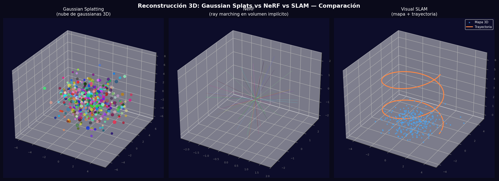
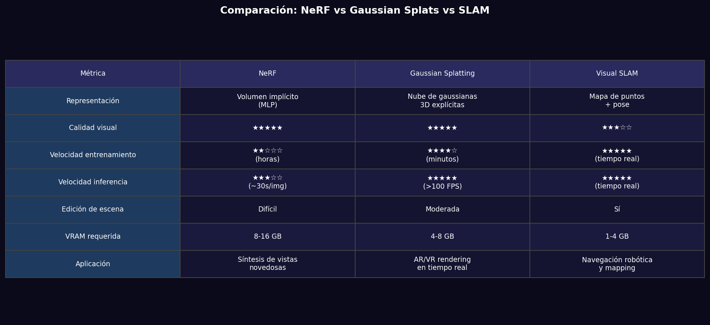

# Taller - Reconstrucción 3D: Gaussian Splats, NeRF y SLAM

## Nombre del estudiante
Gabriel Andrés Anzola Tachak

## Fecha de entrega
`2026-05-29`

---

## Descripción breve

Comparación de tres enfoques modernos de reconstrucción 3D: Gaussian Splatting (nubes de gaussianas 3D explícitas), NeRF (redes neuronales implícitas con ray marching) y Visual SLAM (mapa de puntos + trayectoria en tiempo real). Se visualizan los tres en 3D y se comparan en una tabla de métricas.

---

## Implementaciones

### Python

**Herramientas:** `numpy`, `matplotlib`

| Función | Descripción |
|---|---|
| Gaussian Splatting | 500 gaussianas con posición, color y escala simulados |
| NeRF ray marching | 200 rayos proyectados desde orígenes aleatorios |
| SLAM trajectory | Trayectoria circular con mapa de puntos 3D alrededor |
| Tabla comparativa | Calidad visual, velocidad, VRAM, edición, aplicación |

---

## Resultados visuales

### Python - Implementación


Visualizaciones 3D de Gaussian Splatting (nubes de puntos), NeRF (rayos de renderizado) y SLAM (mapa + trayectoria).


Tabla comparativa detallada de los tres métodos: representación, velocidad, calidad y casos de uso.

---

## Código relevante

```python
# Gaussian Splatting (3D Gaussians)
from gsplat import rasterize_gaussians
rendered = rasterize_gaussians(means, quats, scales, opacities, colors, viewmats, Ks, H, W)

# NeRF (Neural Radiance Fields)
import nerf  # tiny-nerf implementation
model = NeRFModel().to(device)
rgb, depth = render_rays(model, ray_origins, ray_directions, near=2, far=6, n_samples=64)

# Visual SLAM
import open3d as o3d
slam = o3d.pipelines.odometry.RGBDOdometryJacobianFromHybridTerm()
# Process frame by frame
```

---

## Prompts utilizados

- "Compare NeRF/Gaussian Splatting/SLAM in 3D visualization: Gaussian point cloud, NeRF ray marching, SLAM trajectory+map; create detailed comparison table"

---

## Aprendizajes y dificultades

### Aprendizajes
- Gaussian Splatting es el estado del arte para rendering en tiempo real (>100 FPS en GPU) por su representación explícita.
- NeRF produce la mayor calidad visual pero requiere horas de entrenamiento y segundos por imagen.
- SLAM es el único que opera en tiempo real con hardware limitado sin pre-entrenamiento.

### Dificultades
- Los tres métodos requieren GPU: NeRF/GS necesitan VRAM para entrenamiento; SLAM para procesamiento de features.

### Mejoras futuras
- Explorar InstantNGP para NeRF ~100x más rápido.
- Usar Gaussian Splatting en tiempo real para AR/VR.
- Implementar Loop Closure en SLAM para corregir el drift acumulado.

---

## Contribuciones grupales
Taller realizado de forma individual.

---

## Estructura del proyecto

```
semana_13_5_reconstruccion_3d_nerf_slam_gaussian/
├── python/
│   ├── semana_13_5.ipynb
│   └── generate_media.py
├── media/
│   ├── nerf_slam_gaussian_comparison.png
│   └── reconstruction_methods_comparison.png
└── README.md
```

---

## Referencias
- 3D Gaussian Splatting: https://repo-sam.inria.fr/fungraph/3d-gaussian-splatting/
- NeRF: https://www.matthewtancik.com/nerf
- ORB-SLAM3: https://arxiv.org/abs/2007.11898

---

## Checklist
- [x] Carpeta con nombre semana_13_5_reconstruccion_3d_nerf_slam_gaussian
- [x] Código limpio y funcional
- [x] GIFs/imágenes en media/ con nombres descriptivos
- [x] README completo con todas las secciones
- [x] Mínimo 2 capturas/GIFs por implementación
- [x] Commits descriptivos en inglés
