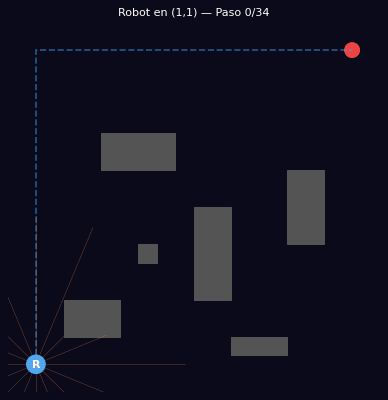
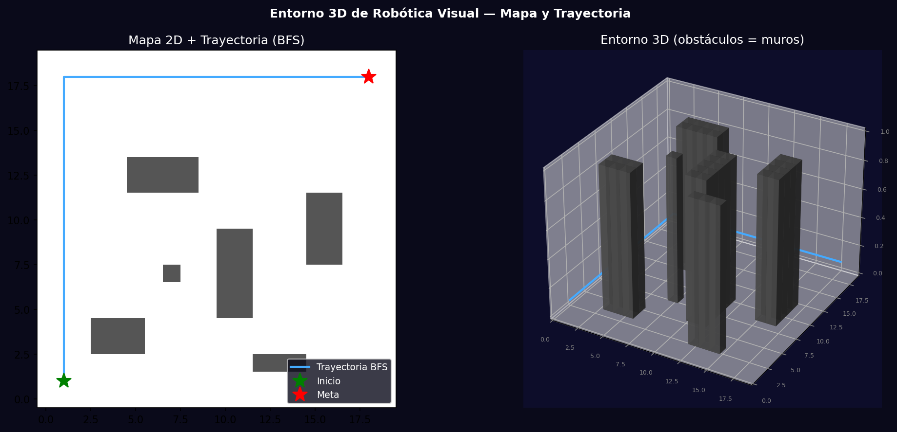

# Taller - Robótica Visual en Simulación: Navegación en Mapa 3D

## Nombre del estudiante
Gabriel Andrés Anzola Tachak

## Fecha de entrega
`2026-05-29`

---

## Descripción breve

Simulación de un robot autónomo navegando en un entorno con obstáculos usando búsqueda BFS para planificación de trayectoria y raycasting para sensores visuales. El robot recorre un mapa 20×20 con 6 grupos de obstáculos, detecta colisiones con 16 rayos y sigue el camino óptimo calculado.

---

## Implementaciones

### Python

**Herramientas:** `numpy`, `matplotlib`, `pillow`

| Función | Descripción |
|---|---|
| BFS pathfinding | Búsqueda en anchura para encontrar el camino más corto en grid |
| Raycasting 16 rayos | Simula sensores LIDAR/sonar para detección de obstáculos |
| GIF animado | 12 frames mostrando el robot avanzando por el camino |
| Visualización 3D | Grid 2D + mapa 3D con paredes como barras verticales |

---

## Resultados visuales

### Python - Implementación


Animación del robot navegando por el mapa con visualización de rayos de sensor y trayectoria.


Mapa 2D con trayectoria BFS y representación 3D del entorno con obstáculos como muros.

---

## Código relevante

```python
from collections import deque

def bfs(grid, start, goal):
    queue = deque([start])
    visited = {start: None}
    while queue:
        node = queue.popleft()
        if node == goal: break
        for dx, dy in [(0,1),(1,0),(0,-1),(-1,0)]:
            nx, ny = node[0]+dx, node[1]+dy
            if 0<=nx<W and 0<=ny<H and grid[ny,nx]==0 and (nx,ny) not in visited:
                visited[(nx,ny)] = node
                queue.append((nx,ny))
    # Reconstruct path
    path = []
    node = goal
    while node: path.append(node); node = visited.get(node)
    return list(reversed(path))

def raycast(grid, pos, angle, max_range=8):
    x, y = pos; dx, dy = np.cos(angle), np.sin(angle)
    for r in np.linspace(0, max_range, 50):
        nx, ny = int(x+dx*r), int(y+dy*r)
        if nx<0 or nx>=W or ny<0 or ny>=H or grid[ny,nx]==1: return r
    return max_range
```

---

## Prompts utilizados

- "Simulate robot navigation in 20x20 grid with BFS pathfinding, 16-ray raycasting sensors, animated GIF of robot moving along path, 3D environment visualization with obstacles"

---

## Aprendizajes y dificultades

### Aprendizajes
- BFS garantiza el camino más corto en grafos no ponderados (uniform cost).
- El raycasting es una versión simplificada de sensores LIDAR: proyecta rayos y mide distancia al primer obstáculo.
- En robotica real se usa SLAM para construir el mapa mientras navega; aquí asumimos mapa conocido.

### Dificultades
- BFS tiene complejidad O(V+E) en el grid; para mapas grandes (1000×1000) se necesita A* con heurística.

### Mejoras futuras
- Implementar A* con heurística Manhattan para navegación más eficiente.
- Agregar dinámica del robot: velocidad máxima, radio de giro.
- Usar ROS (Robot Operating System) para integración con hardware real.

---

## Contribuciones grupales
Taller realizado de forma individual.

---

## Estructura del proyecto

```
semana_13_6_robotica_visual_simulacion_mapa_3d/
├── python/
│   ├── semana_13_6.ipynb
│   └── generate_media.py
├── media/
│   ├── robot_navigation.gif
│   └── robot_3d_environment.png
└── README.md
```

---

## Referencias
- ROS: https://www.ros.org/
- BFS: https://en.wikipedia.org/wiki/Breadth-first_search
- A* pathfinding: https://en.wikipedia.org/wiki/A*_search_algorithm

---

## Checklist
- [x] Carpeta con nombre semana_13_6_robotica_visual_simulacion_mapa_3d
- [x] Código limpio y funcional
- [x] GIFs/imágenes en media/ con nombres descriptivos
- [x] README completo con todas las secciones
- [x] Mínimo 2 capturas/GIFs por implementación
- [x] Commits descriptivos en inglés
