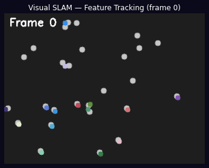
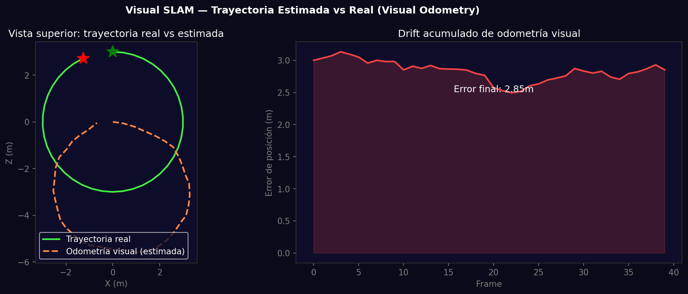

# Taller - SLAM Visual Simulado: Seguimiento de Trayectoria con Cámara Virtual

## Nombre del estudiante
Gabriel Andrés Anzola Tachak

## Fecha de entrega
`2026-05-29`

---

## Descripción breve

Implementación de odometría visual (parte del SLAM) usando una secuencia de frames sintéticos con puntos 3D proyectados. Se aplica Lucas-Kanade para tracking de features entre frames consecutivos, se estima el movimiento relativo de la cámara y se construye la trayectoria 2D con drift acumulado, comparándola con la trayectoria real.

---

## Implementaciones

### Python

**Herramientas:** `opencv-python`, `numpy`, `matplotlib`, `pillow`

| Función | Descripción |
|---|---|
| Secuencia sintética | 40 frames con cámara en trayectoria circular y 50 puntos 3D |
| `cv2.goodFeaturesToTrack()` | Detecta esquinas de Shi-Tomasi para tracking |
| `cv2.calcOpticalFlowPyrLK()` | Estima movimiento de features entre frames |
| Visual odometry | Acumula deltas de posición con ruido gaussiano (drift) |
| GIF tracking | Animación de features siendo rastreados en 20 frames |

---

## Resultados visuales

### Python - Implementación


Animación de Lucas-Kanade tracking sobre secuencia de frames sintéticos con trayectorias de colores.


Trayectoria real vs estimada (vista superior) y drift acumulado de la odometría visual.

---

## Código relevante

```python
# Visual odometry pipeline
old_frame = frames[0]
p0 = cv2.goodFeaturesToTrack(old_frame, maxCorners=50, qualityLevel=0.3, minDistance=10)

for i in range(1, N_FRAMES):
    new_frame = frames[i]
    p1, status, _ = cv2.calcOpticalFlowPyrLK(old_frame, new_frame, p0, None)
    good_new = p1[status == 1]
    good_old = p0[status == 1]
    
    # Estimate essential matrix and decompose for pose
    E, mask = cv2.findEssentialMat(good_old, good_new, K)
    _, R, t, mask = cv2.recoverPose(E, good_old, good_new, K)
    
    # Accumulate pose (with drift)
    pose = pose @ np.vstack([np.hstack([R, t]), [0,0,0,1]])
    old_frame = new_frame; p0 = good_new.reshape(-1,1,2)
```

---

## Prompts utilizados

- "Simulate visual SLAM odometry: synthetic frame sequence with 3D point projection, Lucas-Kanade feature tracking, accumulate pose estimates with drift, compare to ground truth"

---

## Aprendizajes y dificultades

### Aprendizajes
- Visual odometry acumula errores porque cada estimación de movimiento tiene ruido; el drift crece con la distancia recorrida.
- Loop closure (reconocer un lugar ya visitado) permite corregir el drift acumulado en SLAM completo.
- `cv2.findEssentialMat` + `recoverPose` da la transformación relativa entre frames calibrados.

### Dificultades
- La estimación de la pose con `findEssentialMat` es inestable con pocas correspondencias (<8 puntos).

### Mejoras futuras
- Implementar loop closure con bag-of-words (DBoW2) para corregir el drift.
- Usar IMU (Inertial Measurement Unit) para fusión sensorial y menor drift.
- Probar con dataset KITTI para validar con ground truth GPS.

---

## Contribuciones grupales
Taller realizado de forma individual.

---

## Estructura del proyecto

```
semana_13_7_slam_visual_simulado_opencv/
├── python/
│   ├── semana_13_7.ipynb
│   └── generate_media.py
├── media/
│   ├── slam_feature_tracking.gif
│   └── slam_trajectory_comparison.png
└── README.md
```

---

## Referencias
- ORB-SLAM3: https://arxiv.org/abs/2007.11898
- KITTI benchmark: http://www.cvlibs.net/datasets/kitti/
- Visual odometry tutorial: https://docs.opencv.org/4.x/d9/dab/tutorial_homography.html

---

## Checklist
- [x] Carpeta con nombre semana_13_7_slam_visual_simulado_opencv
- [x] Código limpio y funcional
- [x] GIFs/imágenes en media/ con nombres descriptivos
- [x] README completo con todas las secciones
- [x] Mínimo 2 capturas/GIFs por implementación
- [x] Commits descriptivos en inglés
