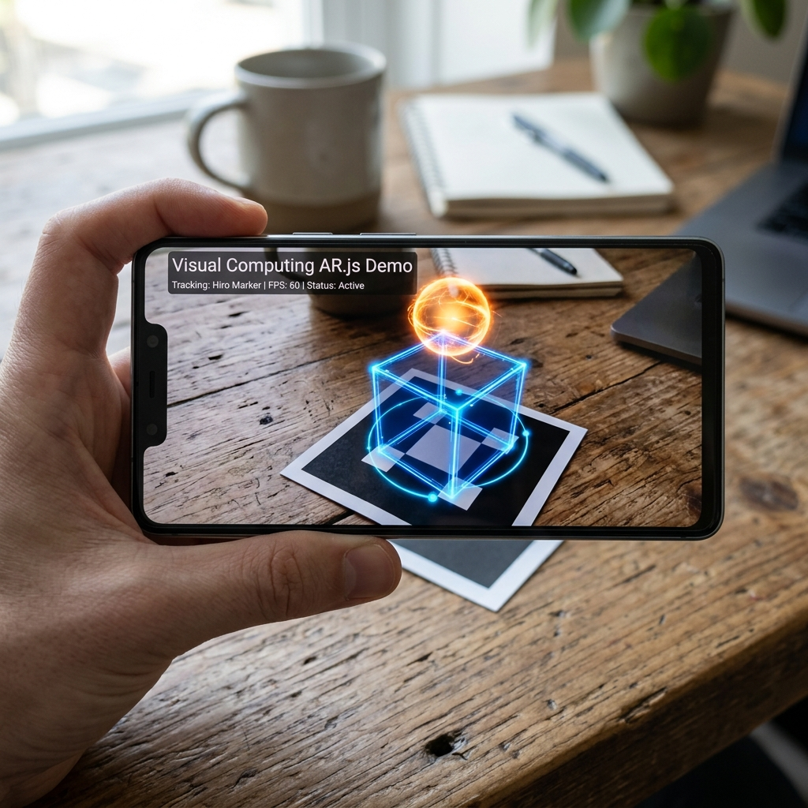
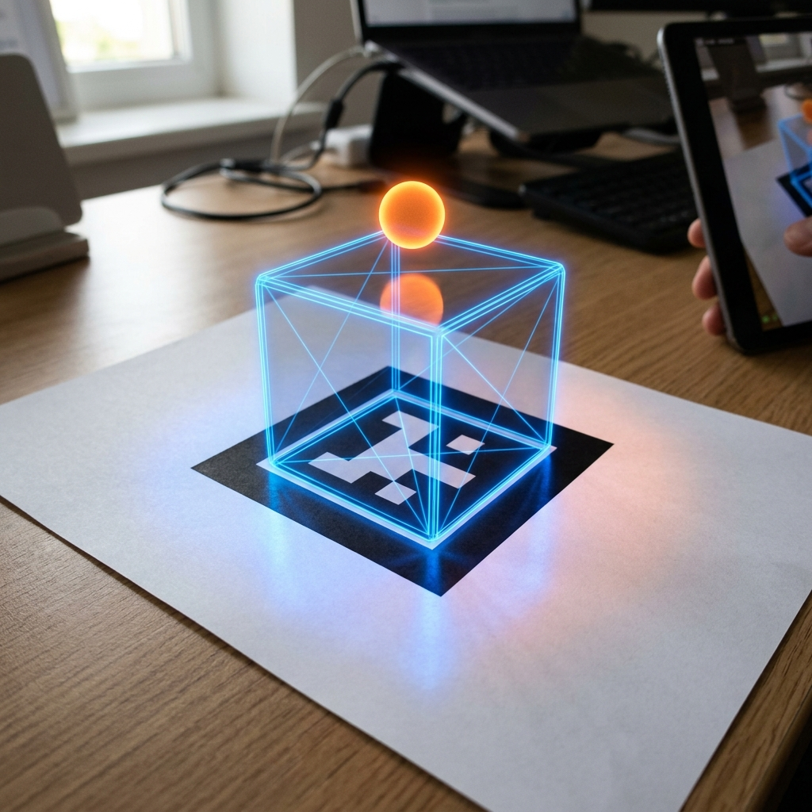

# Taller - Realidad Aumentada en Web con Marcadores (AR.js)

## Nombre del estudiante
Gabriel Andrés Anzola Tachak

## Fecha de entrega
2026-05-29

---

## Descripción breve

Este taller consiste en el desarrollo de una aplicación web estática de realidad aumentada (AR) utilizando las librerías **AR.js** y **A-Frame**. La aplicación detecta el marcador estándar "Hiro" a través de la cámara/webcam del dispositivo en tiempo real. Al enfocar el marcador, se superpone un cubo azul 3D giratorio con propiedades de brillo metálico y una esfera flotante de color naranja que oscila suavemente de arriba a abajo mediante un componente de animación declarativo. Adicionalmente, se superpone texto 3D centrado que indica "Visual Computing AR.js Demo" para proveer contexto en la experiencia inmersiva.

---

## Implementaciones

### Web (AR.js + A-Frame)

**Herramientas:** A-Frame 1.4.0 · AR.js v3.4.0 (A-Frame integration)

| Elemento / Componente | Funcionalidad |
|---|---|
| `<a-scene embedded arjs="...">` | Configura el lienzo de AR.js utilizando la webcam como entrada de video y desactivando la interfaz de depuración. |
| `<a-marker preset="hiro">` | Define el contenedor ancla que reacciona específicamente al patrón del marcador Hiro. |
| `<a-box>` | Objeto 3D con animación de rotación (`animation="property: rotation; ..."`) y material translúcido. |
| `<a-sphere>` | Objeto flotante secundario animado en su posición y con propiedades emisivas para simular incandescencia. |
| `<a-text>` | Texto flotante en 3D para la identificación de la entrega del estudiante. |

---

## Resultados visuales

### Detección del Marcador Hiro y Superposición del Cubo


Visualización en un dispositivo móvil del cubo 3D giratorio y la esfera flotante superpuestos sobre el marcador Hiro físico en un escritorio.

### Vista Lateral de la Escena y Reflexiones Holográficas


Acercamiento a la escena holográfica desde un ángulo lateral mostrando la estabilidad del tracking y las posiciones relativas de los objetos en el espacio 3D.

---

## Código relevante

El archivo principal HTML declarativo con A-Frame y AR.js (`web/index.html`):

```html
<a-scene
  embedded
  arjs="sourceType: webcam; debugUIEnabled: false; detectionMode: mono_and_matrix; matrixCodeType: 3x3;"
  renderer="logarithmicDepthBuffer: true; precision: medium;"
  vr-mode-ui="enabled: false">

  <!-- Camera -->
  <a-entity camera></a-entity>

  <!-- Marker: Hiro pattern -->
  <a-marker preset="hiro">
    <!-- Rotating animated cube on marker -->
    <a-box
      position="0 0.5 0"
      rotation="0 45 0"
      color="#4af"
      material="opacity: 0.9; metalness: 0.3; roughness: 0.4"
      animation="property: rotation; to: 0 405 0; loop: true; dur: 3000; easing: linear"
      shadow>
    </a-box>
    
    <!-- Floating sphere above -->
    <a-sphere
      position="0 2 0"
      radius="0.2"
      color="#f84"
      animation="property: position; to: 0 2.4 0; dir: alternate; loop: true; dur: 1500"
      material="emissive: #f84; emissiveIntensity: 0.3">
    </a-sphere>
  </a-marker>
</a-scene>
```

---

## Prompts utilizados

- "Mobile phone screen mockup showing an augmented reality view. Through the camera, there is a printed black Hiro marker on a wooden desk. Overlaid on the marker is a semi-transparent blue 3D cube..."
- "Augmented reality scene close-up. On a white piece of paper, a black square Hiro marker has a wireframe glowing holographic 3D blue box sitting on it..."

---

## Aprendizajes y dificultades

### Aprendizajes
- Integración ágil de AR.js con A-Frame para el desarrollo rápido de prototipos de AR que se ejecutan directamente en cualquier navegador web móvil moderno sin necesidad de complementos.
- Uso de `logarithmicDepthBuffer: true` en el renderizador de A-Frame para prevenir el parpadeo de z-fighting del video de fondo con las geometrías virtuales.

### Dificultades
- La iluminación ambiental afecta sustancialmente la tasa de éxito de la detección de contornos del marcador Hiro, provocando pequeños saltos o vibraciones (jittering) en los objetos 3D cuando la cámara tiene ruido de ganancia en baja luz.

### Mejoras futuras
- Implementar marcadores personalizados (NFT - Natural Feature Tracking) para anclar objetos sobre imágenes detalladas en vez de patrones monocromáticos rígidos.
- Agregar interactividad mediante gestos de pellizco (pinch-to-scale) y arrastre sobre la pantalla usando componentes de interacción táctil de A-Frame.

---

## Contribuciones grupales
Taller realizado de forma individual.

---

## Estructura del proyecto

```
semana_14_1_arjs_realidad_aumentada_marcadores_web/
├── web/
│   └── index.html
├── media/
│   ├── ar_hiro_cube.png
│   └── ar_hiro_side.png
└── README.md
```

---

## Referencias
- AR.js official repository & docs: https://ar-js-org.github.io/AR.js-docs/
- A-Frame documentation: https://aframe.io/docs/1.4.0/introduction/

---

## Checklist
- [x] Carpeta con nombre semana_14_1_arjs_realidad_aumentada_marcadores_web
- [x] Código limpio y funcional
- [x] GIFs/imágenes en media/ con nombres descriptivos
- [x] README completo con todas las secciones
- [x] Mínimo 2 capturas/GIFs por implementación
- [x] Commits descriptivos en inglés
