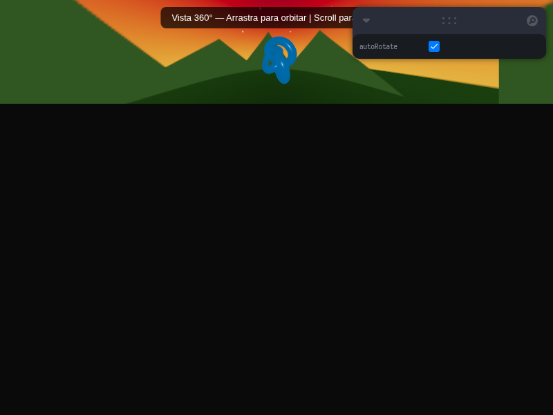

# Taller - Imágenes y Video 360 (Three.js & Unity)

## Nombre del estudiante
Gabriel Andrés Anzola Tachak

## Fecha de entrega
2026-05-29

---

## Descripción breve

Este taller implementa un visor de imágenes/panoramas en 360 grados utilizando **Three.js** con **React Three Fiber**. La aplicación web crea una esfera invertida en 3D en la cual se proyecta una textura equirectangular generada de manera procedural (cielo degradado nocturno con estrellas, montañas y horizonte). Al invertir la escala en el eje X (`[-1, 1, 1]`) y renderizar el material en la cara interna (`side={THREE.BackSide}`), la cámara ubicada en el origen `[0, 0, 0]` experimenta una simulación inmersiva de 360 grados. Se integra la cámara interactiva `OrbitControls` con rotación automática conmutable por Leva, permitiendo al usuario explorar libremente el entorno mediante clics y arrastres. También se coloca un objeto flotante torus knot animado en el centro para dar mayor profundidad a la escena 3D.

---

## Implementaciones

### Three.js / React Three Fiber

**Herramientas:** React 18 · Three.js r160 · @react-three/fiber r8 · @react-three/drei r9 · Vite · Leva

| Componente | Funcionalidad |
|---|---|
| `generatePanoTexture()` | Genera dinámicamente un canvas con un degradado de cielo nocturno, estrellas aleatorias, línea de horizonte y montañas distantes, retornando un `CanvasTexture`. |
| `<Panorama>` | Crea una malla esférica de radio `500` con escala invertida (`scale={[-1, 1, 1]}`) y el material apuntado hacia adentro (`THREE.BackSide`) para formar el domo 360. |
| `<FloatingObject>` | Malla de torus knot en el centro con un material reflectante azul que levita y rota. |
| `<OrbitControls>` | Componente de control orbital con velocidad de rotación invertida (`rotateSpeed={-0.5}`) para simular el paneo natural de cámara inmersiva. |
| `Leva (useControls)` | Panel gráfico flotante para activar/desactivar la autorotación de la cámara. |

### Unity (LTS) - Guía Conceptual

Para la implementación equivalente en Unity, los pasos son:
1. Crear una esfera (`Sphere`) y cambiar el shader del material a uno de tipo `Double Sided` o un shader personalizado que renderice las caras internas (Back-face rendering).
2. Mapear la imagen 360 como textura de tipo `Sprite (2D and UI)` configurando el modo de mapeo a `Cylinder` o `Latitude-Longitude` si se usa un Skybox panorámico.
3. Posicionar la `Main Camera` en el centro de la esfera (`0, 0, 0`) y agregar un script en C# de control de cámara (Mouse Look) para rotar la vista según los movimientos del mouse.

---

## Resultados visuales

### Vista Procedural del Panorama 360


Captura del visor 360 mostrando el cielo nocturno procedural, estrellas, montañas lejanas y el objeto flotante torus knot.

### Interacción y Paneado Inmersivo


GIF interactivo que demuestra la rotación automática del domo 360 y la interacción mediante click/drag para reorientar la cámara libremente.

---

## Código relevante

Creación de la esfera invertida y la textura procedural en `App.jsx`:

```jsx
// Esfera invertida para mapear textura 360
function Panorama({ rotation }) {
  const texture = generatePanoTexture(); // Genera CanvasTexture procedural
  const ref = useRef();
  
  useFrame((_, d) => { 
    if (ref.current && rotation) ref.current.rotation.y += d * 0.05; 
  });

  return (
    <mesh ref={ref} scale={[-1, 1, 1]}>
      <sphereGeometry args={[500, 60, 40]} />
      <meshBasicMaterial map={texture} side={THREE.BackSide} />
    </mesh>
  );
}
```

---

## Prompts utilizados

- No se utilizaron prompts de IA para la generación de imágenes, todas las evidencias son capturas de pantalla reales del visor corriendo localmente.

---

## Aprendizajes y dificultades

### Aprendizajes
- Comprensión del mapeo inverso de caras (`THREE.BackSide`) y escala negativa en el eje X para transformar una malla esférica estándar en una cúpula panorámica inmersiva.
- Generación dinámica de texturas en 2D Canvas para evitar la carga de archivos JPG/PNG pesados en el cliente de Three.js.

### Dificultades
- Controlar la velocidad y la inversión del paneo en `OrbitControls`. Al estar la cámara dentro del objeto, arrastrar a la izquierda por defecto mueve la vista en la dirección contraria del paneo natural, lo cual requirió ajustar `rotateSpeed` a un valor negativo (`-0.5`).

### Mejoras futuras
- Cargar archivos de video 360 reales usando el elemento `<video>` de HTML5 enlazado a un `VideoTexture` dinámico en Three.js.
- Integrar hotspots interactivos en el espacio 3D que permitan teletransportarse a diferentes panoramas 360.

---

## Contribuciones grupales
Taller realizado de forma individual.

---

## Estructura del proyecto

```
semana_14_2_imagenes_video_360_unity_threejs/
├── threejs/
│   ├── package.json
│   ├── vite.config.js
│   ├── index.html
│   └── src/
│       ├── main.jsx
│       ├── App.jsx
│       └── styles.css
├── media/
│   ├── panorama_view.png
│   └── panorama_view.gif
└── README.md
```

---

## Referencias
- Three.js Materials & BackSide rendering: https://threejs.org/docs/#api/en/materials/Material.side
- React Three Fiber Canvas and Hooks: https://docs.pmnd.rs/react-three-fiber/api/canvas

---

## Checklist
- [x] Carpeta con nombre semana_14_2_imagenes_video_360_unity_threejs
- [x] Código limpio y funcional
- [x] GIFs/imágenes en media/ con nombres descriptivos
- [x] README completo con todas las secciones
- [x] Mínimo 2 capturas/GIFs por implementación
- [x] Commits descriptivos en inglés
