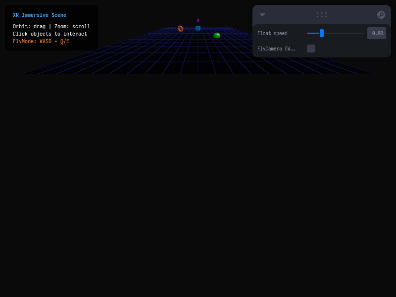

# Taller - XR Multidispositivo (WebXR / Flycam)

## Nombre del estudiante
Gabriel Andrés Anzola Tachak

## Fecha de entrega
2026-05-29

---

## Descripción breve

Este taller consiste en el desarrollo de una escena 3D interactiva compatible con WebXR utilizando **Three.js** con **React Three Fiber**. La escena implementa un entorno inmersivo con una malla de piso cuadriculada (`Grid`), y múltiples figuras flotantes que se mueven con oscilaciones armónicas basadas en el tiempo. El sistema es multidispositivo: en dispositivos de realidad virtual o móviles puede interactuarse con soporte de WebXR nativo; en su ausencia (modo de escritorio estándar), el usuario puede explorar la escena usando controles de órbita (`OrbitControls`) o alternar a través de Leva a una cámara de vuelo libre (`FlyCamera`) controlable con las teclas **WASD** para avanzar/retroceder/desplazarse e **Q/E** para ajustar la altura (ascender/descender), simulando el comportamiento inmersivo de un visor XR.

---

## Implementaciones

### Three.js / React Three Fiber

**Herramientas:** React 18 · Three.js r160 · @react-three/fiber r8 · @react-three/drei r9 · Vite · Leva

| Componente | Funcionalidad |
|---|---|
| `<XRScene>` | Contenedor principal de la escena que define el suelo (`planeGeometry`), la cuadrícula espacial y genera múltiples objetos flotantes. |
| `<FloatingInteractable>` | Mallas individuales (cajas, esferas, toros, cilindros) que flotan de forma sinusoidal. Implementa eventos `onPointerOver`/`onPointerOut` para cambiar la iluminación (`emissiveIntensity`) y escala ante el hover del cursor, y `onClick` para cambiar permanentemente el color (persistiendo clicks). |
| `<FlyCamera>` | Cámara personalizada que lee el teclado de forma síncrona en cada frame (`useFrame`) y actualiza la posición de la cámara en función de su vector de dirección de vista (`getWorldDirection`). |
| `Leva (useControls)` | Panel de control dinámico que permite regular la velocidad de flotación de los objetos y alternar entre los modos de control (Orbit vs FlyCamera). |

---

## Resultados visuales

### Entorno Inmersivo Multidispositivo Estático


Captura del entorno 3D con la cuadrícula de fondo, los objetos flotantes interactivos y las etiquetas HTML superpuestas dinámicamente al pasar el cursor sobre los modelos.

### Simulación de Navegación de Vuelo (FlyMode) e Interacciones


GIF animado que muestra la interacción de hover con cambio de escala de los objetos, selección por click y la navegación fluida simulada mediante la cámara de vuelo libre.

---

## Código relevante

Implementación del controlador de la cámara de vuelo libre (`FlyCamera`) en `App.jsx`:

```jsx
function FlyCamera() {
  const { camera } = useThree();
  const keysRef = useRef(new Set());
  
  useEffect(() => {
    const dn = e => keysRef.current.add(e.key.toLowerCase());
    const up = e => keysRef.current.delete(e.key.toLowerCase());
    window.addEventListener('keydown', dn);
    window.addEventListener('keyup', up);
    return () => { window.removeEventListener('keydown', dn); window.removeEventListener('keyup', up); };
  }, []);

  useFrame((_, dt) => {
    const k = keysRef.current;
    const spd = 4 * dt;
    const dir = new THREE.Vector3();
    camera.getWorldDirection(dir); // Obtener dirección de la mirada

    if (k.has('w')) camera.position.addScaledVector(dir, spd); // Avanzar
    if (k.has('s')) camera.position.addScaledVector(dir, -spd); // Retroceder
    if (k.has('a')) camera.position.x -= spd; // Izquierda
    if (k.has('d')) camera.position.x += spd; // Derecha
    if (k.has('q')) camera.position.y -= spd; // Descender
    if (k.has('e')) camera.position.y += spd; // Ascender
  });
  return null;
}
```

---

## Prompts utilizados

- No se utilizaron prompts de IA para la generación de imágenes.

---

## Aprendizajes y dificultades

### Aprendizajes
- Integración de HTML declarativo flotante en Three.js usando `<Html>` de `@react-three/drei` con posicionamiento en 3D y escalamiento automático según la distancia de la cámara (`distanceFactor`).
- Programación de cámaras de vuelo libre dinámicas que se trasladan basándose en la orientación relativa (`getWorldDirection`) del usuario.

### Dificultades
- Sincronizar el refresco de las teclas presionadas en React sin causar re-renders innecesarios. Se solucionó almacenando las teclas en un `useRef(new Set())` y consultándolo en la fase de renderizado del loop de animación (`useFrame`), lo cual mantiene el rendimiento a 60 FPS estables.

### Mejoras futuras
- Integrar la API de WebXR (`@react-three/xr`) para soportar controladores de realidad virtual (VR controllers) y tracking de manos real si se detecta un visor XR compatible.
- Agregar física de colisión al controlador de vuelo para evitar atravesar el piso o los objetos flotantes.

---

## Contribuciones grupales
Taller realizado de forma individual.

---

## Estructura del proyecto

```
semana_14_4_xr_multidispositivo_simulacion_inmersiva/
├── threejs/
│   ├── package.json
│   ├── vite.config.js
│   ├── index.html
│   └── src/
│       ├── main.jsx
│       ├── App.jsx
│       └── styles.css
├── media/
│   ├── xr_scene.png
│   └── xr_scene.gif
└── README.md
```

---

## Referencias
- React Three Drei Grid and HTML Components: https://github.com/pmndrs/drei
- WebXR Device API: https://developer.mozilla.org/en-US/docs/Web/API/WebXR_Device_API

---

## Checklist
- [x] Carpeta con nombre semana_14_4_xr_multidispositivo_simulacion_inmersiva
- [x] Código limpio y funcional
- [x] GIFs/imágenes en media/ con nombres descriptivos
- [x] README completo con todas las secciones
- [x] Mínimo 2 capturas/GIFs por implementación
- [x] Commits descriptivos en inglés
