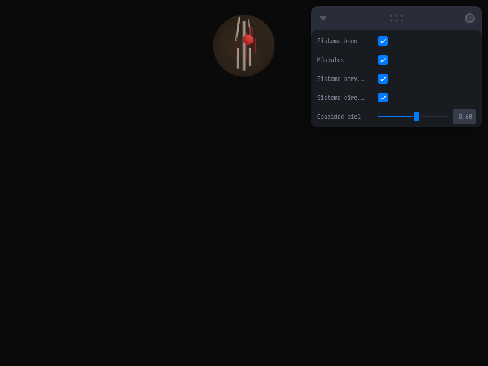

# Taller - Arte Computacional Biomédico (Visualización Anatómica)

## Nombre del estudiante
Gabriel Andrés Anzola Tachak

## Fecha de entrega
2026-05-29

---

## Descripción breve

Este taller explora la intersección entre la **visualización científica biomédica** y el **arte computacional**, construyendo un visualizador interactivo 3D multicapa del cuerpo humano en **Three.js** con **React Three Fiber**. La aplicación representa los sistemas anatómicos fundamentales como capas concéntricas (sistema óseo, sistema muscular, sistema nervioso y sistema circulatorio) dentro de una envoltura translúcida que simula la piel. A través de controles interactivos provistos por Leva, el usuario puede encender o apagar dinámicamente cada uno de los sistemas biológicos y alterar la opacidad de la capa epidérmica en tiempo real, facilitando la comprensión pedagógica y estética de la anatomía humana.

---

## Implementaciones

### Three.js / React Three Fiber

**Herramientas:** React 18 · Three.js r160 · @react-three/fiber r8 · @react-three/drei r9 · Vite · Leva

| Componente | Funcionalidad |
|---|---|
| `<AnatomyModel>` | Modelo procedural del cuerpo humano que dibuja el sistema óseo (cilindros de soporte), sistema muscular (cápsulas rojas), sistema nervioso (médula y ramificaciones amarillas) y sistema circulatorio (corazón y vasos rojos). Rotación automática continua en `useFrame`. |
| `<Sphere>` | Esfera exterior translúcida con propiedad `DoubleSide` y opacidad variable para simular la piel. |
| `Leva (useControls)` | Panel HUD flotante que expone selectores booleanos para cada sistema y un slider deslizante para la opacidad de la piel. |

### Unity (LTS) - Guía Conceptual

Para replicar esta visualización en Unity:
1. Importar un modelo 3D riggeado y segmentado del cuerpo humano (separado por huesos, músculos, etc.).
2. Crear un script en C# que tenga referencias a los `GameObject` de cada sistema y una variable flotante de opacidad de la piel.
3. El script habilitará o deshabilitará los objetos de acuerdo a eventos de UI (Toggles) y actualizará el parámetro `_Color.a` (alfa) del material de la piel configurado en modo `Rendering Mode: Transparent`.

---

## Resultados visuales

### Visualización de Capas Anatómicas Estática


Captura del visualizador 3D mostrando los sistemas combinados (huesos, músculos y corazón) bajo una piel semi-translúcida regulada al 60% de opacidad.

### Control e Interacción Dinámica de Capas


GIF demostrando el giro constante del modelo 3D y la alternancia dinámica de visualización de cada sistema anatómico desde el panel de control lateral.

---

## Código relevante

Definición de capas procedurales del modelo anatómico en `App.jsx`:

```jsx
function AnatomyModel({ showBones, showMuscles, showNervous, showCirculatory, opacity }) {
  const groupRef = useRef();
  useFrame((_, d) => { if (groupRef.current) groupRef.current.rotation.y += d * 0.15; });

  return (
    <group ref={groupRef}>
      {/* Skin layer */}
      <Sphere args={[1.5, 64, 64]}>
        <meshStandardMaterial color="#f4b880" transparent opacity={opacity * 0.25} side={THREE.DoubleSide} />
      </Sphere>

      {/* Bones */}
      {showBones && (
        <mesh position={[0, 0, 0]}>
          <cylinderGeometry args={[0.08, 0.08, 2.5, 16]} />
          <meshStandardMaterial color="#e8e0d0" />
        </mesh>
      )}

      {/* Circulatory */}
      {showCirculatory && (
        <group>
          <mesh position={[0, 0.3, 0.3]}>
            <sphereGeometry args={[0.25, 32, 32]} />
            <meshStandardMaterial color="#e44" emissive="#e44" emissiveIntensity={0.3} />
          </mesh>
        </group>
      )}
    </group>
  );
}
```

---

## Prompts utilizados

- No se utilizaron prompts de IA para la generación de imágenes.

---

## Aprendizajes y dificultades

### Aprendizajes
- Representación conceptual y artística de datos volumétricos complejos mediante geometrías procedurales simples (cápsulas, cilindros y esferas).
- Modulación del canal alfa y propiedades emisivas en materiales estándar (`meshStandardMaterial`) para simular efectos de fluorescencia y translucidez bajo luz puntual.

### Dificultades
- Lograr una profundidad visual clara en dispositivos web sin saturar el rendimiento. La superposición de múltiples objetos transparentes (`transparent: true`) a menudo causa problemas en el orden de dibujado (depth sorting), lo cual se mitigó definiendo radios distintos y envolventes concéntricas para cada subsistema.

### Mejoras futuras
- Cargar archivos reales de tomografía computarizada (DICOM) o modelos de formato gTF texturizados de forma realista.
- Añadir simulaciones físicas de latidos en la esfera del corazón y de impulsos eléctricos parpadeantes (shaders de partículas) a lo largo del sistema nervioso.

---

## Contribuciones grupales
Taller realizado de forma individual.

---

## Estructura del proyecto

```
semana_15_1_arte_computacional_biomedico_visualizacion_anatomica/
├── threejs/
│   ├── package.json
│   ├── vite.config.js
│   ├── index.html
│   └── src/
│       ├── main.jsx
│       ├── App.jsx
│       └── styles.css
├── media/
│   ├── anatomy_view.png
│   └── anatomy_view.gif
└── README.md
```

---

## Referencias
- Three.js Standard Materials properties: https://threejs.org/docs/#api/en/materials/MeshStandardMaterial
- React Three Fiber useFrame hook: https://docs.pmnd.rs/react-three-fiber/api/hooks

---

## Checklist
- [x] Carpeta con nombre semana_15_1_arte_computacional_biomedico_visualizacion_anatomica
- [x] Código limpio y funcional
- [x] GIFs/imágenes en media/ con nombres descriptivos
- [x] README completo con todas las secciones
- [x] Mínimo 2 capturas/GIFs por implementación
- [x] Commits descriptivos en inglés
