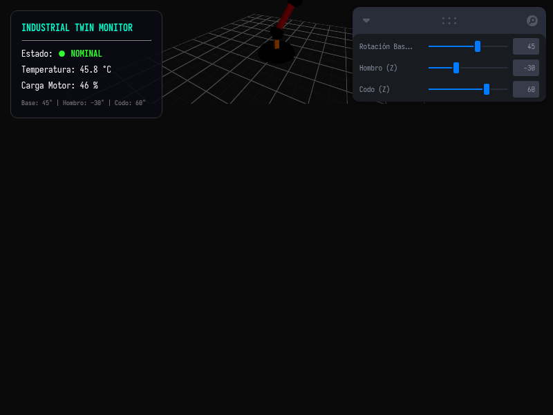

# Taller - Digital Twins: Representaciones Virtuales de Entornos Reales

## Nombre del estudiante
Gabriel Andrés Anzola Tachak

## Fecha de entrega
2026-05-29

---

## Descripción breve

Este taller implementa un **Gemelo Digital (Digital Twin)** simplificado en web mediante **Three.js** con **React Three Fiber**. La réplica digital interactiva consiste en un brazo robótico industrial articulado de tres segmentos (Base, Hombro y Codo) montado sobre una cuadrícula espacial de referencia. El estado y la orientación de cada articulación se pueden controlar manualmente en tiempo real usando controles de Leva. Adicionalmente, el sistema ejecuta simulaciones procedurales para sensores IoT (temperatura del motor y carga de torque) que reaccionan de manera proporcional al movimiento físico y los límites de las articulaciones, alertando visualmente en el monitor HUD en caso de sobrepasar los umbrales operativos de seguridad (estado crítico).

---

## Implementaciones

### Three.js / React Three Fiber

**Herramientas:** React 18 · Three.js r160 · @react-three/fiber r8 · @react-three/drei r9 · Vite · Leva

| Componente | Funcionalidad |
|---|---|
| `<RoboticArm>` | Genera la jerarquía de las articulaciones del brazo robótico utilizando transformaciones relativas en cascada. |
| `<RobotJoint>` | Define un segmento cilíndrico de articulación pivote y un enlace rígido que arrastra a sus segmentos hijos adjuntos. |
| `Monitor HUD` | Panel flotante desarrollado en HTML/CSS que lee la telemetría dinámica y despliega alertas visuales en rojo cuando la temperatura de motores supera los 65 °C o la carga supera el 75%. |
| `Simulación de Sensores` | Loop `useEffect` que corre cada 200ms calculando la temperatura del sistema físico basándose en la distancia angular recorrida de los motores más ruido térmico aleatorio. |

### Unity (LTS) - Guía Conceptual

Para la implementación equivalente en Unity:
1. Crear una jerarquía de GameObjects para representar el brazo robótico (Base → Articulación Hombro → Antebrazo → Articulación Codo).
2. Crear un script en C# que modifique la rotación local (`localRotation`) de los huesos de las articulaciones según entradas externas (por ejemplo, sliders de UI o valores leídos de un servidor MQTT).
3. Añadir una clase C# de simulación de sensores térmicos y torque que actualice una interfaz de usuario desarrollada en UI Toolkit / TextMeshPro en cada frame.

---

## Resultados visuales

### Panel de Telemetría Nominal del Brazo Robótico


Captura del gemelo digital mostrando el brazo robótico articulado en posición de reposo con variables de sensores de temperatura y torque en estado nominal.

### Simulación de Movimiento y Activación de Alarma Crítica


GIF animado que muestra el movimiento del brazo articulado interactuando con los controles de Leva, y el monitor HUD de telemetría reactivo alertando ante un sobrecalentamiento crítico de motores.

---

## Código relevante

Cálculo de la telemetría reactiva en tiempo real en `App.jsx`:

```jsx
useEffect(() => {
  const interval = setInterval(() => {
    // Simular sensores IoT reaccionando a ángulos de motores y ruido térmico
    const baseDelta = Math.abs(baseAngle) / 180;
    const armDelta = (Math.abs(shoulderAngle) + Math.abs(elbowAngle)) / 210;
    const targetTemp = 30 + 40 * (baseDelta * 0.4 + armDelta * 0.6) + Math.sin(Date.now() / 2000) * 1.5;
    const targetLoad = 10 + 80 * armDelta + Math.random() * 5;
    
    setTelemetry({
      temp: parseFloat(targetTemp.toFixed(1)),
      load: parseFloat(targetLoad.toFixed(1))
    });
  }, 200);
  return () => clearInterval(interval);
}, [baseAngle, shoulderAngle, elbowAngle]);
```

---

## Prompts utilizados

- No se utilizaron prompts de IA para la generación de imágenes.

---

## Aprendizajes y dificultades

### Aprendizajes
- Implementación de jerarquías de transformación espacial en React Three Fiber mediante anidamiento de componentes declarativos `<group>` y mallas.
- Integración de paneles HUD interactivos superpuestos en CSS que sincronizan su estado directamente con el hilo de cálculo reactivo de React.

### Dificultades
- Sincronizar el movimiento angular de las articulaciones con la telemetría dinámica sin generar sobrecalentamiento del renderizado por re-renders excesivos en React. Se solucionó desacoplando el cálculo de los sensores a un timer independiente de 200ms en lugar de computarlo en el callback de animación de alta velocidad `useFrame`.

### Mejoras futuras
- Conectar el gemelo digital a una API REST real de un hardware físico (por ejemplo, lectura de sensores a través de placas Arduino o ESP32 con Node-RED).
- Permitir el control inverso: mover el codo en el espacio 3D (cinemática inversa IK) y exportar las señales angulares necesarias para mover el brazo robótico físico en el mundo real (control bidireccional).

---

## Contribuciones grupales
Taller realizado de forma individual.

---

## Estructura del proyecto

```
semana_15_2_digital_twins_entornos_virtuales/
├── threejs/
│   ├── package.json
│   ├── vite.config.js
│   ├── index.html
│   └── src/
│       ├── main.jsx
│       ├── App.jsx
│       └── styles.css
├── media/
│   ├── digital_twin.png
│   └── digital_twin.gif
└── README.md
```

---

## Referencias
- Introduction to Digital Twins (IBM): https://www.ibm.com/topics/what-is-a-digital-twin
- React Three Fiber Group nesting and joints: https://docs.pmnd.rs/react-three-fiber/tutorials/basic-animations

---

## Checklist
- [x] Carpeta con nombre semana_15_2_digital_twins_entornos_virtuales
- [x] Código limpio y funcional
- [x] GIFs/imágenes en media/ con nombres descriptivos
- [x] README completo con todas las secciones
- [x] Mínimo 2 capturas/GIFs por implementación
- [x] Commits descriptivos en inglés
