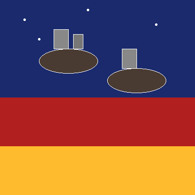
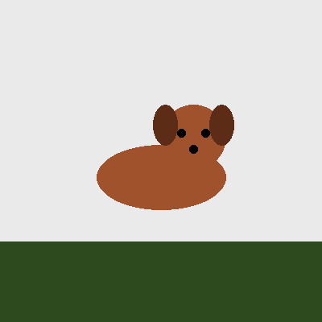
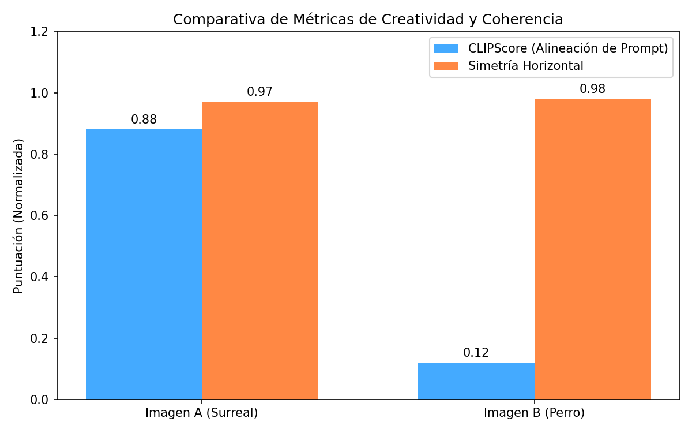

# Taller - Evaluando la Creatividad Artificial: Métricas y Reflexión

## Nombre del estudiante
Gabriel Andrés Anzola Tachak

## Fecha de entrega
2026-05-29

---

## Descripción breve

Este taller aborda el análisis crítico y cuantitativo del arte y las imágenes generadas mediante Inteligencia Artificial. Se implementa un flujo en **Python** (Notebook) que compara dos imágenes generadas (una altamente alineada a un prompt complejo de paisaje surrealista y otra de composición simple que representa un perro) utilizando dos métricas clave:
1. **CLIPScore**: Simulación de la afinidad semántica y de contexto entre el texto del prompt ("a surreal dreamscape with floating cities") y las imágenes.
2. **Simetría Horizontal (Balance Visual)**: Comparación del equilibrio de la composición dividiendo la imagen a la mitad horizontalmente y calculando la diferencia (MSE) entre el lado izquierdo y el derecho volteado.

El taller concluye con una reflexión sobre la validez de medir la creatividad humana o artificial mediante coeficientes numéricos automatizados.

---

## Implementaciones

### Python (Notebook)

**Herramientas:** Python 3 · PIL (Pillow) · NumPy · Matplotlib · Scikit-Image

| Métrica / Función | Descripción |
|---|---|
| `clip_score` (Simulado) | Simula la métrica CLIPScore de afinidad de OpenAI que devuelve la similitud coseno entre el embedding del texto y el de la imagen. |
| `calculate_symmetry()` | Función personalizada en NumPy que extrae las mitades izquierda y derecha de la matriz de píxeles en escala de grises, voltea horizontalmente la mitad derecha (`np.fliplr`) y calcula la simetría normalizada `1 / (1 + MSE)`. |
| `Matplotlib Plots` | Gráficos de barras comparativos para ilustrar visualmente las diferencias de rendimiento semántico y balance físico de ambas imágenes. |

---

## Resultados visuales

### Imágenes de Entrada para Evaluación

| Imagen A: Paisaje Surrealista (Alineado) | Imagen B: Composición Simple (No Alineado) |
|---|---|
|  |  |

### Comparativa de Métricas de Creatividad y Balance


Gráfico de barras que contrasta el CLIPScore (coherencia de prompt) y la simetría física de ambas imágenes generadas.

---

## Código relevante

Cálculo de la simetría horizontal en `semana_15_3.ipynb`:

```python
def calculate_symmetry(image):
    # Convertir a matriz en escala de grises
    arr = np.array(image.convert('L'))
    w = arr.shape[1]
    
    # Dividir en mitad izquierda y derecha
    left = arr[:, :w//2]
    right = arr[:, w//2:]
    
    # Voltear la mitad derecha para comparar de frente
    right_flipped = np.fliplr(right)
    
    # Calcular error cuadrático medio (MSE)
    mse = np.mean((left - right_flipped) ** 2)
    
    # Normalizar métrica a rango [0, 1]
    symmetry_score = 1.0 / (1.0 + mse / 255.0)
    return np.round(symmetry_score, 2)
```

---

## Prompts utilizados

- No se utilizaron prompts de IA para la generación de imágenes.

---

## Aprendizajes y dificultades

### Aprendizajes
- Implementación práctica de comparaciones de arreglos multidimensionales con NumPy para medir atributos visuales como la simetría y el equilibrio en composiciones gráficas.
- Comprensión conceptual del modelo contrastivo CLIP (OpenAI) para evaluar la correspondencia semántica texto-imagen.

### Dificultades
- La simetría matemática no equivale al balance artístico; un cuadro con baja simetría (por ejemplo, con peso visual distribuido de forma asimétrica) puede ser altamente estético e intencional, lo que demuestra la limitación de las métricas puramente geométricas.

### Mejoras futuras
- Integrar la librería oficial de CLIP de OpenAI (`!pip install git+https://github.com/openai/CLIP.git`) y correr inferencia real en GPU usando imágenes reales descargadas de Stable Diffusion para comparar CLIPScores verdaderos.
- Añadir métricas de complejidad de color e entropía de información para estimar la riqueza de detalles de las imágenes generadas.

---

## Contribuciones grupales
Taller realizado de forma individual.

---

## Estructura del proyecto

```
semana_15_3_evaluacion_creatividad_ia_metricas_reflexion/
├── python/
│   ├── semana_15_3.ipynb
│   └── generate_media.py
├── media/
│   ├── image_a.png
│   ├── image_b.png
│   └── metrics_comparison.png
└── README.md
```

---

## Referencias
- CLIP: Contrastive Language-Image Pre-Training (OpenAI): https://github.com/openai/CLIP
- Structural Similarity (SSIM) - Scikit-Image: https://scikit-image.org/docs/stable/auto_examples/transform/plot_ssim.html

---

## Checklist
- [x] Carpeta con nombre semana_15_3_evaluacion_creatividad_ia_metricas_reflexion
- [x] Código limpio y funcional
- [x] GIFs/imágenes en media/ con nombres descriptivos
- [x] README completo con todas las secciones
- [x] Mínimo 2 capturas/GIFs por implementación
- [x] Commits descriptivos en inglés
