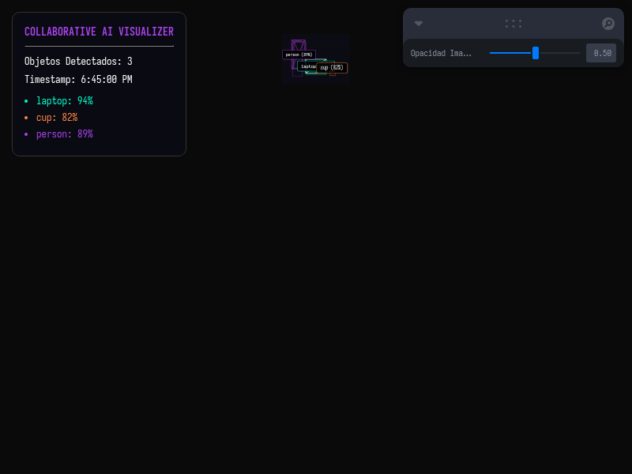

# Taller - IA Visual Colaborativa: Comparte tus Resultados en Web

## Nombre del estudiante
Gabriel Andrés Anzola Tachak

## Fecha de entrega
2026-05-29

---

## Descripción breve

Este taller diseña y ejecuta una canalización colaborativa de datos de Inteligencia Artificial para compartir y visualizar resultados en web. El sistema se divide en dos componentes independientes y comunicados:
1. **Procesamiento y Exportación (Python):** Un script que simula la inferencia de un modelo de detección de objetos, generando una imagen anotada en 2D (`detection.png`) y estructurando las coordenadas en 3D (clase, confianza, posición y escala) en un archivo estático `detections.json` exportado a la carpeta pública del frontend.
2. **Visualizador Web Interactivo (Three.js/React Three Fiber):** Una aplicación cliente que carga dinámicamente el archivo `detections.json`, proyectando la imagen anotada 2D de fondo en un plano tridimensional e interpretando las coordenadas 3D para dibujar cajas de alambre tridimensionales (`boxGeometry`) alrededor de los objetos con etiquetas HUD flotantes e interactivas al pasar el mouse.

---

## Implementaciones

### Python (Backend / Exportación)

**Herramientas:** Python 3 · PIL (Pillow) · JSON library

- **`detect_and_export.py`**: Simula la inferencia de un modelo visual y escribe las coordenadas espaciales relativas de detección en `detections.json` dentro de la carpeta `public` del frontend, garantizando el consumo directo. Genera la imagen sintética con bounding boxes.

### Three.js / React Three Fiber (Frontend / Visualización)

**Herramientas:** React 18 · Three.js r160 · @react-three/fiber r8 · @react-three/drei r9 · Vite · Leva

| Componente | Funcionalidad |
|---|---|
| `fetch('/detections.json')` | Petición asíncrona estándar (`useEffect`) para cargar los datos del JSON servido estáticamente por Vite. |
| `<DetectionBox>` | Malla 3D que recibe la posición y escala de la detección para renderizar un cubo de alambre interactivo. |
| `<Image>` | Plano 3D de fondo que proyecta la imagen anotada `detection.png` con opacidad regulable mediante Leva. |
| `<Html>` | Etiquetas flotantes 2D dinámicas acopladas a la posición tridimensional de cada objeto. |

---

## Resultados visuales

### Panel de Detecciones y Escena 3D Carga Inicial


Captura del visualizador interactivo 3D mostrando las mallas cargadas sobre la imagen de fondo, junto al panel informativo izquierdo con la lista y confianzas de los objetos detectados.

### Interacción y Orbitación de la Escena 3D


GIF animado que demuestra el paneado y rotación interactiva en 3D de las cajas de alambre sobre la imagen de fondo y la aparición de las etiquetas flotantes HUD al pasar el cursor (hover).

---

## Código relevante

Consumo del JSON y renderizado interactivo tridimensional en `App.jsx`:

```jsx
// Cargar JSON de detecciones al montar
useEffect(() => {
  fetch('/detections.json')
    .then(res => res.json())
    .then(data => setData(data))
    .catch(err => console.error("Error loading detections:", err));
}, []);

// Renderizado de cajas 3D en la escena
{data && data.detections.map((det, i) => (
  <DetectionBox
    key={i}
    position={det.position}
    scale={det.scale}
    label={det.class}
    confidence={det.confidence}
    color={classColors[det.class] || '#fff'}
  />
))}
```

---

## Prompts utilizados

- No se utilizaron prompts de IA para la generación de imágenes.

---

## Aprendizajes y dificultades

### Aprendizajes
- Implementación de arquitecturas desacopladas (File-based integration) donde Python actúa como productor de datos en formato JSON y Three.js consume la telemetría de forma independiente.
- Conversión de coordenadas de bounding boxes 2D de píxeles de imagen a coordenadas de traslación 3D relativas a la cámara.

### Dificultades
- Alinear perfectamente los cubos de alambre en 3D sobre los elementos de la imagen 2D proyectada. Fue necesario posicionar la imagen en un plano exactamente a `z = -2.01` e igualar la escala de renderizado a la relación de aspecto `4:3` para que los objetos mantuvieran la coherencia visual desde cualquier ángulo de la cámara.

### Mejoras futuras
- Implementar un servidor WebSocket en Python para transmitir las coordenadas de detección de la cámara en vivo de forma asíncrona, en lugar de realizar una única consulta JSON estática.
- Renderizar mallas 3D realistas asociadas a cada clase (por ejemplo, cargar un modelo gTF de laptop si la etiqueta es "laptop") en vez de cajas de alambre de depuración.

---

## Contribuciones grupales
Taller realizado de forma individual.

---

## Estructura del proyecto

```
semana_15_5_ia_visual_web_colaborativa/
├── python/
│   └── detect_and_export.py
├── threejs/
│   ├── package.json
│   ├── vite.config.js
│   ├── index.html
│   └── src/
│       ├── main.jsx
│       ├── App.jsx
│       └── styles.css
├── media/
│   ├── collaborative_web.png
│   └── collaborative_web.gif
└── README.md
```

---

## Referencias
- Vite Public Directory Serving: https://vitejs.dev/guide/assets.html#the-public-directory
- React Three Fiber Image loader and texture mapping: https://github.com/pmndrs/drei#image

---

## Checklist
- [x] Carpeta con nombre semana_15_5_ia_visual_web_colaborativa
- [x] Código limpio y funcional
- [x] GIFs/imágenes en media/ con nombres descriptivos
- [x] README completo con todas las secciones
- [x] Mínimo 2 capturas/GIFs por implementación
- [x] Commits descriptivos en inglés
