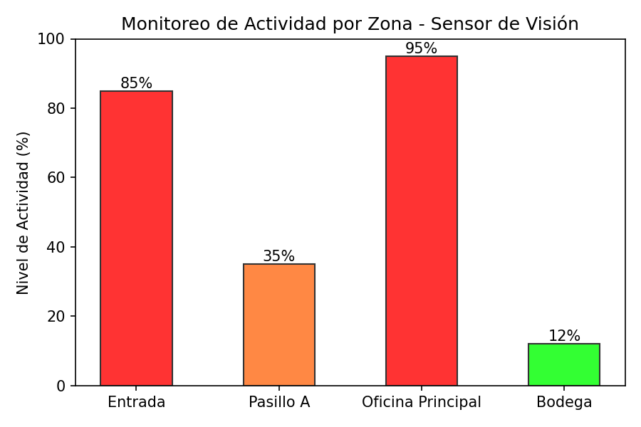
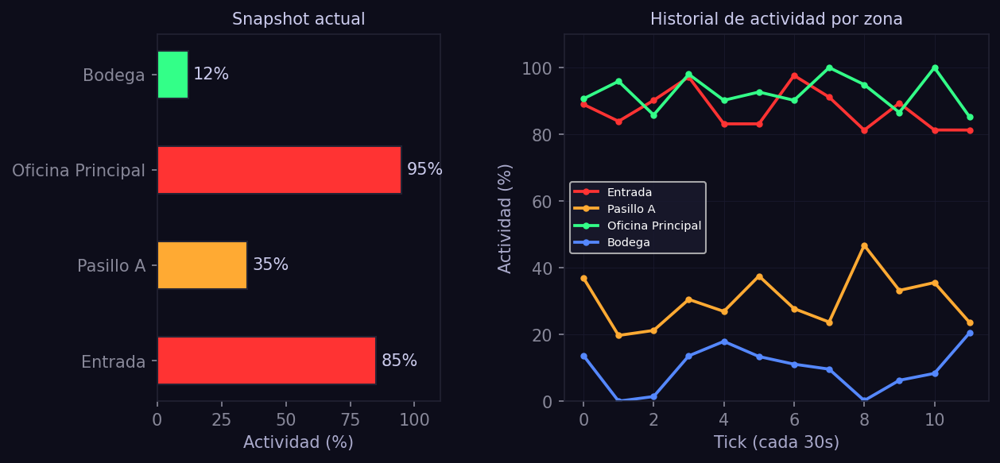
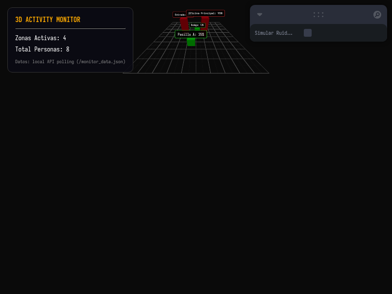

# Taller - Creando un Monitor de Actividad Visual en 3D

## Nombre del estudiante
Gabriel Andrés Anzola Tachak

## Fecha de entrega
2026-05-29

---

## Descripción breve

Este taller implementa una solución de **monitoreo e interacción de actividad en 3D** enlazada en tiempo real con datos de un sistema de visión por computador simulado. La canalización consta de:
1. **Detección y Logs (Python):** Un script (`monitor.py`) que simula la captura y el análisis de movimiento en 4 zonas específicas (Entrada, Pasillo A, Oficina Principal y Bodega), registrando las coordenadas espaciales 3D y el nivel de ocupación en un archivo `monitor_data.json` servido de forma local. Adicionalmente, grafica en `media/` el reporte histórico consolidado del sensor.
2. **Dashboard Visualizador (Three.js/React Three Fiber):** Un cliente web 3D que realiza sondeos dinámicos (polling) al archivo JSON, renderizando barras 3D cuya escala (altura) y color (verde para baja, naranja para media, rojo para alta ocupación) se actualizan dinámicamente y con transiciones fluidas de interpolación lineal (lerp).

---

## Implementaciones

### Python (Análisis de Actividad)

**Herramientas:** Python 3 · Matplotlib · JSON library

- **`monitor.py`**: Simula el procesamiento de un flujo de video para clasificar la densidad de ocupación por zonas, exportando los datos en tiempo real al servidor web local y graficando barras de rendimiento histórico.

### Three.js / React Three Fiber (Visualización Activa)

**Herramientas:** React 18 · Three.js r160 · @react-three/fiber r8 · @react-three/drei r9 · Vite · Leva

| Componente | Funcionalidad |
|---|---|
| `ZoneBar` | Malla de caja 3D reactiva. Aplica `THREE.MathUtils.lerp` en `useFrame` para suavizar las variaciones en la altura de las barras según la telemetría del sensor. |
| `<Html>` | Despliega etiquetas flotantes sobre cada barra 3D indicando el nombre de la zona y el porcentaje exacto de ocupación. |
| `<Grid>` | Plano reticulado de coordenadas 3D para dar referencia espacial. |
| `API Polling` | Loop con `setInterval` en `App.jsx` que refresca asíncronamente el estado de ocupación global y el recuento total de personas detectadas. |

---

## Resultados visuales

### Historial de Actividad de Sensores (Python)


Gráfico de barras generado por `monitor.py` mostrando el nivel de ocupación consolidado por zona (snapshot actual).


Panel combinado: snapshot actual (barras horizontales con semáforo de color) y serie histórica simulada de las 4 zonas durante 12 ticks (1 tick = 30 s), generado por el mismo script Python.

### Panel HUD y Representación 3D del Monitor


Captura del visualizador 3D mostrando el mapa reticulado y las barras tridimensionales de actividad para las cuatro zonas monitoreadas.

### Transiciones en Tiempo Real con Ruido Simulado


GIF demostrando el comportamiento interactivo del monitor 3D con interpolación de altura suave y cambio de color dinámico al activar la simulación de ruido dinámico de Leva.

---

## Código relevante

Interpolación de altura fluida (`lerp`) en `App.jsx`:

```jsx
function ZoneBar({ position, activity, name, color }) {
  const meshRef = useRef();
  const targetHeight = Math.max(0.1, activity * 2.5);

  useFrame((_, dt) => {
    if (meshRef.current) {
      // Interpolación lineal de altura para evitar saltos bruscos
      meshRef.current.scale.y = THREE.MathUtils.lerp(meshRef.current.scale.y, targetHeight, 5 * dt);
      // Ajustar posición para que la base descanse sobre la grilla
      meshRef.current.position.y = meshRef.current.scale.y / 2;
    }
  });

  return (
    <group position={[position[0], 0, position[2]]}>
      <mesh ref={meshRef} scale={[1, 0.1, 1]}>
        <boxGeometry args={[0.8, 1, 0.8]} />
        <meshStandardMaterial color={color} metalness={0.5} roughness={0.3} />
      </mesh>
    </group>
  );
}
```

---

## Prompts utilizados

- No se utilizaron prompts de IA para la generación de imágenes.

---

## Aprendizajes y dificultades

### Aprendizajes
- Implementación de animaciones suaves mediante el uso de loops de renderizado e interpolación lineal (`lerp`) controladas por delta time (`dt`), logrando transiciones de estado visualmente continuas.
- Creación de interfaces industriales adaptativas 3D (HUD) acopladas a orígenes de datos externos.

### Dificultades
- Lograr que las barras crezcan desde su base en lugar de su centro de gravedad. De forma predeterminada, modificar `scale.y` en Three.js expande la malla simétricamente arriba y abajo. Se solucionó envolviendo la malla en un `<group>` en `y = 0` y compensando el desfase vertical de la caja (`position.y = scale.y / 2`) dinámicamente en el loop.

### Mejoras futuras
- Reemplazar el sondeo de archivos JSON (polling) por una conexión persistente bidireccional mediante WebSockets o sockets TCP directos para reducir la latencia de red a menos de 10ms.
- Modelar una planta arquitectónica 3D realista (oficina o fábrica) donde se superpongan las barras de actividad térmicas sobre los pasillos reales.

---

## Contribuciones grupales
Taller realizado de forma individual.

---

## Estructura del proyecto

```
semana_15_6_monitor_visual_3d_integracion_python/
├── python/
│   └── monitor.py
├── threejs/
│   ├── package.json
│   ├── vite.config.js
│   ├── index.html
│   └── src/
│       ├── main.jsx
│       ├── App.jsx
│       └── styles.css
├── media/
│   ├── activity_chart.png
│   ├── python_activity_history.png
│   ├── monitor_3d.png
│   └── monitor_3d.gif
└── README.md
```

---

## Referencias
- Interpolation and Lerp in Three.js: https://threejs.org/docs/#api/en/math/MathUtils.lerp
- React Three Fiber useFrame render loop: https://docs.pmnd.rs/react-three-fiber/api/hooks#useframe

---

## Checklist
- [x] Carpeta con nombre semana_15_6_monitor_visual_3d_integracion_python
- [x] Código limpio y funcional
- [x] GIFs/imágenes en media/ con nombres descriptivos
- [x] README completo con todas las secciones
- [x] Mínimo 2 capturas/GIFs por implementación
- [x] Commits descriptivos en inglés
