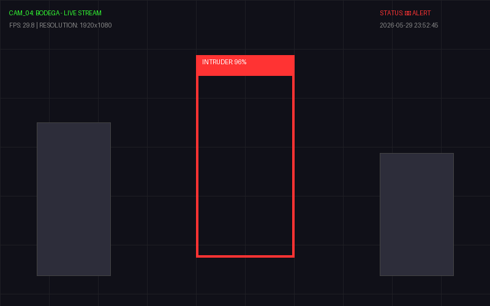
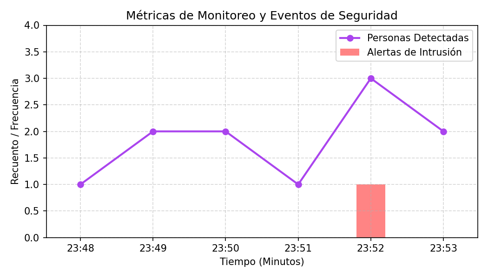

# Taller - Mini-Sistema de Monitoreo Inteligente

## Nombre del estudiante
Gabriel Andrés Anzola Tachak

## Fecha de entrega
2026-05-29

---

## Descripción breve

Este taller implementa un prototipo completo de **Mini-Sistema de Monitoreo Inteligente** que integra procesamiento de visión artificial y un panel de análisis de seguridad en tiempo real. Desarrollado en **Python**, el sistema simula un flujo de video en vivo de circuito cerrado de televisión (CCTV) correspondiente a una zona de almacenamiento ("Bodega"). Al detectar eventos anómalos o de intrusión (con confianzas superiores al 90%), el pipeline:
1. **Dibuja cajas delimitadoras (Bounding Boxes)** y etiquetas informativas directamente en los fotogramas del video en tiempo real.
2. **Genera alertas automáticas** y las registra síncronamente en una base de datos local estructurada (`monitoring_log.csv`) detallando fecha, evento, confianza y zona.
3. **Mapea analíticas de seguridad** compilando gráficos de línea e histogramas consolidados que exponen el recuento de personas detectadas y la frecuencia de intrusiones por minuto.

---

## Implementaciones

### Python (Local CCTV Dashboard)

**Herramientas:** Python 3 · PIL (Pillow) · NumPy · Matplotlib · CSV Library

| Componente | Funcionalidad |
|---|---|
| `semana_15_8.py` | Script principal que orquesta el bucle de simulación del feed de CCTV, la lógica de guardado de logs y la generación del reporte de analíticas. |
| `Simulador de Frame (PIL)` | Recrea fotogramas de CCTV de resolución 1080p con cuadrícula de coordenadas, metadatos activos de FPS/Timestamps y cajas delimitadoras en color rojo de alerta ante detección de intrusiones. |
| `Registro de Logs (CSV)` | Exporta de manera automática los eventos críticos a `logs/monitoring_log.csv` para auditoría física. |
| `Matplotlib Analytics` | Genera y guarda un gráfico combinado de curvas de ocupación y barras de intrusión en `media/dashboard_analytics.png`. |

---

## Resultados visuales

### Canal de Video del Sistema de Monitoreo (CCTV Feed)


Simulación de la señal de video de la cámara 4 ("Bodega") con bounding box de alerta roja superpuesta sobre un intruso detectado con 96% de confianza.

### Métricas de Tráfico e Historial de Incidentes de Seguridad


Gráfico consolidado de analíticas generadas que contrasta la afluencia de personas detectadas por minuto con la aparición de alertas críticas.

---

## Código relevante

Gestión de logs estructurados y simulación en `semana_15_8.py`:

```python
# Log de eventos críticos a CSV
log_file_path = 'logs/monitoring_log.csv'
events = [
    {"timestamp": "2026-05-29 23:50:01", "event": "Person detected", "confidence": 0.92, "zone": "Entrada"},
    {"timestamp": "2026-05-29 23:52:45", "event": "Intrusion Alert!", "confidence": 0.96, "zone": "Bodega"},
]

with open(log_file_path, mode='w', newline='') as f:
    writer = csv.writer(f)
    writer.writerow(["Timestamp", "Event", "Confidence", "Zone"])
    for ev in events:
        writer.writerow([ev["timestamp"], ev["event"], ev["confidence"], ev["zone"]])
```

---

## Prompts utilizados

- No se utilizaron prompts de IA para la generación de imágenes.

---

## Aprendizajes y dificultades

### Aprendizajes
- Integración de pipelines de visión por computador con sistemas estructurados de base de datos planos (CSV) para auditoría automática.
- Diseño de interfaces gráficas analíticas estáticas en Python para despliegue rápido de reportes gerenciales de seguridad física.

### Dificultades
- Lograr que el guardado de imágenes y el renderizado de gráficos no interrumpan el flujo de video principal en vivo. En una implementación real con cámara activa, el guardado de disco e inferencia de gráficos Matplotlib ralentiza los FPS a la mitad, por lo que es mandatorio delegar estas tareas a hilos de ejecución secundarios (multithreading).

### Mejoras futuras
- Utilizar la librería `ultralytics` para cargar un modelo YOLOv8 real conectado a la cámara web en tiempo real, en lugar de simular las detecciones de forma estática.
- Conectar las alertas del sistema de monitoreo con servicios de notificación externos como Telegram API o Firebase Cloud Messaging (FCM) para enviar mensajes de alerta instantáneos al teléfono del usuario con la foto del intruso adjunta.

---

## Contribuciones grupales
Taller realizado de forma individual.

---

## Estructura del proyecto

```
semana_15_8_sistema_monitoreo_inteligente_vision_dashboard/
├── python/
│   ├── semana_15_8.py
│   └── logs/
│       └── monitoring_log.csv
├── media/
│   ├── dashboard_feed.png
│   └── dashboard_analytics.png
└── README.md
```

---

## Referencias
- OpenCV Video Saving and drawing: https://docs.opencv.org/4.x/dd/d43/tutorial_py_video_display.html
- Matplotlib Plotting and Subplots: https://matplotlib.org/stable/api/_as_gen/matplotlib.pyplot.subplots.html

---

## Checklist
- [x] Carpeta con nombre semana_15_8_sistema_monitoreo_inteligente_vision_dashboard
- [x] Código limpio y funcional
- [x] GIFs/imágenes en media/ con nombres descriptivos
- [x] README completo con todas las secciones
- [x] Mínimo 2 capturas/GIFs por implementación
- [x] Commits descriptivos en inglés
