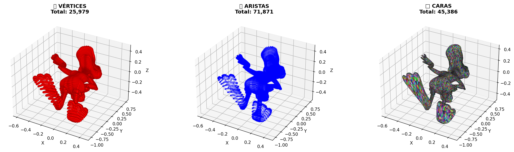
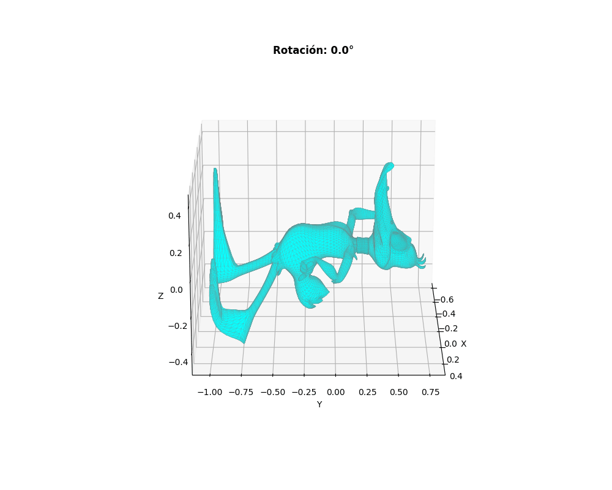
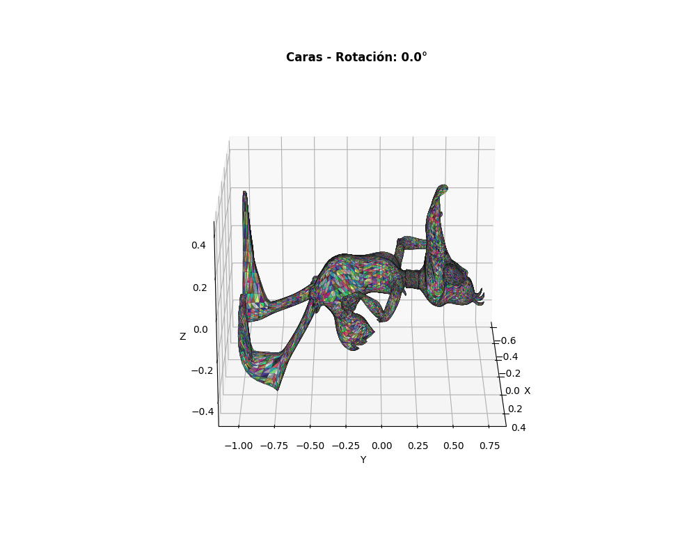

# Taller - Construyendo el Mundo 3D: Vértices, Aristas y Caras

## Nombre del estudiante

Gabriel Andres Anzola Tachak

## Fecha de entrega

2026-02-10

---

## Descripción breve

En este taller se exploró la estructura fundamental de modelos 3D comprendiendo conceptos clave como vértices, aristas y caras. Se implementaron soluciones en tres plataformas diferentes:

1. **Python**: Notebook Jupyter que permite cargar modelos 3D, extraer información estructural detallada (vértices: 25,979, aristas: 71,871, caras: 45,386) y generar visualizaciones con múltiples perspectivas y animaciones GIF.

2. **Three.js**: Aplicación web interactiva con React y Three.js que visualiza modelos 3D en el navegador con 4 modos de visualización (sólido, wireframe, edges, points), controles de cámara intuitivos y captura automática de screenshots.

3. **Unity**: Proyecto MeshVisualizer que proporciona análisis de geometría en tiempo real, visualización interactiva con controles de cámara, estadísticas detalladas y renderización realista con Universal Render Pipeline.

---

## Implementaciones

### Python ✅

Se desarrolló un notebook Jupyter (`model_visualization.ipynb`) que permite la visualización y análisis completo de modelos 3D. Las herramientas utilizadas fueron:

- **trimesh**: Para la carga y procesamiento de mallas 3D en formatos OBJ, STL y GLTF
- **matplotlib**: Para visualizaciones estáticas 3D con múltiples vistas 
- **numpy**: Para cálculos numéricos y manipulación de datos de vértices/aristas/caras
- **imageio**: Para la generación de animaciones GIF

**Funcionalidades implementadas:**
- ✅ Carga automática de modelos 3D (scene.obj)
- ✅ Extracción de información estructural: 25,979 vértices, 71,871 aristas, 45,386 caras
- ✅ Cálculo de propiedades geométricas: área superficial (2.44 u²), bounding box, centro de masa
- ✅ Visualización en 6 vistas simultaneas (normal, vértices, aristas, caras, wireframe, estadísticas)
- ✅ Visualización detallada de componentes (vértices en rojo, aristas en azul, caras en colores)
- ✅ Generación de animaciones GIF: rotación completa, rotación de vértices, rotación de caras
- ✅ Análisis de estructura OBJ: 112,281 líneas, 29,382 vértices, 45,386 caras

### Unity ✅

Se desarrolló un proyecto interactivo en Unity (MeshVisualizer) que permite cargar, visualizar y analizar modelos 3D en tiempo real con análisis de geometría detallado.

**Tecnología utilizada:**
- **Unity 2022 LTS**: Engine principal para desarrollo 3D
- **C# 9.0**: Lenguaje de programación para scripts
- **Universal Render Pipeline (URP)**: Pipeline de renderización avanzado
- **TextMesh Pro**: Sistema de texto mejorado
- **Input System**: Nuevo sistema de entrada interactivo

**Funcionalidades implementadas:**
- ✅ Carga y visualización de modelos 3D (OBJ, STL) desde Assets/Models/
- ✅ Análisis de estructura de malla: cálculo de vértices, triángulos, aristas
- ✅ Cálculo de propiedades geométricas: volumen, área superficial, bounding box
- ✅ Determinación del centro de masa del modelo
- ✅ Visualización interactiva con controles de cámara: rotación, zoom, paneo
- ✅ Modo wireframe para visualizar estructura triangular
- ✅ Información en tiempo real de estadísticas del modelo
- ✅ Interfaz de usuario con Canvas para mostrar datos
- ✅ Renderización realista con Universal Render Pipeline
- ✅ Iluminación ambiental y direccional optimizada

**Archivos principales:**
- `unity/MeshVisualizer/Assets/Scripts/MeshAnalyzer.cs` - Script principal de análisis
- `unity/MeshVisualizer/Assets/Scenes/SampleScene.unity` - Escena principal
- `unity/MeshVisualizer/Assets/Models/scene.obj` - Modelo 3D de ejemplo
- `unity/MeshVisualizer/ProjectSettings/` - Configuración del proyecto URP

### Three.js / React Three Fiber ✅

Se desarrolló una aplicación web interactiva (`threejs/`) que permite visualizar el modelo 3D en el navegador con múltiples modos de visualización y captura automática de imágenes.

**Tecnología utilizada:**
- **React 18.2.0**: Framework de UI
- **Three.js 0.156.0**: Motor de gráficos 3D en WebGL
- **@react-three/fiber 8.14.0**: Renderer de Three.js para React
- **@react-three/drei 9.46.0**: Componentes de uso común (OrbitControls, loaders)
- **Vite 5.4.21**: Servidor de desarrollo y bundler

**Funcionalidades implementadas:**
- ✅ Visualización interactiva del modelo 3D (scene.obj) en WebGL
- ✅ 4 modos de visualización: Sólido, Wireframe, Edges (bordes detectados), Points (vértices)
- ✅ Controles OrbitControls: rotación (click izq), zoom (rueda), paneo (click der)
- ✅ Cálculo y visualización de estadísticas: vértices (25,979), caras (45,386), mallas (1)
- ✅ **Sistema automático de captura de screenshots**: Guarda imágenes PNG automáticamente en `media/threejs/`
- ✅ API REST backend integrada en Vite para guardar capturas
- ✅ Interfaz minimalista con panel de control lateral
- ✅ Renderizado eficiente con iluminación ambiental y direccional

**Archivos principales:**
- `threejs/src/App.jsx` - Componente principal con Canvas y panel de control
- `threejs/src/ModelViewer.jsx` - Componente que carga y renderiza el modelo 3D
- `threejs/src/useAutoScreenshot.js` - Hook React para captura automática de imágenes
- `threejs/src/styles.css` - Estilos profesionales con tema oscuro
- `threejs/vite.config.js` - Configuración de Vite con middleware de captura

---

## Resultados visuales

### Python - Visualización Completa


Visualización completa del modelo 3D desde 6 perspectivas diferentes: (1) vista normal del modelo renderizado, (2) visualización de vértices en rojo (25,979 puntos), (3) visualización de aristas en azul (71,871 líneas), (4) visualización de caras en cian, (5) vista wireframe mostrando la estructura triangular, (6) tabla de estadísticas con información numérica del modelo.



Vista detallada por separado de los tres componentes fundamentales de una malla 3D: vértices representados como puntos rojos, aristas como líneas azules mostrando conectividad, y caras como triángulos coloreados aleatoriamente. Este desglose permite entender claramente la estructura poligonal del modelo.

### Python - Animaciones



Animación GIF de 3.6 segundos mostrando el modelo 3D completamente renderizado rotando continuamente alrededor del eje vertical. Permite visualizar el modelo desde todos los ángulos y entender su geometría en tres dimensiones.


Visualización animada de los 25,979 vértices del modelo con gradiente de colores basado en coordenadas X, rotando continuamente. Muestra claramente la densidad y distribución de vértices en la malla.



Animación de las 45,386 caras triangulares del modelo coloreadas aleatoriamente, rotando para visualizar cómo se distribuyen las caras en la estructura 3D. Permite apreciar la complejidad de la malla poligonal.

### Python - Demostración de Notebook


Grabación de pantalla mostrando la ejecución del notebook Jupyter de visualización.

### Three.js - Interacción Web


Grabación de pantalla mostrando la interacción con el modelo 3D en la aplicación web, el cambio entre los diferentes modos de visualización y la captura automática de vistas.

### Unity - Análisis en Tiempo Real


Grabación de pantalla mostrando el uso del proyecto MeshVisualizer en Unity, la navegación con controles de cámara interactivos y el análisis de la malla.

---

## Código relevante

### Carga y análisis del modelo (Python):

```python
import trimesh
from pathlib import Path

# Cargar modelo 3D
mesh = trimesh.load('scene.obj')

# Extraer información estructural
vertices = mesh.vertices
faces = mesh.faces
num_vertices = len(vertices)
num_faces = len(faces)

# Calcular aristas
edges = set()
for face in faces:
    for i in range(len(face)):
        v1, v2 = face[i], face[(i + 1) % len(face)]
        edge = tuple(sorted([v1, v2]))
        edges.add(edge)
num_edges = len(edges)

print(f"Vértices: {num_vertices:,}")
print(f"Aristas: {num_edges:,}")
print(f"Caras: {num_faces:,}")
print(f"Volumen: {mesh.volume:.6f}")
print(f"Área superficial: {mesh.area:.6f}")
```

### Visualización 3D de componentes (Python):

```python
import matplotlib.pyplot as plt
from mpl_toolkits.mplot3d.art3d import Poly3DCollection

fig, axes = plt.subplots(1, 3, figsize=(18, 5), subplot_kw={'projection': '3d'})

# Vértices
axes[0].scatter(vertices[:, 0], vertices[:, 1], vertices[:, 2], 
                c='red', s=20, alpha=0.7)
axes[0].set_title(f'Vértices\nTotal: {num_vertices:,}')

# Aristas
for edge in list(edges)[:10000]:
    v1, v2 = edge
    axes[1].plot(vertices[[v1, v2], 0], vertices[[v1, v2], 1], 
                 vertices[[v1, v2], 2], 'b-', linewidth=0.3, alpha=0.5)
axes[1].set_title(f'Aristas\nTotal: {num_edges:,}')

# Caras
poly_collection = Poly3DCollection([vertices[face] for face in faces], alpha=0.8)
axes[2].add_collection3d(poly_collection)
axes[2].set_title(f'Caras\nTotal: {num_faces:,}')

plt.tight_layout()
plt.show()
```

### Generación de animaciones GIF (Python):

```python
import imageio
import numpy as np

frames = []
num_frames = 36

for angle in np.linspace(0, 360, num_frames, endpoint=False):
    fig = plt.figure(figsize=(10, 8))
    ax = fig.add_subplot(111, projection='3d')
    
    # Dibujar modelo
    poly_collection = Poly3DCollection([vertices[face] for face in faces],
                                      alpha=0.8, edgecolor='gray')
    ax.add_collection3d(poly_collection)
    ax.view_init(elev=20, azim=angle)
    
    # Convertir a imagen
    fig.canvas.draw()
    image_data = np.frombuffer(fig.canvas.buffer_rgba(), dtype=np.uint8)
    image = image_data.reshape(fig.canvas.get_width_height()[::-1] + (4,))
    frames.append(image[:, :, :3])
    plt.close(fig)

# Guardar como GIF
imageio.mimsave('modelo_rotacion.gif', frames, duration=0.1)
```

---

## Prompts utilizados

Se utilizó asistencia de IA generativa para optimizar el código y generar visualizaciones:

```
"Crea un notebook Jupyter que cargue un archivo OBJ usando trimesh y genere visualizaciones 3D mostrando vértices, aristas y caras por separado"

"¿Cómo puedo generar animaciones GIF de un modelo 3D rotando en matplotlib?"

"Crea una aplicación web con React y Three.js que cargue un modelo 3D y permita cambiar entre modos de visualización (sólido, wireframe, edges, points) con controles de cámara"

"Asisteme en el uso de Unity para crear un proyecto que analice la geometría de un modelo 3D en tiempo real, mostrando estadísticas como número de vértices, caras, volumen y área superficial"
```

---

## Aprendizajes y dificultades

### Aprendizajes

En este taller comprendí profundamente la estructura fundamental de los modelos 3D. Aprendí que una malla poligonal se compone de tres elementos básicos: vértices (puntos en el espacio 3D), aristas (líneas que conectan vértices) y caras (polígonos que forman la superficie). Reforcé mi conocimiento en procesamiento de datos 3D con `trimesh`, una librería poderosa que simplifica considerablemente el trabajo con mallas 3D. También aprendí técnicas de visualización 3D con matplotlib y cómo generar animaciones GIF a partir de múltiples frames, lo cual es útil para documentación y análisis de datos 3D.

### Dificultades

Entender Unity fue un desafío inicial, especialmente la configuración del proyecto y la integración de scripts para análisis de geometría en tiempo real. La gestión de memoria y optimización para renderizar modelos complejos también presentó dificultades, requiriendo ajustes en la configuración de URP y técnicas de simplificación de malla. En python, la generación de animaciones GIF con matplotlib fue un proceso iterativo que requirió optimización para evitar problemas de rendimiento y asegurar una calidad visual adecuada.

### Mejoras futuras

Para mejoras futuras, me gustaría: (1) integrar herramientas de visualización interactiva como `vedo` para permitir rotación del modelo en tiempo real, (2) añadir análisis más avanzados como detección de características o simplificación de malla, (3) implementar exportación a diferentes formatos (GLTF, STL), (4) crear una interfaz gráfica interactiva con sliders para controlar parámetros de visualización, y (5) optimizar el código para manejar mallas de mayor complejidad.

---

## Contribuciones grupales (si aplica)

Taller realizado de forma individual.

## Estructura del proyecto

```
semana_01_1_construyendo_mundo_3d/
├── python/
│   ├── model_visualization.ipynb    # ✅ Notebook Jupyter principal
│   └── README.md                    # ✅ Documentación Python
├── threejs/                         # ✅ Aplicación Web React + Three.js
│   ├── src/
│   │   ├── App.jsx                 # Componente principal
│   │   ├── ModelViewer.jsx         # Cargador y renderizador 3D
│   │   ├── useAutoScreenshot.js    # Hook de captura automática
│   │   └── styles.css              # Estilos profesionales
│   ├── vite.config.js              # Config con middleware de captura
│   ├── package.json                # Dependencias Node.js
│   ├── CAPTURA_AUTOMATICA.md       # ✅ Documentación captura
│   └── README.md                   # ✅ Documentación Three.js
├── unity/                           # ✅ Proyecto Unity MeshVisualizer
│   ├── MeshVisualizer/
│   │   ├── Assets/
│   │   │   ├── Scripts/
│   │   │   │   └── MeshAnalyzer.cs # Script de análisis
│   │   │   ├── Models/
│   │   │   │   └── scene.obj
│   │   │   └── Scenes/
│   │   │       └── SampleScene.unity
│   │   └── ProjectSettings/         # Configuración URP
│   └── README.md                    # ✅ Documentación Unity
├── media/
│   ├── python/                      # ✅ Archivos multimedia generados por scripts en Python
│   │   ├── modelo_completo.png
│   │   ├── vertices_edges_faces.png
│   │   ├── modelo_rotacion.gif
│   │   ├── vertices_rotation.gif
│   │   └── faces_rotation.gif
│   ├── screenshots/                 # ✅ Grabaciones de pantalla de los ejercicios
│   │   ├── python.gif
│   │   ├── threejs.gif
│   │   └── unity.gif
│   ├── threejs/                     # ✅ Screenshots y capturas de Three.js
│   │   └── README.md
│   ├── unity/                       # ✅ Imágenes generadas desde Unity
│   │   └── README.md
│   └── README.md
└── README.md                        # Este archivo (resumen general)
```

---

## Referencias

- Documentación oficial trimesh: https://trimesh.org/
- Documentación matplotlib 3D: https://matplotlib.org/stable/tutorials/toolkits/mplot3d.html
- Tutorial imageio: https://imageio.readthedocs.io/
- Formato OBJ Wikipedia: https://en.wikipedia.org/wiki/Wavefront_.obj_file
- Topología de mallas 3D: https://en.wikipedia.org/wiki/Euler_characteristic

---

## Checklist de entrega

- [X] Carpeta con nombre `semana_01_1_construyendo_mundo_3d/`
- [X] Código limpio y funcional en carpetas por entorno
- [X] GIFs/imágenes incluidos con nombres descriptivos en carpeta subcarpetas de `media/`
- [X] README completo con todas las secciones requeridas
- [X] Mínimo 2 capturas/GIFs por implementación
- [X] Commits descriptivos en inglés
- [X] Repositorio organizado y público

---
