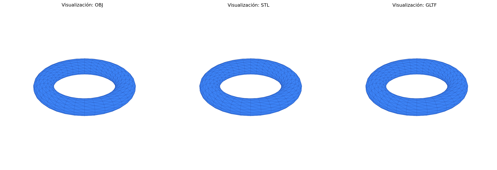

# Taller - Importando el Mundo: Visualización y Conversión de Formatos 3D

## Nombre del estudiante

Gabriel Andres Anzola Tachak

## Fecha de entrega

2026-02-19

---

## Descripción breve

En este segundo taller exploramos la estructura, el almacenamiento y la representación de modelos 3D mediante la manipulación experimental de formatos estándar en la industria computacional (`.OBJ`, `.STL`, y `.GLTF`). El objetivo de esta práctica es comprender de manera empírica las diferencias que existen entre ellos tanto a nivel de datos algorítmicos como a nivel de capacidades estéticas.

Para ello, utilizamos un flujo de trabajo dividido en dos grandes entornos:
1. **Python**: Se establecieron operaciones analíticas automáticas que generan modelos 3D genéricos (temporalmente), validan las propiedades estadísticas del archivo almacenado (conteo de vértices, caras, chequeos de normalidad y mallas "Watertight") y automatizan la conversión manual entre formatos usando la biblioteca `trimesh`.
2. **Three.js**: Se configuró y construyó un aplicativo interactivo en la web utilizando el marco React Three Fiber (R3F) para visualizar emparejamientos visuales de los modelos procesados. Permite alternar dinámicamente entre cada uno de los formatos expuestos para revelar cómo son interpretados por el sistema de renderizado.

---

## Implementaciones

### Python ✅

Se desarrolló un notebook de Jupyter en Python. Las herramientas destacadas fueron `trimesh`, `numpy` y `matplotlib`.

**`model_converter.ipynb`:** Genera un modelo nativo (temporizado como un simple Torus programático) y lo exporta simultáneamente en formatos OBJ, STL y GLTF asegurando las variaciones inherentes al motor algorítmico subyacente de cada formato. Además, implementa los algoritmos de validación paso a paso:
- Extrae la información estructural: nodos únicos, normales incrustadas, recuento de caras/topología de polígonos e informa sobre posibles duplicados generados como rastros de optimizaciones del formato.
- Detecta propiedades topológicas avanzadas (¿es la malla "Watertight"?).
- Convierte y re-exporta los archivos bajo demanda demostrando la interoperatibilidad que provee `trimesh.exchange`.

### Three.js / React Three Fiber ✅

Se construyó una aplicación Web Single Page (`App.jsx` + `Vite` con React 18) que proporciona una visualización premium interactiva para juzgar visualmente y a nivel perceptual cómo difiere la carga de estos archivos en WebGL.

- Cuenta con **Cargadores Específicos (Loaders)** (`OBJLoader`, `STLLoader`, `GLTFLoader`) para ingestar individualmente cada modelo dependiendo del tipo de botón que seleccione el usuario.
- Despliega un panel automatizado de estadísticas del modelo analizando directamente en el buffer de geometría del cliente cuántos vértices de geometría y polígonos están cargados en la escena.
- Renderizado de alto contraste e iluminación (`Environment`, `ContactShadows`) sobre un canvas fluido permitiendo el estudio de la percepción de texturas/materiales predeterminados que soporta cada uno. STL por ejemplo, al no tener soporte integrado nativo para jerarquías o texturas PBR se renderizará como geometría pura con materiales estándar instanciados.
- Controles de cámara inmersivos integrados con `OrbitControls`.

---

## Resultados visuales

A continuación se muestran las capturas de pantalla de los resultados visuales de los módulos de la Semana 01.2.

### Python - Implementación



*Captura de pantalla del notebook `model_converter.ipynb` mostrando la exportación a gráfica Matplotlib.*

### Three.js - Implementación


*Demostración animada de la interactividad entre la interfaz al cargar el GLTF preservando su topología web-ready en React.*

---

## Código relevante

### Análisis del Modelo y Duplicados (Python):

```python
import trimesh
import numpy as np

# Cargar el modelo asegurando formato mesh puro
mesh = trimesh.load('models/generic_model.obj', force='mesh')

num_vertices = len(mesh.vertices)
has_vertex_normals = 'vertex_normals' in mesh.visual.__dict__ or hasattr(mesh, 'vertex_normals')

# Verificación algorítmica de duplicados
unique_vertices = len(np.unique(mesh.vertices, axis=0))
duplicados = num_vertices - unique_vertices

print(f"Vértices: {num_vertices} | Duplicados ocultos: {duplicados}")
```

### Cambio Condicional de Formatos WebGL (Three.js):

Extracción de carga de memoria basada en el Hook generalizado dentro de `ModelViewer.jsx`:

```javascript
// La carga condicional provee abstracciones para los tres grandes tipos
useEffect(() => {
  let loader;
  if (format === 'OBJ') loader = new OBJLoader();
  else if (format === 'STL') loader = new STLLoader();
  else if (format === 'GLTF') loader = new GLTFLoader();

  loader.load(url, (object) => {
    let sceneObj = null;
    
    // Tratamientos especiales (STL llega como raw BufferGeometry directamente)
    if (format === 'STL') {
      const material = new THREE.MeshStandardMaterial({ color: '#3b82f6' });
      sceneObj = new THREE.Mesh(object, material);
    } else if (format === 'GLTF') {
      sceneObj = object.scene;
    } else {
       sceneObj = object; // OBJ Group
    }
    
    setModel(sceneObj);
  });
}, [format, url]);
```

---

## Prompts utilizados

Se utilizó asistencia de IA como par de programación para estructurar y optimizar el scaffolding del web client y los parseadores:

```
"Crea un script python que analice archivos OBJ, STL y GLTF buscando sus estadísticas fundamentales cómo vértices, topología y normales usando trimesh."

"Arma un archivo App.jsx para React Three Fiber capaz de mostrar botones interactivos en una barra lateral y un canvas WebGL a la derecha, para cambiar y mostrar estadísticas de modelos cargados."

"Estructura el archivo utilitario index.css acorde a directrices estéticas dark-mode de alta retención para Vite JS."
```

---

## Aprendizajes y dificultades

### Aprendizajes

Durante este taller, se fortaleció notablemente mi comprensión práctica de cómo el software almacena representaciones espaciales. Entender que el STL fue pionero y solo comprende triángulos directos careciendo por completo de capacidades referenciales de normales complejas o metadatos de texturas. Así como presenciar la carga optimizada del `GLTF` que empaqueta las jerarquías de forma excelente orientada a la web (formato JSON), y que a diferencia del clásico `OBJ`, facilita la interoperabilidad del mundo real.

### Dificultades

La curva de manejo de instanciación con el paquete de los `three-stdlib` fue un leve desafío, dado que Three.js no abstrae de manera equivalente todos los Loaders. OBJ retorna grupos, STL retorna geometrías puras y GLTF retorna escenas híbridas. Tuve que programar "wrappers" y ajustes algorítmicos al instanciador con React (useEffect) para tratarlos todos uniformemente y poder calcular con éxito la cantidad de vértices reales sobre el entorno de renderizado.

### Mejoras futuras

Eventualmente me gustaría diseñar herramientas automáticas para exportar e integrar compresiones con Draco para las librerías WebGL, ya que modelos extremadamente intrincados demuestran que las mallas gigantes de OBJ ralentizan la aplicación y podrían colapsar el navegador del cliente final a escala de producción.

---

## Contribuciones grupales

Taller realizado de forma individual.

## Estructura del proyecto

```text
semana_01_2_conversion_formatos_3d/
├── python/                     # Código de Trimesh Python
│   └── model_converter.ipynb   # Notebook con análisis paso a paso 
├── threejs/                    # Aplicación Web React 
│   ├── src/                    
│   │   ├── App.jsx             
│   │   ├── ModelViewer.jsx     
│   │   └── index.css           # Estilizado de alto nivel dark-mode
│   └── public/models/          # Modelos servidos estáticamente
├── models/                     # Carpeta de salida raw temporal compartida a Python y React
├── media/                      # Capturas resultantes y material audiovisual
│   ├── python/                 # Capturas de Matplotlib y resultados Python
│   └── screenshots/            # Grabaciones y animaciones GIF demostrativas
└── README.md                   # Documentación principal final
```

---

## Referencias

- Sistema de Exchange Trimesh: https://trimesh.org/trimesh.exchange.html
- Sistema de Loaders ThreeJS: https://threejs.org/docs/#manual/en/introduction/Loading-3D-models
- Especificación oficial de geometría GLTF (Khronos Group): https://www.khronos.org/gltf/
