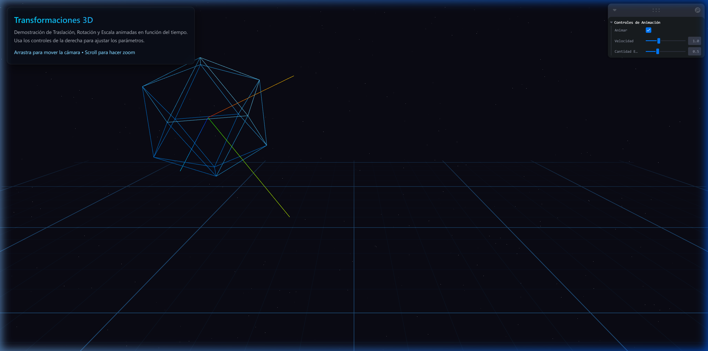

# Taller Transformaciones

**Estudiante:** Gabriel Andres Anzola Tachak  
**Fecha de entrega:** 20 de Febrero de 2026  

## Descripción breve
El objetivo de este taller es explorar los conceptos fundamentales de **transformaciones geométricas** (traslación, rotación y escala) en distintos entornos de programación visual. Para ello hemos creado un "Hola Mundo Visual" animando las transformaciones de objetos de forma estática y en función del tiempo.

Se han desarrollado implementaciones en los siguientes entornos de desarrollo:
1. Python (mediante Jupyter Notebook)
2. Processing (Java)
3. Three.js con React Three Fiber

_Nota: La implementación en Unity fue omitida según se indicó en las instrucciones como un requerimiento opcional._

---

## Implementaciones

### 1. Python (Jupyter Notebook)
En la carpeta `python/` se encuentra un Jupyter Notebook (`transformaciones.ipynb`) que hace uso de `numpy` y `matplotlib` para definir la geometría de un polígono 2D. Utilizando matrices de transformación $3\times3$ en coordenadas homogéneas, se aplican sobre la figura simultáneamente las tres transformaciones:
- **Rotación** completa sobre su eje.
- **Traslación** en trayectoria de arco/ovalada interactuando con funciones seno y coseno combinadas con el tiempo.
- **Escalado** con efecto de oscilación/respiración.

El resultado es convertido en imágenes fotograma por fotograma y finalmente compilado en un GIF animado utilizando `imageio` que es almacenado en la carpeta `media/python/`.

### 2. Processing (3D)
En la carpeta `processing/transformaciones/` se presenta un sketch en lenguaje estandar basado en Java desarrollado usando `Processing 3D (P3D)`. 
En la escena hay un cubo simple rodeado por unos ejes locales XYZ. Gracias a las directivas `pushMatrix()` y `popMatrix()` las transformaciones se aíslan de la cámara y del UI.
- Se hace uso de `millis()` para obtener el tiempo dinámico de la animación.
- El objeto gira continuamente en X, Y, Z iterando ángulos crecientes.
- El cubo hace un recorrido sinusoidal de izquierda a derecha.
- Un factor de escala modificado por la función seno hace aparentar un efecto de tipo latido sobre el cubo.

### 3. Three.js con React Three Fiber
El directorio `threejs/` contiene una aplicación web completa desarrollada con Vite y React.
La escena incluye un *Icosaedro* representado mediante `meshStandardMaterial` de forma wireframe brillante, posicionado en un `Canvas` general que también incluye grillas y componentes estáticos visuales.
- Se utiliza el hook `useFrame` de **React Three Fiber** para actualizar la propiedad de rotación, posición y escala del objeto de manera declarativa cada vez que el renderizador emite un nuevo *frame*.
- Se integró el entorno **Leva** (`useControls`) que permite desactivar el movimiento de la pantalla, configurar su velocidad y el grado de escala con controles deslizantes e interactivos al vuelo.

---

## Resultados visuales

### Python
Se ejecutó el bloque de código correspondiente al Notebook para generar la animación.


### Three.js (React Three Fiber)
Interacción directa con el entorno 3D manipulado usando los controles deslizantes disponibles en la Interfaz interactiva para corroborar que responden inmediatamente y cambian el render de WebGL. 
A continuación se exhiben los detalles del Load inicial y la Scene Activa del sistema de animaciones.




_Se puede reproducir el comportamiento en formato de video (WebP) desde `./media/threejs/animation_test.webp`._

### Processing
_(Se incluye el código principal del `sketch` para ser ejecutado directamente en el entorno de desarrollo ya que este sistema local y entorno headless omite de forma predeterminada el despliegue del software PApplet requeridos para capturas)_

---

## Código relevante

### Python (Matrices de Transformación)
```python
def rotation_matrix(angle_degrees):
    theta = np.radians(angle_degrees)
    return np.array([
        [np.cos(theta), -np.sin(theta), 0],
        [np.sin(theta),  np.cos(theta), 0],
        [0,             0,            1]
    ])

def scale_matrix(sx, sy):
    return np.array([
        [sx, 0,  0],
        [0,  sy, 0],
        [0,  0,  1]
    ])
```

### Three.js (useFrame Animación)
```javascript
  useFrame((state) => {
    if (!meshRef.current || !enableAnimation) return
    const t = state.clock.elapsedTime * speed
    
    // Transformaciones paramétricas
    meshRef.current.position.x = Math.sin(t) * 2.5
    meshRef.current.rotation.x = t * 1.2
    
    const scale = 1.0 + Math.sin(t * 2) * scaleAmount
    meshRef.current.scale.set(scale, scale, scale)
  })
```

---

## Prompts utilizados
- "Crea un plan y estructura de archivos para implementar el taller de transformaciones espaciales (`semana_01_4_transformaciones.md`) acorde a las pautas y formato seguidos en proyectos previos, prestando especial énfasis a las rutas visuales de assets."
- "Genera el código en Processing 3D para ilustrar oscilaciones armónicas en los vectores locales de translación y rotación (`X`, `Y`, `Z`) apoyándose en la librería básica de transformaciones de la UI."
- "Escribe e implementa un Notebook interactivo parametrizable para Python integrando `matplotlib` que demuestre de modo ilustrativo la multiplicación encadenada de transformaciones de escala y rotación orientada a objetos visuales y expórtelo finalmente a `imageio`."

## Aprendizajes y dificultades
El uso del estado interno dentro de los frames de React para una escena en conjunto con la librería externa React-Three-Fiber ayudó dramáticamente a abstraer operaciones usualmente farragosas en manipulación de árboles de escena orientadas a objetos. No obstante, en Python la manipulación de matrices estática brindó contexto necesario y entendimiento general numérico frente a lo que representa por contraparte una matrix de transformación y como se transfiere en geometría visual. Por su parte, la separación por contextos (`push/pop`) originados en Processing ilustran de origen el concepto de transformaciones relativas, esencial para crear estructuras de jerarquías coherentes.
