# Taller Espacios Proyectivos y Matrices de Proyección

## Nombre del estudiante
Gabriel Andres Anzola Tachak

## Fecha de entrega
2026-02-27

---

## Descripción breve

Comprender la geometría proyectiva como fundamento matemático del pipeline gráfico. Se implementaron y compararon las dos proyecciones clásicas —perspectiva y ortogonal— desde sus matrices homogéneas, demostrando cómo un motor gráfico pasa de un punto 3D a un píxel en pantalla.

---

## Fundamento matemático

### Coordenadas homogéneas

Para poder representar traslación como multiplicación de matrices (necesario para componer transformaciones con una sola operación), se agrega una coordenada extra `w` a cada punto:

```
Punto 3D (x, y, z)  →  Coordenada homogénea (x, y, z, w)
```

Para recuperar el punto euclideano se divide por `w`:

```
(x, y, z, w)  →  (x/w, y/w, z/w)
```

### Matriz de proyección en perspectiva

La cámara de perspectiva simula cómo el ojo humano percibe profundidad: los objetos lejanos aparecen más pequeños. La matriz usada en este taller, con distancia focal `d`, es:

```
     ┌ 1  0   0   0 ┐
P =  │ 0  1   0   0 │
     │ 0  0   1   0 │
     └ 0  0  1/d  0 ┘
```

Al multiplicar un punto homogéneo `(x, y, z, 1)` por esta matriz se obtiene:

```
P · (x, y, z, 1)ᵀ = (x, y, z, z/d)
```

Dividiendo por `w = z/d` se recuperan las coordenadas proyectadas:

```
x' = x · d/z
y' = y · d/z
```

El factor `d/z` es la clave: a mayor `z` (más lejos), el punto se achica, produciendo la percepción de profundidad.

### Matriz de proyección ortogonal

La proyección ortogonal elimina directamente la componente Z, sin escalar x ni y por la distancia. Los objetos mantienen su tamaño independientemente de su profundidad:

```
     ┌ 1  0  0  0 ┐
P =  │ 0  1  0  0 │
     │ 0  0  0  0 │
     └ 0  0  0  1 ┘
```

Resultado: `(x, y, 0, 1)` → simplemente se proyecta el punto sobre el plano XY, descartando Z.

### Efecto de la distancia focal `d`

| `d` pequeño | FOV amplio — los puntos se dispersan, se exagera la perspectiva |
|-------------|----------------------------------------------------------------|
| `d` grande  | FOV estrecho — los puntos convergen, la escena parece "plana" |

---

## Implementaciones

### Python

Se definieron 3 puntos en 3D con coordenadas homogéneas y se implementaron manualmente ambas matrices de proyección con NumPy.

```python
import numpy as np

puntos = np.array([
    [1, 2, 1, 1],
    [3, 4, 5, 1],
    [2, 1, 2, 1]
]).T  # Shape (4, 3) — cada columna es un punto homogéneo

def proyectar_perspectiva(puntos, d=1.0):
    P = np.array([
        [1, 0, 0,   0],
        [0, 1, 0,   0],
        [0, 0, 1,   0],
        [0, 0, 1/d, 0]
    ])
    proy = P @ puntos
    proy /= proy[-1, :]   # División por w para volver a coordenadas euclideanas
    return proy

def proyectar_ortogonal(puntos):
    P = np.array([
        [1, 0, 0, 0],
        [0, 1, 0, 0],
        [0, 0, 0, 0],
        [0, 0, 0, 1]
    ])
    return P @ puntos
```

Primero se visualizaron los puntos en el espacio 3D para tener referencia:

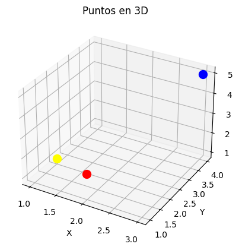

Luego se graficó la proyección perspectiva con tres distancias focales distintas (`d = 0.5, 1, 2`) para observar cómo `d` afecta la dispersión de los puntos proyectados:

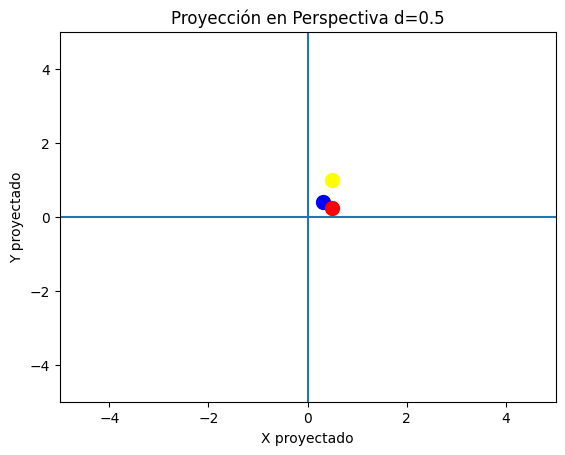
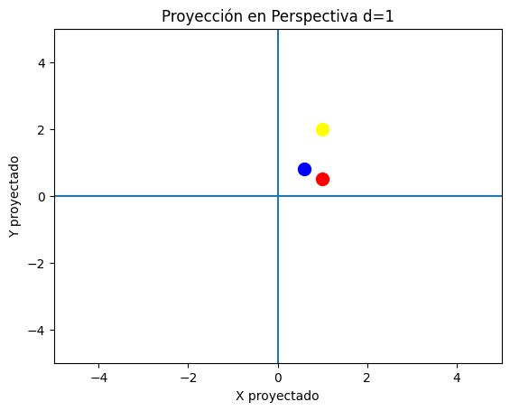
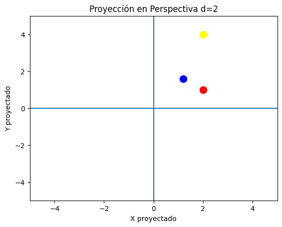

Finalmente la proyección ortogonal, donde los puntos caen directamente en sus coordenadas XY:

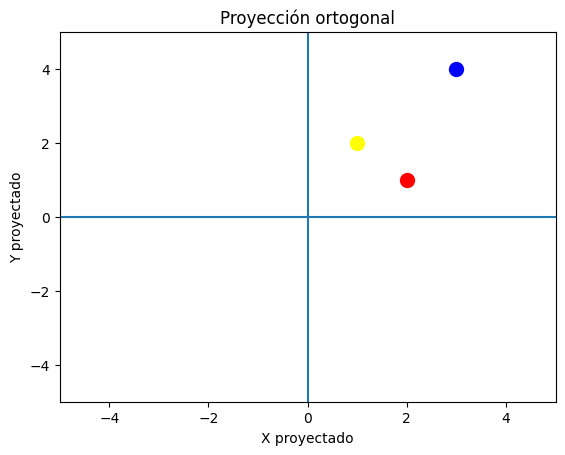

---

### Unity

Se colocaron 3 cubos alineados en el eje Z para comparar ambas proyecciones directamente en el motor.

**Perspectiva (configuración por defecto):** los cubos más lejanos se ven más pequeños.

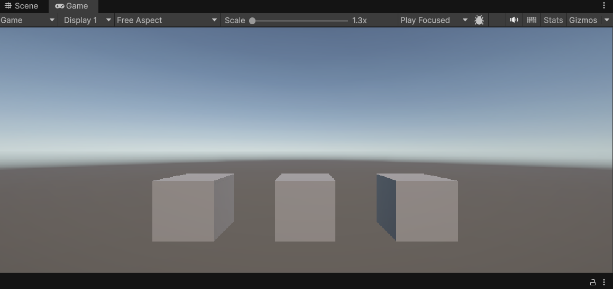

**Ortográfica:** los tres cubos se ven del mismo tamaño aunque estén a distintas profundidades.

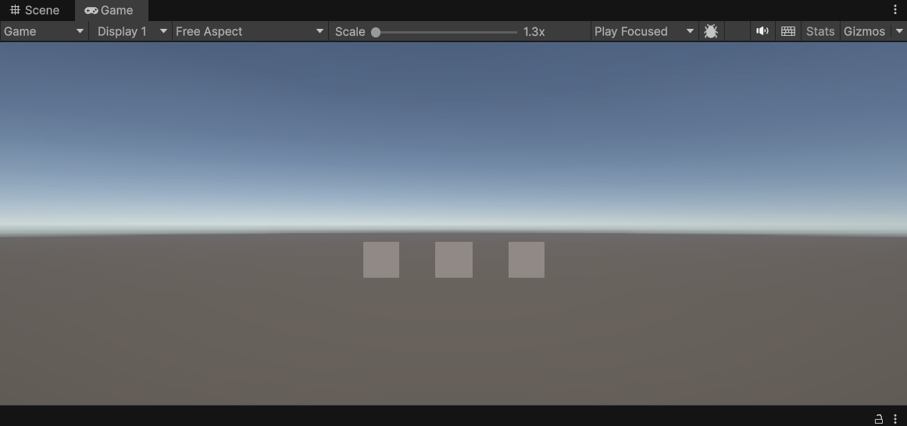

**FOV reducido a 30°:** al estrechar el frustum se recortan los cubos de los costados.

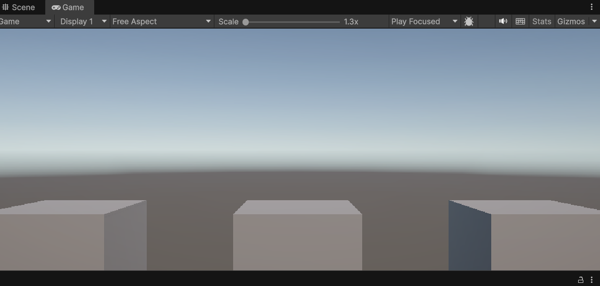

**Near clipping plane ajustado a 3.5:** la cara frontal del cubo más cercano deja de renderizarse porque queda fuera del volumen de vista.

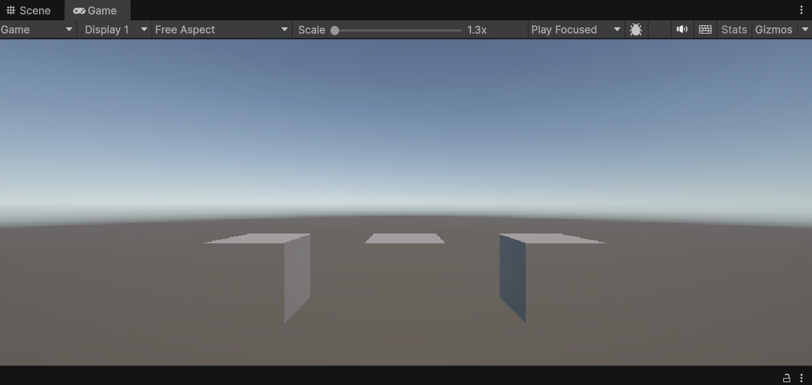

---

### Three.js (React Three Fiber)

Se implementó una escena interactiva con tres cubos a distintas profundidades (`Z = 0`, `Z = -5`, `Z = -10`) y botones para cambiar en tiempo real entre cámara perspectiva y ortográfica, usando `OrbitControls` para navegación libre.

```jsx
import { PerspectiveCamera, OrthographicCamera, OrbitControls } from '@react-three/drei';

// Perspectiva: el FOV y la distancia Z determinan el tamaño aparente
<PerspectiveCamera makeDefault position={[0, 3, 8]} fov={60} near={0.1} far={100} />

// Ortográfica: el tamaño en pantalla es independiente de la profundidad
<OrthographicCamera makeDefault position={[0, 3, 8]} zoom={55} near={0.1} far={100} />
```

Los objetos están posicionados a diferentes Z para que la diferencia sea visible al cambiar de modo:

```jsx
const OBJECTS = [
  { position: [0, 0,   0], color: '#ef4444', label: 'Z = 0\n(cercano)'  },
  { position: [0, 0,  -5], color: '#22c55e', label: 'Z = -5\n(medio)'   },
  { position: [0, 0, -10], color: '#3b82f6', label: 'Z = -10\n(lejano)' },
];
```

Con la cámara en **perspectiva** el cubo azul (Z = -10) aparece notablemente más pequeño que el rojo (Z = 0). Al cambiar a **ortográfica**, los tres cubos tienen el mismo tamaño en pantalla.

---

### Processing

Se ubicaron 3 cubos con diferentes valores de `z` y se definió una variable booleana para alternar entre proyección ortogonal y perspectiva usando las funciones nativas `perspective()` y `ortho()` de Processing.

```java
pushMatrix();
translate(-100, 0, -100);
fill(255, 0, 0);
box(80);
popMatrix();

pushMatrix();
translate(0, 0, -300);
fill(0, 255, 0);
box(80);
popMatrix();

pushMatrix();
translate(100, 0, -500);
fill(0, 0, 255);
box(80);
popMatrix();
```

**Proyección en perspectiva:**

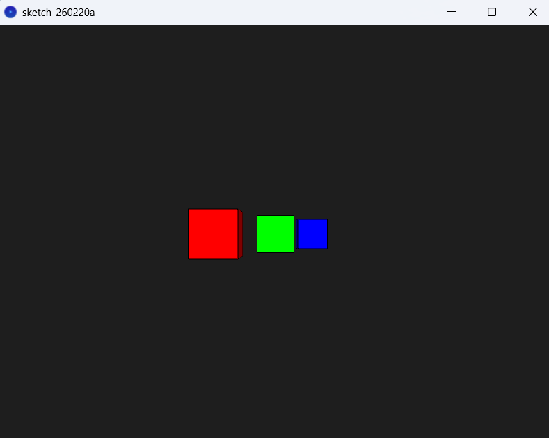

**Proyección ortogonal:**

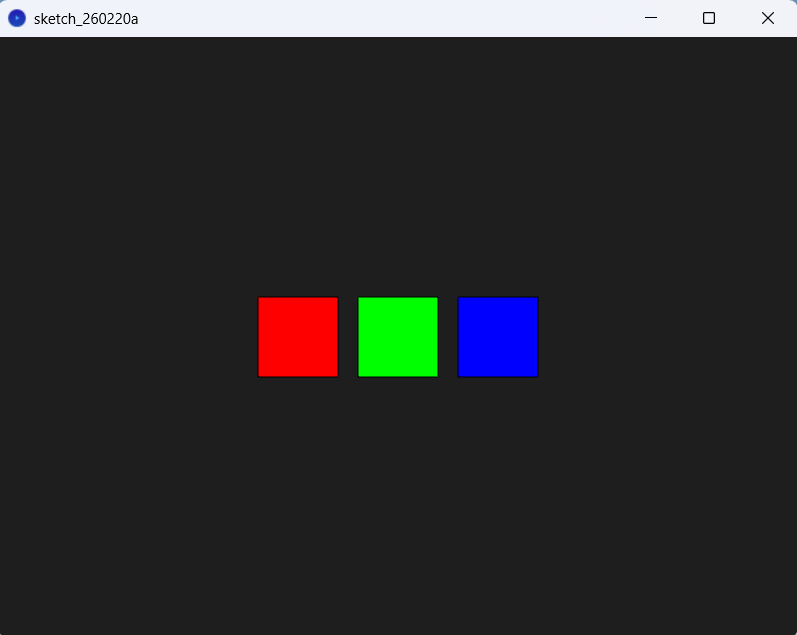

---

## Aprendizajes y dificultades

- Las "cámaras" en motores gráficos no son más que una **matriz de proyección** que transforma el espacio 3D en coordenadas de pantalla 2D. Cambiar de perspectiva a ortográfica equivale a swapear esa matriz.
- La división por `w` (perspectiva divide) es lo que produce el efecto de profundidad: es matemáticamente lo mismo que la proyección de un rayo desde el centro de la cámara hacia el punto en el espacio.
- El **FOV** y la distancia focal `d` son inversamente proporcionales: `d = 1/tan(FOV/2)`. Un FOV amplio corresponde a una `d` pequeña.
- El **near clipping plane** existe porque la división por `z` explota cuando `z → 0`; el hardware necesita ese límite mínimo para que los cálculos de profundidad (z-buffer) sean numericamente estables.
- En Three.js, `PerspectiveCamera` y `OrthographicCamera` son exactamente esas matrices más una transformación de viewport, lo que hace muy directo trasladar la teoría al código.
