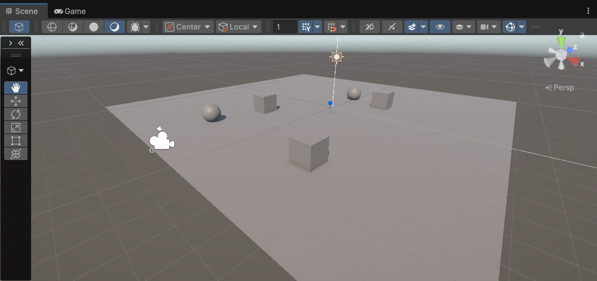

# Taller Proyecciones 3D: Cómo ve una una cámara virtual
Sebastián Andrade Cedano

Entregado: 27 Feb 2026

## Objetivo

El taller consiste en experimentar con los diversos tipos de proyección de las cámaras en Unity, y con los párametros que estas tienen.

## Implementaciones

### Unity
Se ubicó un plano en la escena, y se ubicaron sobre este varios cubos y esferas en distintas posiciones.



Se agregó también un toggle button, un slider y un TMP Text, cuyas funciones son: cambiar entre cámara ortográfica y en perspectiva, modificar el FOV o el Size, e imprimir la matriz de proyección que la cámara está aplicando en un momento dado.

En el script se agregaron estos Game Objects y se manejan de la siguiente forma:

El método `SwitchMode` nos permite cambiar el modo de la cámara usando el toggle button, se encarga de configurar los valores máximos y mínimos del slider para configurar o el size de la proyección ortográfica o el fov de la perspectiva.
```
    public void SwitchMode()
    {
        if(orthographic.isOn)
        {
            cam.orthographic = true;
            float orthoSize = cam.orthographicSize;
            label.text = $"Size: {orthoSize.ToString("F2")}";
            slider.maxValue = 20;
            slider.value = orthoSize;
        }
        else
        {
            cam.orthographic = false;
            float fov = cam.fieldOfView;
            label.text = $"FOV: {fov.ToString("F2")}";
            slider.maxValue = 169;
            slider.value = fov;
        }

        matrixText.text = cam.projectionMatrix.ToString("F2");
    }
```

El método `ManageSlider` se encarga de detectar el modo actual de la cámara y en base a ese modo configurar el párametro size o fov, para ortográfica o perspectiva, respectivamente.

```
    public void ManageSlider()
    {
        float value = slider.value;

        if(orthographic.isOn)
        {
            cam.orthographicSize = value;
            label.text = $"Size: {value.ToString("F2")}";
        }
        else
        {
            cam.fieldOfView = value;
            label.text = $"FOV: {value.ToString("F2")}";
        }

        matrixText.text = cam.projectionMatrix.ToString("F2");
    }
```
#### Escena en ejecución


Se puede observar en el gif, como difieren la proyección ortográfica y en perspectiva, y como el cambiar los parametros de estas proyecciones deforma la manera en la que los diversos objetos se representan en la pantalla.

## Aprendizajes y dificultades
* La proyección ortogonal difiere bastante de la perspectiva.
* Los parámetros de size y fov afectan significativamente la forma en la que se observan los objetos.
