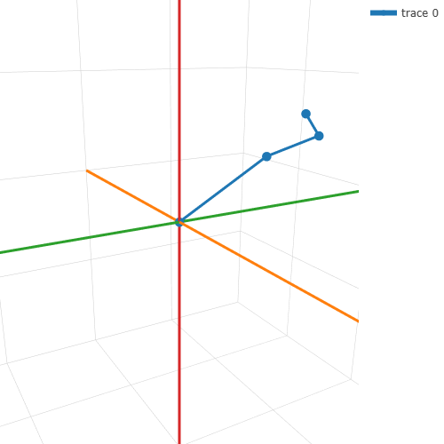
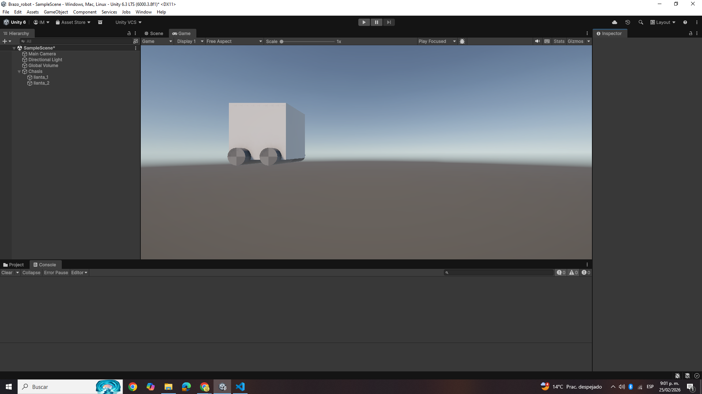
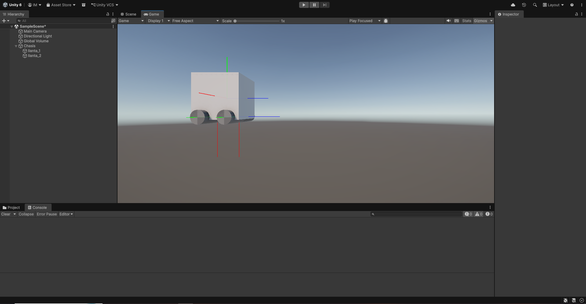
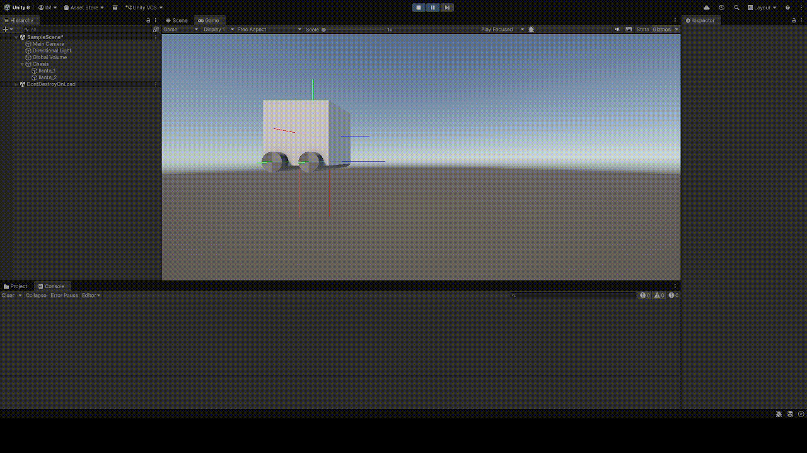
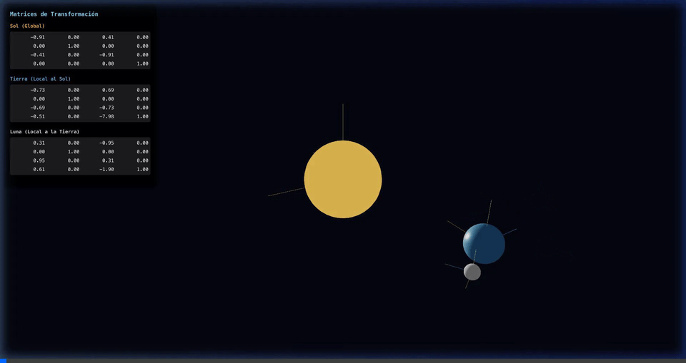

# Taller Transformaciones Homogéneas y Cambios de Base

## Nombre del estudiante
Gabriel Andres Anzola Tachak

## Fecha de entrega
2026-02-27

---

## Descripción breve

Aplicar transformaciones homogéneas (traslación, rotación, escala) como multiplicaciones de matrices 4×4, comprender la composición de transformaciones mediante producto matricial, y explorar cambios de base entre sistemas de referencia locales y globales en contextos de robótica y gráficos 3D.

---

## Fundamento matemático

### ¿Por qué coordenadas homogéneas?

En 3D euclidiano las rotaciones y escalas se representan con matrices 3×3, pero la **traslación no puede expresarse como multiplicación**:

```
punto_trasladado = punto + t   ← suma, no puede unirse a una rotación en una sola multiplicación
```

Agregando una cuarta coordenada `w = 1` a cada punto, la traslación se convierte en multiplicación de matrices 4×4, lo que permite **componer cualquier transformación en un solo producto**:

```
(x, y, z)  →  (x, y, z, 1)
```

### Matrices de transformación homogénea

**Traslación** por `(tx, ty, tz)`:

```
     ┌ 1  0  0  tx ┐
T =  │ 0  1  0  ty │
     │ 0  0  1  tz │
     └ 0  0  0   1 ┘
```

**Rotación alrededor de Z** por ángulo `θ`:

```
      ┌ cos θ  -sin θ  0  0 ┐
Rz =  │ sin θ   cos θ  0  0 │
      │   0       0    1  0 │
      └   0       0    0  1 ┘
```

**Rotación alrededor de X** por ángulo `θ`:

```
      ┌ 1    0       0    0 ┐
Rx =  │ 0  cos θ  -sin θ  0 │
      │ 0  sin θ   cos θ  0 │
      └ 0    0       0    1 ┘
```

**Rotación alrededor de Y** por ángulo `θ`:

```
      ┌  cos θ  0  sin θ  0 ┐
Ry =  │    0    1    0    0 │
      │ -sin θ  0  cos θ  0 │
      └    0    0    0    1 ┘
```

### Composición de transformaciones

La clave del taller es que **concatenar transformaciones = multiplicar matrices**. Si quiero rotar y luego trasladar:

```
M_compuesta = T · R
```

El orden importa: `T · R ≠ R · T` en general.

### Transformaciones locales vs. globales en una jerarquía

En una cadena cinemática (brazo robótico, sistema solar):

```
M_global_hijo = M_global_padre · M_local_hijo
```

Esto permite que el hijo herede automáticamente el movimiento del padre: si el padre rota, el hijo rota con él **además** de su propio movimiento local.

---

## Implementaciones

### Brazo robótico en Python

Se modeló un brazo con 3 articulaciones: hombro (`shoulder`), codo (`elbow`) y muñeca (`wrist`), cada una con su sistema de coordenadas local. El hombro está anclado al origen.

```python
import numpy as np

# Posición de cada articulación relativa a su padre (local), en coordenadas homogéneas
shoulder = np.array([[0, 0, 0, 1]]).T
elbow    = np.array([[4, 0, 0, 1]]).T
wrist    = np.array([[2, 0, 0, 1]]).T
hand     = np.array([[1, 0, 0, 1]]).T

# Matrices de posición base (traslación pura, identidad + offset)
M_elbow = np.eye(4)
M_elbow[:, 3] = elbow[:, 0]

Ml_wrist = np.eye(4)
Ml_wrist[:, 3] = wrist[:, 0]

# Posición global de la muñeca = posición global del codo × posición local de la muñeca
Mg_wrist = M_elbow @ Ml_wrist

Ml_hand = np.eye(4)
Ml_hand[:, 3] = hand[:, 0]
Mg_hand = Mg_wrist @ Ml_hand
```

**Función general de rotación** para cualquier eje:

```python
def rotationMatrix(theta, axis):
    c, s = np.cos(theta), np.sin(theta)
    if axis == 'z':
        return np.array([[c, -s, 0, 0],
                         [s,  c, 0, 0],
                         [0,  0, 1, 0],
                         [0,  0, 0, 1]])
    elif axis == 'x':
        return np.array([[1, 0,  0, 0],
                         [0, c, -s, 0],
                         [0, s,  c, 0],
                         [0, 0,  0, 1]])
    elif axis == 'y':
        return np.array([[ c, 0, s, 0],
                         [ 0, 1, 0, 0],
                         [-s, 0, c, 0],
                         [ 0, 0, 0, 1]])
```

Al rotar el hombro, la transformación se **propaga** automáticamente al codo y la muñeca recomputando sus matrices globales:

```python
def rotateShoulder(theta, axis):
    # Rotar el codo en coordenadas locales
    matrix = rotationMatrix(theta, axis)
    M_elbow = matrix @ M_elbow_base

    # Propagar al hijo (muñeca) y nieto (mano)
    Mg_wrist = M_elbow @ Ml_wrist
    Mg_hand  = Mg_wrist @ Ml_hand
```

El mismo patrón se aplica a `rotateElbow` y `rotateWrist`, propagando solo hacia los hijos descendientes.



El gráfico interactivo (Plotly + sliders) permite controlar el ángulo de cada articulación en tiempo real:


---

### Unity — Carro con llantas

Se modeló un carro compuesto de un chasis y dos llantas. Cada llanta aplica rotación de forma diferente para comparar las dos aproximaciones disponibles en Unity.

**Llanta 1: rotación mediante `Transform.Rotate`** (API de alto nivel):

```csharp
public class Llanta : MonoBehaviour
{
    public float velocidadRotacion = 67f;

    void Update()
    {
        // Transform.Rotate aplica internamente una multiplicación de matrices
        transform.Rotate(Vector3.up * velocidadRotacion * Time.deltaTime, Space.Self);
    }
}
```

**Llanta 2: rotación explícita con `Matrix4x4`** (API de bajo nivel, equivalente al Python):

```csharp
public class Llanta_matrix : MonoBehaviour
{
    public float velocidadRotacion = 67f;

    void Update()
    {
        float angulo = velocidadRotacion * Time.deltaTime;

        // Matriz incremental de rotación para este frame
        Matrix4x4 rotacion = Matrix4x4.Rotate(Quaternion.Euler(0f, angulo, 0f));

        // Matriz de rotación actual del transform
        Matrix4x4 actual = Matrix4x4.Rotate(transform.localRotation);

        // Composición: nueva_rotación = rotación_acumulada × incremento
        Matrix4x4 resultado = actual * rotacion;

        // Convertir de vuelta a Quaternion para asignar al transform
        transform.localRotation = resultado.rotation;
    }
}
```

Ambas producen el mismo resultado visual, pero la segunda muestra explícitamente que Unity gestiona las transformaciones internamente como **productos de matrices 4×4**.



Los ejes locales del objeto se visualizan con Gizmos para comprobar el sistema de referencia:



El chasis traslada y las llantas rotan produciendo la animación completa:



---

### Sistema Solar en Three.js

Se implementó un sistema Sol–Tierra–Luna para demostrar la composición jerárquica de transformaciones. La jerarquía de escena de R3F reproduce la relación `M_global = M_padre × M_local` de forma automática.

Para evitar el overhead de React en cada frame, se desactivó el recálculo automático de matrices (`matrixAutoUpdate={false}`) y se manipularon directamente con `THREE.Matrix4` en `useFrame`:

**Tierra orbitando el Sol (composición rotación × traslación):**

```javascript
// En useFrame, t = tiempo acumulado en segundos

// Rotación de órbita alrededor del Sol
mRotationEarthY.makeRotationY(t * 1.5);

// Traslación radial (radio de órbita = 8 unidades)
mTranslationEarth.makeTranslation(8, 0, 0);

// Composición: primero rota el eje, luego traslada sobre ese eje rotado
// → produce órbita circular alrededor del origen
mEarthLocal.identity();
mEarthLocal.multiply(mRotationEarthY);
mEarthLocal.multiply(mTranslationEarth);

// Spin propio de la Tierra sobre su eje
const spinEarth = new THREE.Matrix4().makeRotationY(t * 4);
mEarthLocal.multiply(spinEarth);

// Asignar directamente. Como Earth es hijo de Sun en el scene graph,
// Three.js aplica: M_global_Earth = M_global_Sun × mEarthLocal
earthRef.current.matrix.copy(mEarthLocal);
```

**Luna orbitando la Tierra (exactamente el mismo patrón, a menor escala):**

```javascript
mRotationMoonY.makeRotationY(t * 5);         // Órbita más rápida
mTranslationMoon.makeTranslation(2, 0, 0);   // Radio = 2 unidades

mMoonLocal.identity();
mMoonLocal.multiply(mRotationMoonY);
mMoonLocal.multiply(mTranslationMoon);

moonRef.current.matrix.copy(mMoonLocal);
// M_global_Moon = M_global_Earth × mMoonLocal
//               = M_global_Sun × mEarthLocal × mMoonLocal
```

La UI muestra la matriz 4×4 completa de cada cuerpo celeste en tiempo real, donde la cuarta columna refleja la posición global (X, Y, Z) y el bloque 3×3 superior izquierdo codifica la orientación.



---

## Aprendizajes y dificultades

- **La composición de transformaciones no es conmutativa**: `T·R ≠ R·T`. Trasladar y luego rotar produce un resultado diferente a rotar primero. En la órbita terrestre esto es crítico: si se pone la traslación antes de la rotación, la Tierra no orbita sino que gira en torno a sí misma desplazada.
- **Las jerarquías eliminan la aritmética manual de coordenadas globales**: basta con definir cada movimiento en coordenadas locales y el producto `M_global_padre × M_local_hijo` hace el resto. El brazo robótico lo muestra claramente.
- **En Three.js es necesario generar una nueva rotación desde cero en cada frame** (no acumular `makeRotationY` sobre la misma matriz), de lo contrario la rotación no parte del ángulo correcto. El truco es recalcular desde `t` (tiempo total) en vez de delta.
- **`matrixAutoUpdate = false`** es esencial para control manual de matrices en R3F: sin ello Three.js sobreescribe la matriz con los valores de `position`/`rotation`/`scale` del objeto en cada frame, descartando las operaciones manuales.
- En Unity, `Matrix4x4.rotation` hace una decompocición de la parte rotacional de la matriz 4×4, recordando que la representación interna de Unity siempre es Quaternion. El paso matriz → Quaternion → matriz puede acumular error de punto flotante a lo largo del tiempo.
