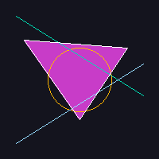
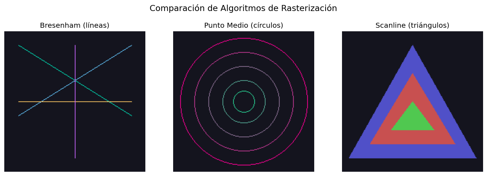

# Taller 3.1 — Algoritmos de Rasterización Básica

## Nombre del estudiante
Gabriel Andres Anzola Tachak

## Fecha de entrega
2026-04-08

---

## Descripción breve

Este taller implementa los tres algoritmos clásicos de rasterización directamente sobre un mapa de píxeles, sin depender de librerías de alto nivel para el dibujo. El objetivo es comprender cómo una GPU o software renderer convierte primitivas geométricas (líneas, círculos, triángulos) en píxeles discretos.

El **algoritmo de Bresenham** genera líneas usando únicamente aritmética entera, evitando operaciones de punto flotante. El **algoritmo del punto medio** aprovecha la simetría de 8 octantes de un círculo para reducir el cómputo a solo un octante. El **relleno scanline** recorre el triángulo horizontalmente línea a línea, interpolando los bordes para determinar qué píxeles quedan dentro.

---

## Implementaciones

| Entorno | Archivo | Estado |
|---|---|---|
| Python | `python/rasterizacion_basica.ipynb` | Completado |
| Three.js | — | No requerido |

---

## Resultados Visuales

### Escena Completa (todos los algoritmos combinados)


### Comparación de los tres algoritmos


### GIF — Construcción progresiva


---

## Código Relevante

### Bresenham (línea)
```python
def bresenham(x0, y0, x1, y1):
    pixels = []
    dx = abs(x1 - x0); dy = abs(y1 - y0)
    sx = 1 if x0 < x1 else -1
    sy = 1 if y0 < y1 else -1
    err = dx - dy
    while True:
        pixels.append((x0, y0))
        if x0 == x1 and y0 == y1: break
        e2 = 2 * err
        if e2 > -dy: err -= dy; x0 += sx
        if e2 < dx:  err += dx; y0 += sy
    return pixels
```

### Punto Medio (círculo)
```python
def midpoint_circle(x0, y0, radius):
    x, y, p = radius, 0, 1 - radius
    while x > y:
        y += 1
        p = p + 2*y + 1 if p <= 0 else p + 2*y - 2*x + 1
        if p > 0: x -= 1
        # pintar los 8 octantes...
```

### Scanline (triángulo)
```python
def fill_triangle(px, p1, p2, p3, color):
    verts = sorted([p1, p2, p3], key=lambda v: v[1])
    # para cada scanline entre y_min y y_max:
    #   interpolar borde izquierdo y derecho
    #   rellenar píxeles entre ellos
```

---

## Prompts Utilizados

Este taller fue desarrollado con asistencia de Claude Code para generar el scaffolding del notebook, siguiendo el mismo esquema de configuración del taller 1.4.

---

## Aprendizajes y Dificultades

- El algoritmo de Bresenham requiere cuidado con el manejo del signo en todas las 4 direcciones de pendiente; la variable `err` acumula el error fraccional que se compensa con incrementos enteros.
- El punto medio para círculos funciona porque la circunferencia es simétrica: calcular un punto en el primer octante determina los otros 7 por reflexión.
- El relleno scanline necesita dividir el triángulo en dos mitades (superior e inferior respecto al vértice medio en Y) para que la interpolación de bordes sea correcta en cada tramo.

---

## Estructura del Proyecto

```
semana_3_1_algoritmos_rasterizacion_basica/
├── python/
│   └── rasterizacion_basica.ipynb
├── media/
│   ├── escena_completa.png
│   ├── comparacion_algoritmos.png
│   └── rasterizacion_construccion.gif
└── README.md
```
