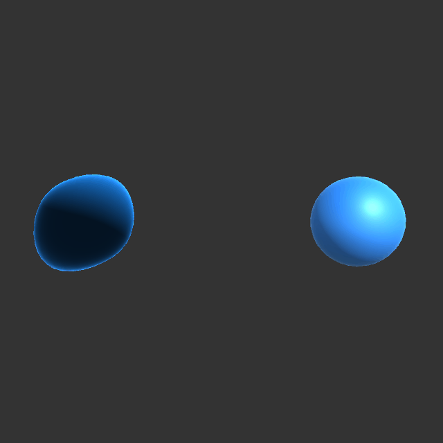

# Taller 3.4 — Etapas del Pipeline Programable

## Nombre del estudiante
Gabriel Andres Anzola Tachak

## Fecha de entrega
2026-04-08

**Curso:** Computación Visual 2026-I

---

## Descripción breve

Este taller recorre las cuatro etapas del pipeline gráfico programable implementando
shaders GLSL personalizados con `ShaderMaterial` de Three.js.

El **vertex shader** (`vertex.glsl`) toma cada vértice en model space, lo deforma
sinusoidalmente en función del tiempo, pasa las coordenadas UV y la normal
transformada como *varyings*, y por último proyecta la posición a clip space mediante
`projectionMatrix × modelViewMatrix`. La malla animada hace evidente que el vertex
shader opera *antes* del rasterizador: la GPU solo recibe posiciones finales, sin
saber nada del cálculo de onda que las generó.

El **fragment shader** (`fragment.glsl`) recibe los varyings ya interpolados
baricentricamente por el rasterizador, construye el color final en tres capas:
color base derivado de las coordenadas UV animadas en el tiempo, iluminación difusa
Lambert (`dot(N, L)`) y un efecto Fresnel de borde
(`pow(1 - dot(N, viewDir), p)`). El exponente Fresnel es controlable en tiempo real
desde la UI, lo que permite ver directamente cómo un uniform modifica el resultado
per-fragmento sin recompilar el shader.

---

## Implementaciones

| Entorno  | Archivo(s) | Descripción |
|----------|-----------|-------------|
| Three.js | `src/App.jsx` + `src/shaders/vertex.glsl` + `src/shaders/fragment.glsl` | Pipeline completo con UI interactiva |
| Unity    | `unity/project_3_4/Assets/Shaders/...` | Pipeline Shader (HLSL) y script auto-setup (C#) |

---

## Resultados visuales

Capturas disponibles en `media/` tras ejecutar `npm run dev`.

| Captura | Descripción |
|---------|-------------|
| `media/pipeline_overview.png` | Esfera deformada con normal-color + Fresnel |
| `media/fresnel_comparison.png` | Mismo frame con Fresnel power = 1 vs 7 |


---

## Código relevante

### Vertex shader — deformación sinusoidal + MVP

```glsl
uniform float time;
varying vec2  vUv;
varying vec3  vNormal;
varying vec3  vPosition;

void main() {
  vUv      = uv;
  vNormal  = normalize(normalMatrix * normal);

  vec3 pos  = position;
  pos.z    += sin(pos.x * 5.0 + time) * 0.12;
  pos.z    += sin(pos.y * 4.0 + time * 0.7) * 0.08;

  vPosition   = (modelViewMatrix * vec4(pos, 1.0)).xyz;
  gl_Position = projectionMatrix * modelViewMatrix * vec4(pos, 1.0);
}
```

### Fragment shader — Lambert + Fresnel

```glsl
uniform float time;
uniform vec3  lightDir;
uniform float fresnelPow;

varying vec2  vUv;
varying vec3  vNormal;
varying vec3  vPosition;

void main() {
  vec3 n = normalize(vNormal);

  // Color base UV-animado
  vec3 baseColor = vec3(vUv.x, vUv.y, 0.5 + 0.5 * sin(time * 0.8));

  // Lambert
  float diff  = max(dot(n, normalize(lightDir)), 0.0);
  vec3 litColor = baseColor * (0.15 + 0.85 * diff);

  // Fresnel rim
  vec3  viewDir = normalize(-vPosition);
  float fresnel = pow(1.0 - max(dot(n, viewDir), 0.0), fresnelPow);
  vec3  rimColor = vec3(0.2, 0.6, 1.0) * fresnel;

  gl_FragColor = vec4(litColor + rimColor, 1.0);
}
```

### Actualizar uniform `time` en cada fotograma (React Three Fiber)

```jsx
useFrame((_, delta) => {
  clockRef.current += delta;
  material.uniforms.time.value = clockRef.current;
});
```

### Importar shaders GLSL como texto (Vite `?raw`)

```js
import vertexShader   from './shaders/vertex.glsl?raw';
import fragmentShader from './shaders/fragment.glsl?raw';

const material = new THREE.ShaderMaterial({ vertexShader, fragmentShader, uniforms });
```

### Unity — Pipeline Programable (HLSL y Automatización)

Se estructuró el proyecto en Unity 6 utilizando un shader clásico `.shader` tipo ShaderLab que implementa las etapas Vertex y Fragment mediante código HLSL directamente. Al carecer de componentes generadores manuales en el editor, se elaboró un script C# `ShaderDemoSetup.cs` que orquesta la carga automática, asignación de materiales e instanciación de primitivas en la escena de pruebas.

**ShaderLab + HLSL (Vertex & Fragment):**

```glsl
// En la etapa de Vertex (Vertex Shader)
float waveX = sin(v.vertex.x * 5.0 + _Time.y * 3.0) * 0.12;
v.vertex.z += waveX;

o.vertex = UnityObjectToClipPos(v.vertex);
o.normalWS = UnityObjectToWorldNormal(v.normal);

// En la etapa Fragment (Fragment Shader)
float3 n = normalize(i.normalWS);
float fresnel = pow(1.0 - max(dot(n, i.viewDirWS), 0.0), _FresnelPower);
```

**Script de Setup Automático (C#):**

```csharp
Material pipelineMat = new Material(Shader.Find("Custom/PipelinePersonalizado"));
pipelineMat.SetColor("_Color", new Color(0.1f, 0.5f, 0.9f));
pipelineMat.SetFloat("_FresnelPower", 4.0f);
AssetDatabase.CreateAsset(pipelineMat, "Assets/Materials/PipelineShaderMaterial.mat");
sphere.GetComponent<Renderer>().sharedMaterial = pipelineMat;
```

A través de una simulación algorítmica de manipulación de la variable global de Tiempo (`_Time`) desde procesamiento Batchmode y la extracción iterada a una textura en memoria RAM (`RenderTexture`), se lograron exportar 30 imágenes continuas que se unificaron para visualizar la muestra dinámica del Shader evaluándose interactivo de forma nativa en el motor.



---

## Prompts utilizados

Se usó IA (Claude) como asistente para generar el scaffolding y la estructura de
archivos. La lógica GLSL (transformaciones, Lambert, Fresnel) fue revisada y
verificada manualmente contra las ecuaciones del enunciado.

---

## Aprendizajes y dificultades

- La distinción entre **uniform** (constante por draw call, enviada desde CPU) y
  **varying** (interpolada entre vértices por el rasterizador) es la clave para
  entender el flujo de datos del pipeline. Un error común es tratar de escribir en
  un varying desde el fragment shader, lo que el compilador rechaza.
- `normalMatrix` (inversa traspuesta de la parte 3×3 de modelViewMatrix) es
  necesaria para transformar normales correctamente cuando hay escalas no uniformes;
  usar `modelViewMatrix` directamente distorsionaría las normales.
- Vite importa archivos `.glsl` como string de texto usando el sufijo `?raw`,
  sin necesidad de plugins adicionales.
- El efecto Fresnel requiere que `vPosition` esté en **view space** (no world space)
  porque `normalize(-vPosition)` apunta hacia el origen de la cámara, que en view
  space siempre es `(0, 0, 0)`.

---

## Estructura del proyecto

```
semana_3_4_etapas_pipeline_programable/
├── unity/
│   └── project_3_4/
│       └── Assets/
│           ├── Shaders/PipelinePersonalizado.shader
│           └── Scripts/ShaderDemoSetup.cs
├── threejs/
│   ├── index.html
│   ├── package.json
│   ├── vite.config.js
│   ├── eslint.config.js
│   └── src/
│       ├── main.jsx
│       ├── App.jsx
│       ├── index.css
│       └── shaders/
│           ├── vertex.glsl
│           └── fragment.glsl
├── media/
└── README.md
```
