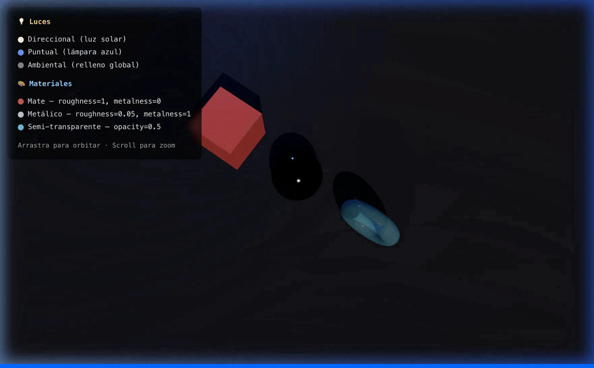

# Taller Luces Sombras Radiometria

**Estudiante:** Gabriel Andres Anzola Tachak  
**Fecha de entrega:** 2026-04-08

---

## Descripción breve

Este taller explora la interacción entre fuentes de luz y materiales 3D usando Three.js con React Three Fiber. El objetivo es entender cómo distintos tipos de luz (ambiental, direccional, puntual) afectan superficies con propiedades radiométricas diferentes (mate, metálico, semi-transparente), y cómo el motor gráfico genera sombras proyectadas mediante shadow maps.

Se implementó una escena interactiva con tres objetos que representan cada categoría de material, iluminados por tres fuentes de luz simultáneas y renderizados sobre un plano receptor de sombras.

---

## Implementaciones

### Three.js con React Three Fiber

**Escena:**  
Una habitación oscura con piso plano sobre el que se proyectan sombras de tres objetos con geometrías y materiales distintos.

**Luces configuradas:**

| Tipo | Posición | Color | Intensidad | Sombras |
|------|----------|-------|-----------|---------|
| `ambientLight` | — | #ffffff | 0.25 | No |
| `directionalLight` | (5, 8, 5) | #fff5e0 (cálido) | 1.8 | Sí — shadow-mapSize 2048×2048 |
| `pointLight` | (-5, 4, -4) | #5599ff (frío) | 40 cd | No |

**Materiales usados:**

| Objeto | Geometría | `roughness` | `metalness` | `opacity` | Comportamiento |
|--------|-----------|------------|------------|----------|---------------|
| Caja roja | Box | 1.0 | 0.0 | 1.0 | Solo respuesta difusa (Lambertiana) |
| Esfera plateada | Sphere (64 seg) | 0.05 | 1.0 | 1.0 | Especular dominante, refleja el entorno |
| Torus cian | Torus (80 seg) | 0.15 | 0.0 | 0.5 | Transmisión parcial de luz |

**Sombras:**  
El `<Canvas>` tiene `shadows` habilitado. La `directionalLight` tiene `castShadow` con un frustum ortográfico de ±12 unidades. El piso usa `receiveShadow`. Los tres objetos usan tanto `castShadow` como `receiveShadow`.

---

## Resultados visuales

> Captura las siguientes vistas con GIPHY Capture y colócalas en `media/`:

- `media/escena_completa.gif` — Orbita completa mostrando las 3 luces y 3 materiales
- `media/sombras_detalle.png` — Vista cenital de las sombras proyectadas sobre el plano




---

## Código relevante

### Canvas con sombras y cámara
```jsx
<Canvas shadows camera={{ position: [7, 6, 10], fov: 45 }}>
  <color attach="background" args={["#1a1a2e"]} />
  <Scene />
</Canvas>
```

### Luz direccional con shadow map
```jsx
<directionalLight
  position={[5, 8, 5]}
  intensity={1.8}
  color="#fff5e0"
  castShadow
  shadow-mapSize={[2048, 2048]}
  shadow-camera-near={0.1}
  shadow-camera-far={60}
  shadow-camera-left={-12}
  shadow-camera-right={12}
  shadow-camera-top={12}
  shadow-camera-bottom={-12}
/>
```

### Materiales (mate · metálico · transparente)
```jsx
// Matte — Lambertian diffuse, roughness=1
<meshStandardMaterial color="#d94f4f" roughness={1} metalness={0} />

// Metallic — specular dominant
<meshStandardMaterial color="#c0c8d0" roughness={0.05} metalness={1} />

// Semi-transparent — partial light transmission
<meshStandardMaterial
  color="#52c0e8" transparent opacity={0.5}
  roughness={0.15} metalness={0} depthWrite={false}
/>
```

---

## Prompts utilizados

Se usó Claude (claude-sonnet-4-6) para:
- Estructurar la escena Three.js a partir de los requisitos radiométricos del taller.
- Definir los valores de `roughness`, `metalness` y `opacity` coherentes con los modelos PBR.
- Configurar el frustum ortográfico del shadow map para cubrir la escena sin desperdiciar resolución.

---

## Aprendizajes y dificultades

- La propiedad `shadows` en el `<Canvas>` activa el pipeline de shadow maps de WebGL; sin ella, ninguna luz proyecta sombras aunque tenga `castShadow`.
- El frustum de la `directionalLight` debe ajustarse manualmente a la escena: si es demasiado grande, los shadow maps pierden resolución; si es demasiado pequeño, las sombras se cortan.
- El `depthWrite={false}` en el material transparente evita artefactos de z-fighting donde las caras del torus se superponen a sí mismas.
- La `pointLight` usa unidades físicas (candela); valores bajos como 1.0 no son visibles, fue necesario aumentar a 40.

---

## Estructura del proyecto

```
semana_4_1_luces_sombras_radiometria/
├── threejs/
│   ├── src/
│   │   ├── App.jsx               ← Wrapper + Legend overlay
│   │   ├── main.jsx
│   │   ├── index.css
│   │   └── components/
│   │       └── LightScene.jsx    ← Canvas + Scene (luces y objetos)
│   ├── index.html
│   ├── package.json
│   ├── vite.config.js
│   ├── eslint.config.js
│   └── .gitignore
├── media/
│   ├── escena_completa.gif       ← pendiente captura
│   └── sombras_detalle.png       ← pendiente captura
└── README.md
```

---

## Referencias

- [React Three Fiber — Lights](https://docs.pmnd.rs/react-three-fiber/api/objects)
- [Three.js MeshStandardMaterial](https://threejs.org/docs/#api/en/materials/MeshStandardMaterial)
- [Three.js Shadow Maps](https://threejs.org/docs/#api/en/renderers/WebGLRenderer.shadowMap)
- Enunciado del taller: `semana_04_1_luces_sombras_radiometria.md`

---

## Checklist de entrega

- [ ] Escena Three.js con 3 tipos de luz (ambiental, direccional, puntual)
- [ ] 3 materiales distintos (mate, metálico, semi-transparente)
- [ ] Sombras proyectadas sobre plano receptor
- [ ] `media/` con mínimo 2 capturas/GIFs
- [ ] README completo con todos los campos
- [ ] `.gitignore` en carpeta `threejs/`
- [ ] Commits descriptivos en inglés
- [ ] Carpeta nombrada `semana_4_1_luces_sombras_radiometria`
