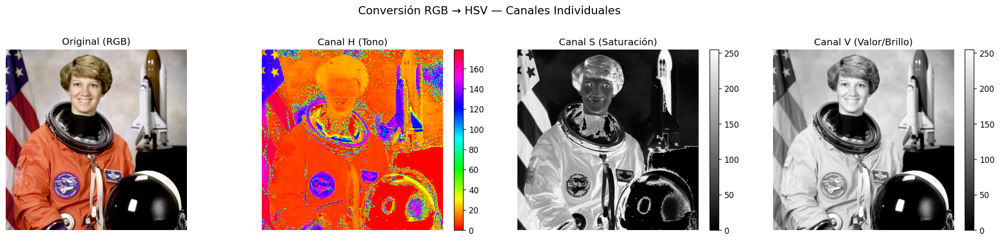
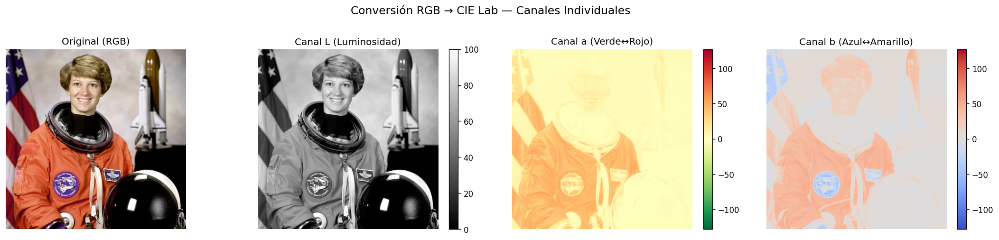
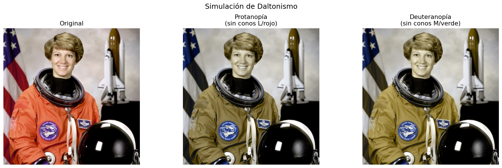
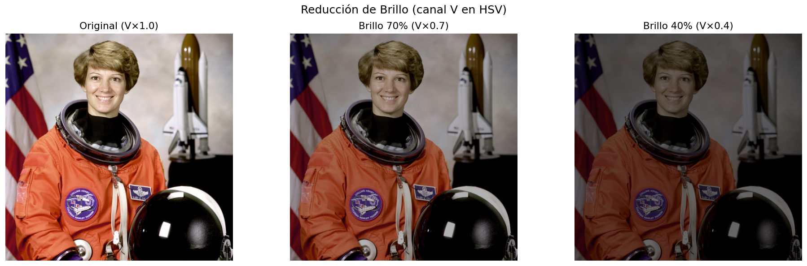
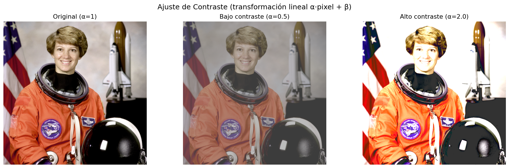
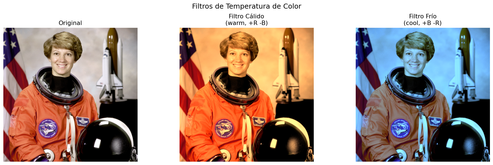
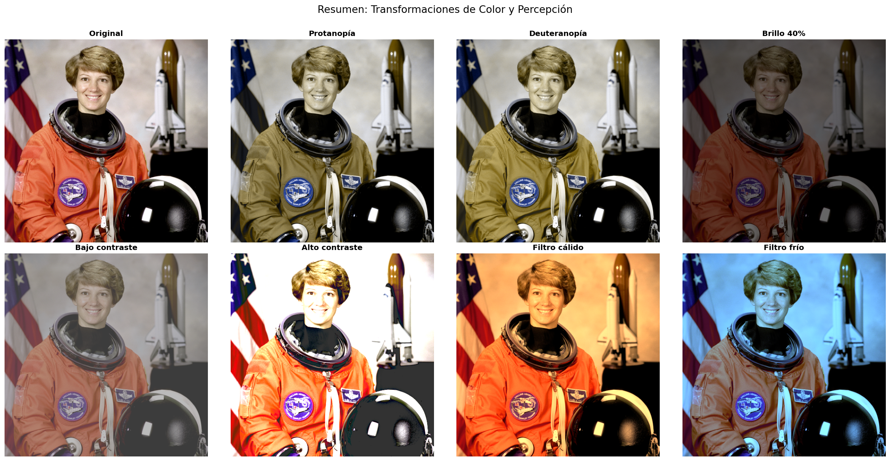

# Taller Modelos Color Percepcion

**Estudiante:** Gabriel Andrés Anzola Tachak  
**Fecha:** 2026-04-08

---

## Descripción

Exploración de la percepción del color desde el punto de vista humano y computacional. Se implementaron conversiones entre espacios de color (RGB→HSV, RGB→CIE Lab), simulaciones de daltonismo (protanopía y deuteranopía), y transformaciones de brillo, contraste y temperatura de color.

---

## Implementaciones

### Python (Jupyter Notebook)

| Funcionalidad | Descripción |
|---|---|
| RGB → HSV | Visualización separada de canales H, S, V |
| RGB → CIE Lab | Visualización separada de canales L, a, b |
| Daltonismo — Protanopía | Matriz de transformación LMS (sin conos L/rojo) |
| Daltonismo — Deuteranopía | Matriz de transformación LMS (sin conos M/verde) |
| Reducción de brillo | Multiplicación del canal V en HSV |
| Ajuste de contraste | Transformación lineal `α·pixel + β` con `cv2.convertScaleAbs` |
| Filtro cálido (warm) | Refuerza R, reduce B |
| Filtro frío (cool) | Refuerza B, reduce R |

---

## Resultados Visuales

### Canales HSV individuales


### Canales CIE Lab individuales


### Simulación de daltonismo (original vs. protanopía vs. deuteranopía)


### Reducción de brillo


### Ajuste de contraste


### Filtros de temperatura de color


### Resumen — todas las transformaciones


---

## Código Relevante

### Conversión RGB → HSV
```python
img_bgr = cv2.cvtColor(img_rgb, cv2.COLOR_RGB2BGR)
img_hsv = cv2.cvtColor(img_bgr, cv2.COLOR_BGR2HSV)
H, S, V = img_hsv[:,:,0], img_hsv[:,:,1], img_hsv[:,:,2]
```

### Simulación de daltonismo (Machado et al. 2009)
```python
M_protanopia = np.array([
    [0.152286, 1.052583, -0.204868],
    [0.114503, 0.786281,  0.099216],
    [-0.003882, -0.048116, 1.051998]
])
flat = img_float.reshape(-1, 3)
transformed = np.clip((M @ flat.T).T, 0, 1).reshape(h, w, 3)
```

### Ajuste de brillo via canal V
```python
hsv[:,:,2] = np.clip(hsv[:,:,2] * factor, 0, 255)
```

---

## Prompts Utilizados (IA Generativa)

- "Crea un notebook Python que implemente conversiones RGB→HSV y RGB→CIE Lab con visualización de canales individuales usando opencv y skimage"
- "Genera matrices de simulación de daltonismo (protanopía/deuteranopía) basadas en Machado et al. 2009"
- "Implementa filtros warm/cool manipulando canales RGB directamente"

---

## Aprendizajes y Dificultades

- **HSV vs. Lab:** HSV facilita la manipulación intuitiva (tono, saturación, brillo separados), mientras que CIE Lab es perceptualmente uniforme — la distancia euclidiana en Lab corresponde a diferencias percibidas.
- **Daltonismo:** Las matrices de transformación LMS (basadas en el espacio de conos) producen simulaciones más precisas que simplemente eliminar un canal RGB.
- **Contraste:** La transformación `α·x + β` puede saturar píxeles fácilmente; `cv2.convertScaleAbs` maneja el clipping automáticamente.
- **Dificultad principal:** Asegurar la consistencia de tipos (uint8 vs. float32) al pasar entre OpenCV y skimage.

---

## Estructura del Proyecto

```
semana_4_2_modelos_color_percepcion/
├── python/
│   ├── semana_4_2.ipynb
│   └── .gitignore
├── media/
│   ├── hsv_channels.png
│   ├── lab_channels.png
│   ├── daltonismo.png
│   ├── brightness.png
│   ├── contrast.png
│   ├── color_filters.png
│   └── summary.png
└── README.md
```

---

## Referencias

- Machado, G. M., Oliveira, M. M., & Fernandes, L. A. F. (2009). A Physiologically-based Model for Simulation of Color Vision Deficiency. *IEEE Transactions on Visualization and Computer Graphics*.
- OpenCV docs: `cv2.cvtColor`, `cv2.convertScaleAbs`
- scikit-image: `skimage.color.rgb2lab`, `skimage.data.astronaut`

---

## Checklist

- [x] Conversión RGB → HSV con visualización de canales H, S, V
- [x] Conversión RGB → CIE Lab con visualización de canales L, a, b
- [x] Simulación daltonismo protanopía
- [x] Simulación daltonismo deuteranopía
- [x] Transformación de brillo (canal V en HSV)
- [x] Ajuste de contraste (transformación lineal)
- [x] Filtro de color warm/cool
- [x] Mínimo 2 capturas en media/
- [x] README completo
