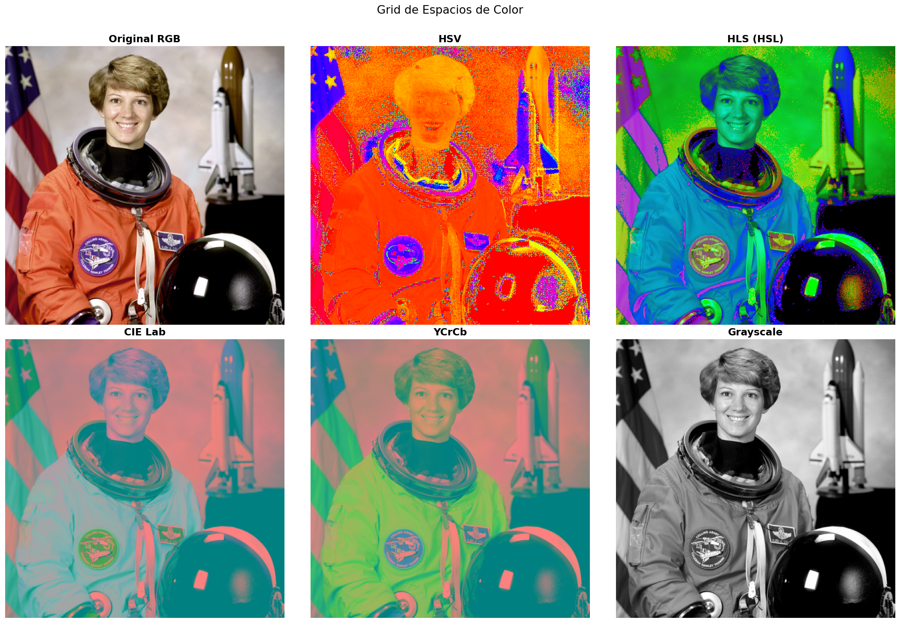
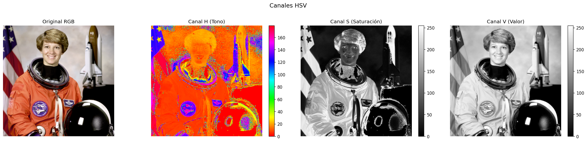
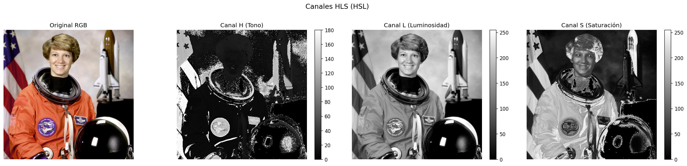
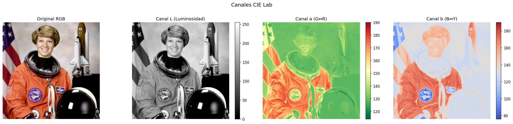
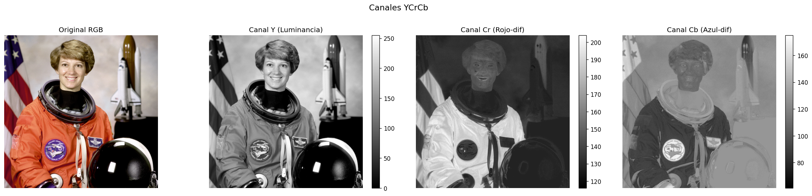
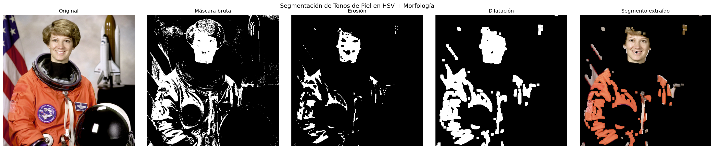
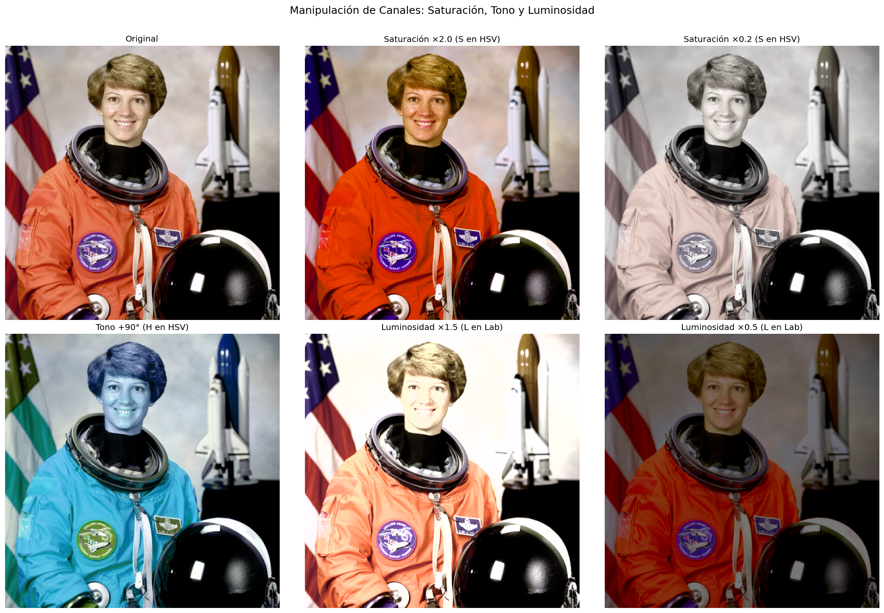
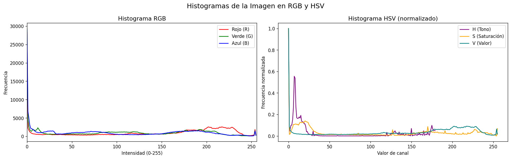
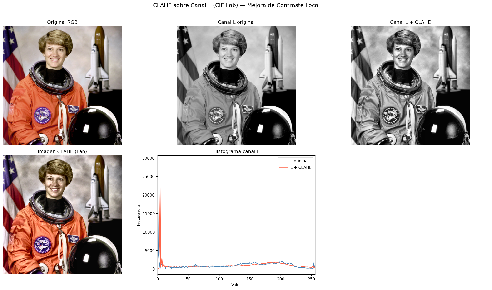
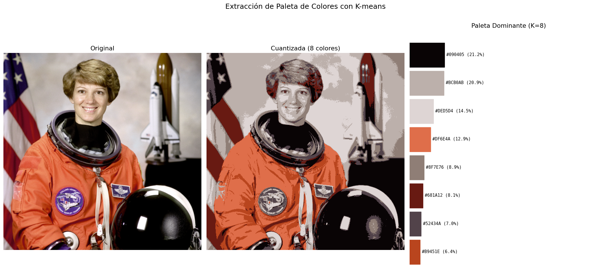

# Taller Conversion Espacios Color

**Estudiante:** Gabriel Andrés Anzola Tachak  
**Fecha:** 2026-04-08

---

## Descripción

Implementación completa de conversión y manipulación de espacios de color usando OpenCV y scikit-image. Se cubrieron las conversiones RGB→HSV/HLS/LAB/YCrCb/Grayscale, segmentación por color con morfología, manipulación de canales, histogramas con `cv2.calcHist`, CLAHE sobre LAB y extracción de paleta dominante con K-means.

---

## Implementaciones

### Python — Jupyter Notebook (`python/semana_4_4.ipynb`)

| Sección | Funcionalidad |
|---------|--------------|
| 4 | Conversiones RGB→HSV, HLS, LAB, YCrCb, Grayscale con `cv2.cvtColor` + grid visual |
| 5 | Canales individuales de cada espacio (H/S/V, H/L/S, L/a/b, Y/Cr/Cb) |
| 6 | Segmentación de tonos de piel en HSV + erosión/dilatación |
| 7 | Ajuste de saturación (S en HSV), rotación de tono (H en HSV), luminosidad (L en Lab) |
| 8 | Histogramas RGB y HSV con `cv2.calcHist` |
| 9 | CLAHE sobre canal L (CIE Lab) con `cv2.createCLAHE` |
| 10 | Paleta de colores dominantes con `cv2.kmeans` (K=8) |

---

## Resultados Visuales

### Grid de espacios de color


### Canales HSV individuales


### Canales HLS individuales


### Canales CIE Lab individuales


### Canales YCrCb individuales


### Segmentación por color + morfología


### Manipulación de saturación, tono y luminosidad


### Histogramas RGB y HSV


### CLAHE sobre canal L (LAB)


### Paleta dominante con K-means


---

## Código Relevante

### Conversiones con cv2.cvtColor
```python
img_hsv   = cv2.cvtColor(img_bgr, cv2.COLOR_BGR2HSV)
img_hls   = cv2.cvtColor(img_bgr, cv2.COLOR_BGR2HLS)
img_lab   = cv2.cvtColor(img_bgr, cv2.COLOR_BGR2LAB)
img_ycrcb = cv2.cvtColor(img_bgr, cv2.COLOR_BGR2YCrCb)
img_gray  = cv2.cvtColor(img_bgr, cv2.COLOR_BGR2GRAY)
```

### Segmentación HSV + morfología
```python
lower_skin = np.array([0, 30, 80],  dtype=np.uint8)
upper_skin = np.array([20, 180, 255], dtype=np.uint8)
mask = cv2.inRange(img_hsv, lower_skin, upper_skin)
kernel = np.ones((5, 5), np.uint8)
mask = cv2.erode(mask, kernel, iterations=1)
mask = cv2.dilate(mask, kernel, iterations=2)
```

### Rotación de tono (canal H en HSV)
```python
hsv = cv2.cvtColor(img_bgr, cv2.COLOR_BGR2HSV).astype(np.int32)
hsv[:,:,0] = (hsv[:,:,0] + 90) % 180   # +90° en H
```

### CLAHE sobre canal L
```python
clahe = cv2.createCLAHE(clipLimit=3.0, tileGridSize=(8, 8))
L, A, B = cv2.split(cv2.cvtColor(img_bgr, cv2.COLOR_BGR2LAB))
L_clahe = clahe.apply(L)
```

### K-means para paleta dominante
```python
pixels = img_rgb.reshape(-1, 3).astype(np.float32)
criteria = (cv2.TERM_CRITERIA_EPS + cv2.TERM_CRITERIA_MAX_ITER, 100, 0.2)
_, labels, centers = cv2.kmeans(pixels, K, None, criteria, 5, cv2.KMEANS_PP_CENTERS)
```

---

## Prompts Utilizados (IA Generativa)

- "Crea un notebook Python que cubra: conversiones cv2.cvtColor entre RGB/HSV/HLS/LAB/YCrCb/Grayscale, segmentación HSV con morfología, manipulación de canales H/S/L, histogramas cv2.calcHist, CLAHE en LAB, y paleta K-means"
- "Visualiza cada canal individualmente con colorbar en matplotlib para cuatro espacios de color"

---

## Aprendizajes y Dificultades

- **HSV vs. HLS:** Ambos separan el tono del color de la luminosidad, pero HSV usa el componente V (brillo del color más brillante) mientras HLS usa L (media entre el más brillante y el más oscuro). HLS es más simétrico pero menos intuitivo para segmentación.
- **CIE Lab:** El espacio más complejo de interpretar pero el más cercano a la percepción humana — la distancia euclidiana en Lab corresponde a diferencias percibidas (ΔE).
- **Morfología:** La erosión elimina píxeles de borde de la máscara (ruido pequeño desaparece) y la dilatación posterior recupera el tamaño y rellena huecos internos.
- **CLAHE vs. HE global:** La ecualización global puede sobreexponer zonas ya brillantes; CLAHE limita el histograma localmente (clipLimit) y lo ecualiza por tiles, preservando detalles en zonas oscuras sin saturar las claras.
- **K-means en píxeles:** La convergencia depende de la inicialización; `KMEANS_PP_CENTERS` (K-means++) da centros iniciales más dispersos y converge más rápido que la inicialización aleatoria.
- **Dificultad:** La conversión RGB↔LAB pasa internamente por XYZ con gamma sRGB — cv2 lo hace automáticamente pero los rangos de salida (L: 0-255 en uint8 aunque conceptualmente 0-100) pueden confundir.

---

## Estructura del Proyecto

```
semana_4_4_conversion_espacios_color/
├── python/
│   ├── semana_4_4.ipynb
│   └── .gitignore
├── media/
│   ├── color_spaces_grid.png
│   ├── channels_hsv.png
│   ├── channels_hls.png
│   ├── channels_lab.png
│   ├── channels_ycrcb.png
│   ├── segmentation.png
│   ├── color_manipulation.png
│   ├── histograms.png
│   ├── clahe.png
│   └── kmeans_palette.png
└── README.md
```

---

## Referencias

- OpenCV docs: `cv2.cvtColor`, `cv2.inRange`, `cv2.createCLAHE`, `cv2.kmeans`
- Gonzalez & Woods. *Digital Image Processing* (4th ed.) — Cap. 6: Color Image Processing
- Arthur, D. & Vassilvitskii, S. (2007). K-means++: The advantages of careful seeding. *SODA '07*.

---

## Checklist

- [x] Conversiones RGB→HSV, HLS, LAB, YCrCb, Grayscale con `cv2.cvtColor`
- [x] Visualización de canales individuales para cada espacio
- [x] Segmentación de color en HSV (máscara binaria con `cv2.inRange`)
- [x] Operaciones morfológicas (erosión + dilatación)
- [x] Ajuste de saturación (canal S en HSV)
- [x] Rotación de tono (canal H en HSV)
- [x] Modificación de luminosidad (canal L en LAB)
- [x] Histogramas RGB y HSV con `cv2.calcHist`
- [x] CLAHE sobre canal L (CIE Lab)
- [x] Paleta de colores dominantes con `cv2.kmeans`
- [x] Mínimo 2 capturas en media/ (hay 10)
- [x] README completo
