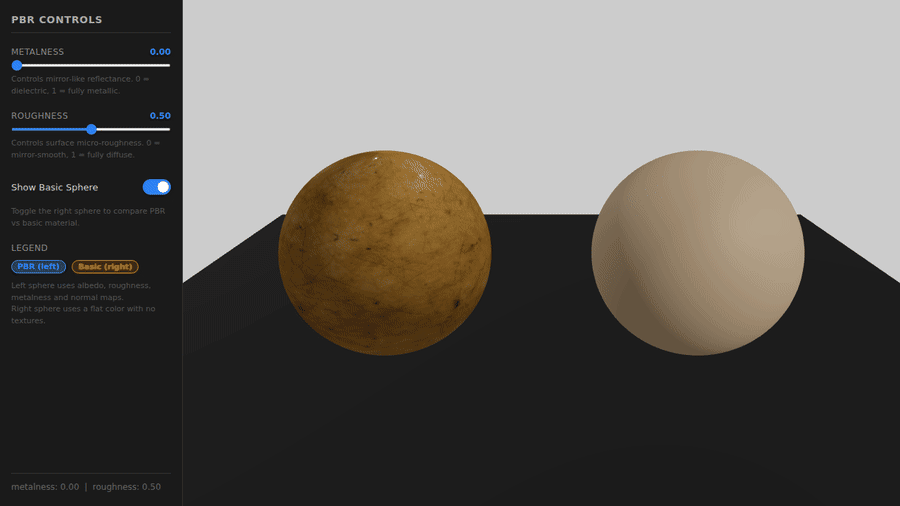
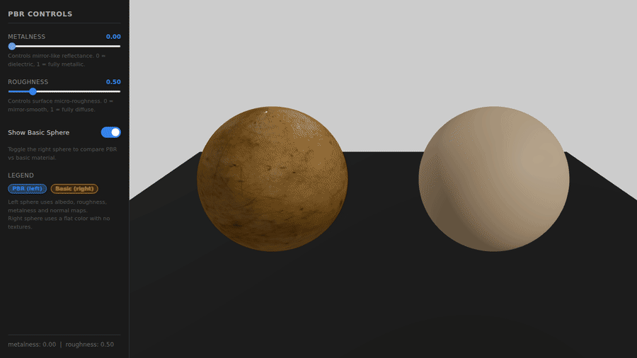
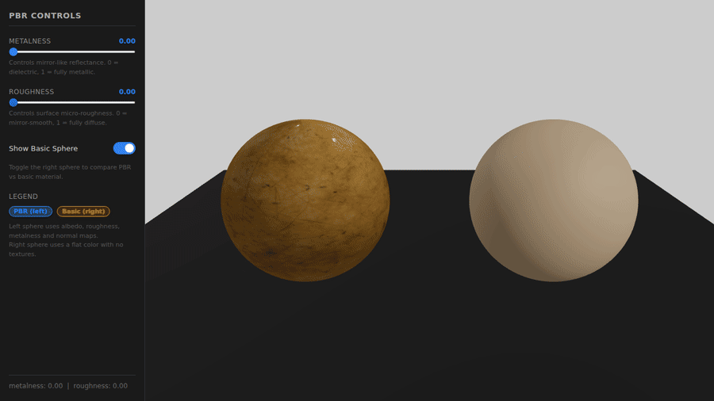
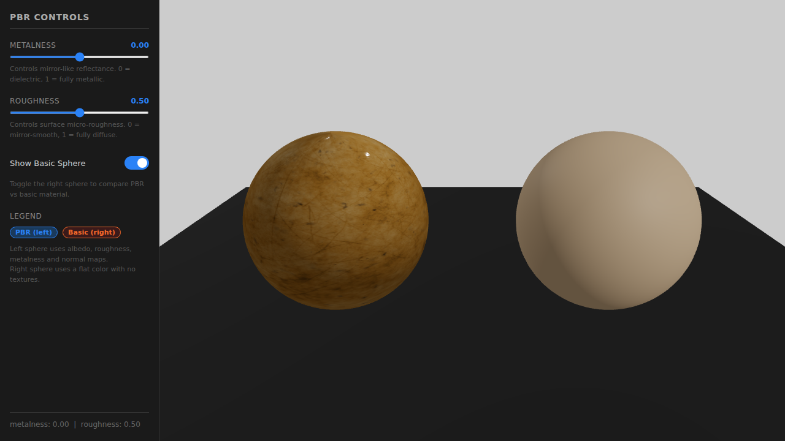

# Taller - Materiales Realistas: Introducción a PBR en Three.js

## Nombre del estudiante
Gabriel Andrés Anzola Tachak

## Fecha de entrega
2026-04-14

---

## Descripción breve

Implementación interactiva de materiales **Physically Based Rendering (PBR)** usando **Three.js con React Three Fiber**. Se desarrolló una escena que coloca dos esferas lado a lado bajo iluminación idéntica: la izquierda carga un set completo de texturas PBR (albedo, roughness, metalness y normal map) aplicadas sobre `MeshStandardMaterial`; la derecha usa únicamente un color RGB plano sin mapas de textura. La comparación simultánea permite observar de forma directa cómo los mapas de textura modulan la respuesta ante la luz frente a un material sin información de superficie.

Un panel lateral expone sliders que actualizan en tiempo real los valores de `metalness` y `roughness` del material PBR, ilustrando la separación entre los dos parámetros clave del modelo BRDF de Cook-Torrance que subyace a `MeshStandardMaterial`. Las texturas provienen de **ambientCG** (Metal007, 1K JPG), bajo licencia Creative Commons CC0.

---

## Implementaciones

### Three.js / React Three Fiber (`threejs/`)

| Componente | Funcionalidad |
|------------|---------------|
| `Scene.jsx` | Luces (ambiental + direccional), piso, OrbitControls, monta PBRMaterial y BasicMaterial |
| `PBRMaterial.jsx` | Carga 4 texturas con `useLoader(TextureLoader)`, aplica mapas a `MeshStandardMaterial`, rotación automática |
| `BasicMaterial.jsx` | `MeshStandardMaterial` sin mapas, color fijo RGB(200,150,100), misma rotación |
| `App.jsx` | Estado de metalness, roughness y visibilidad; layout Canvas + panel lateral |

**Stack:** React 18.2 · Three.js 0.160 · @react-three/fiber 8.15 · @react-three/drei 9.90 · Leva 0.9 · Vite 5.1  
**Texturas:** ambientCG — Metal007 1K (CC0) — albedo, roughness, metalness, normalGL

---

## Resultados Visuales

### Ambas esferas rotando — PBR vs Basic



Vista general de la escena con las dos esferas rotando automáticamente bajo la misma iluminación. La esfera izquierda (PBR) muestra detalles de superficie, variaciones de color y micro-relieve provenientes de los mapas de textura. La esfera derecha (Basic) refleja la luz de forma uniforme sin ninguna modulación de superficie.

### Slider de Metalness (0 → 1)



Transición de `metalness` de 0 a 1 en la esfera PBR. Al incrementar el valor, la reflectancia especular adopta el color del albedo (comportamiento metálico), mientras que la reflectancia difusa se extingue. El contraste con la esfera básica permanece constante a la derecha.

### Slider de Roughness (0 → 1)



Transición de `roughness` de 0 a 1 con `metalness` elevado para hacer el efecto visible. Con roughness bajo, el lóbulo especular es estrecho y brillante (casi espejo); al subir el valor, el lóbulo se ensancha y la superficie se vuelve mate. El mapa de roughness de la textura modula este valor píxel a píxel.

### Screenshot comparativo con sliders al 50%



Captura estática con `metalness = 0.5` y `roughness = 0.5`. La diferencia de aspecto entre la esfera PBR (izquierda, con detalle de textura metálica) y la esfera básica (derecha, color uniforme sin información de superficie) queda claramente expuesta bajo esta configuración intermedia.

---

## Código Relevante

### PBRMaterial.jsx — carga de texturas y MeshStandardMaterial

```jsx
import { useLoader } from '@react-three/fiber';
import * as THREE from 'three';

const [albedo, roughnessMap, metalnessMap, normalMap] = useLoader(THREE.TextureLoader, [
  '/textures/Metal007_1K-JPG_Color.jpg',
  '/textures/Metal007_1K-JPG_Roughness.jpg',
  '/textures/Metal007_1K-JPG_Metalness.jpg',
  '/textures/Metal007_1K-JPG_NormalGL.jpg',
]);

// Aplicación al material
<meshStandardMaterial
  map={albedo}
  roughnessMap={roughnessMap}
  metalnessMap={metalnessMap}
  normalMap={normalMap}
  roughness={roughness}   // valor base multiplicado por el mapa
  metalness={metalness}   // valor base multiplicado por el mapa
/>
```

`useLoader` con `TextureLoader` agrupa las cuatro peticiones en paralelo y suspende el componente hasta que todas las texturas están disponibles, evitando frames intermedios con materiales incompletos.

### BasicMaterial.jsx — material sin mapas

```jsx
<meshStandardMaterial
  color={[200 / 255, 150 / 255, 100 / 255]}
  roughness={0.6}
  metalness={0.0}
/>
```

Sin ningún mapa asignado, `MeshStandardMaterial` evalúa el BRDF con valores escalares uniformes para toda la superficie, produciendo el aspecto plano característico de los materiales sin PBR.

### App.jsx — sliders con estado React

```jsx
const [metalness, setMetalness] = useState(0.0);
const [roughness, setRoughness] = useState(0.5);

<input
  type="range" min={0} max={1} step={0.01} value={metalness}
  onChange={(e) => setMetalness(parseFloat(e.target.value))}
/>
```

El estado de React propagado como prop a `PBRMaterial` provoca un re-render selectivo del material en cada tick del slider, sin reconstruir la escena ni recargar las texturas.

---

## Prompts Utilizados (IA Generativa)

```
"Crea la estructura base de un proyecto React con Vite para Three.js con
React Three Fiber. Necesito componentes para PBRMaterial (con cuatro mapas
de textura usando useLoader) y BasicMaterial (color plano sin mapas), además
de un panel lateral con sliders para metalness y roughness"

"Implementa useLoader(THREE.TextureLoader, [...]) para cargar 4 texturas PBR
en paralelo con Suspense, y aplícalas a MeshStandardMaterial en React Three Fiber"

"Diseña el panel de control con sliders HTML nativos en lugar de Leva para
mantener consistencia visual con el resto del proyecto. Incluye badges de
leyenda y descripción de cada parámetro"

"Crea un script capture_gifs.mjs con Playwright + ffmpeg que simule el
arrastre de sliders frame a frame para generar GIFs de la transición de
metalness y roughness"
```

---

## Aprendizajes y Dificultades

- **Metalness vs. roughness:** Son parámetros ortogonales del BRDF de Cook-Torrance. `metalness` controla qué fracción de la luz se refleja como especular con tinte del albedo (comportamiento conductor); `roughness` controla la distribución del lóbulo especular (NDF). Un material puede ser metálico y liso o metálico y rugoso simultáneamente.

- **Mapas como multiplicadores:** En `MeshStandardMaterial`, los mapas `roughnessMap` y `metalnessMap` modulan los valores escalares `roughness` y `metalness` píxel a píxel, es decir, el valor final es `scalar × texel`. Esto permite ajustar el rango global con el slider sin perder la variación espacial de la textura.

- **normalMap OpenGL vs. DirectX:** ambientCG ofrece ambas variantes (NormalGL y NormalDX). Three.js espera la convención OpenGL (canal Y sin invertir). Usar NormalDX produce iluminación invertida en el eje Y.

- **useLoader con Suspense:** Si el componente que llama a `useLoader` no está envuelto en `<Suspense>`, Three.js lanza un error en el primer render antes de que las texturas estén disponibles. La solución es siempre envolver con `<Suspense fallback={null}>` en el componente padre.

- **Comparación válida:** Para que la comparación sea significativa, ambas esferas deben estar iluminadas exactamente igual (misma geometría, misma posición relativa a la luz) y rotar al mismo ritmo. Cualquier diferencia de posición o geometría introduce variables confusoras.

### Mejoras futuras

Entorno HDRI con `<Environment>` de Drei para especular más realista, soporte para displacement map en la esfera PBR con subdivisión extra, múltiples sets de texturas intercambiables con un selector.

---

## Estructura del Proyecto

```
semana_5_1_materiales_pbr_unity_threejs/
├── threejs/
│   ├── src/
│   │   ├── main.jsx
│   │   ├── App.jsx
│   │   ├── styles.css
│   │   └── components/
│   │       ├── Scene.jsx
│   │       ├── PBRMaterial.jsx
│   │       └── BasicMaterial.jsx
│   ├── public/
│   │   └── textures/
│   │       ├── Metal007_1K-JPG_Color.jpg
│   │       ├── Metal007_1K-JPG_Roughness.jpg
│   │       ├── Metal007_1K-JPG_Metalness.jpg
│   │       └── Metal007_1K-JPG_NormalGL.jpg
│   ├── capture_gifs.mjs
│   ├── index.html
│   ├── package.json
│   └── vite.config.js
├── media/
│   ├── threejs_pbr_comparison.gif
│   ├── threejs_metalness_slider.gif
│   ├── threejs_roughness_slider.gif
│   └── basic_vs_pbr_comparison.png
└── README.md
```

---

## Referencias

- Three.js MeshStandardMaterial: https://threejs.org/docs/#api/en/materials/MeshStandardMaterial
- React Three Fiber docs: https://docs.pmnd.rs/react-three-fiber/
- Drei — useLoader / OrbitControls: https://github.com/pmndrs/drei
- ambientCG — Metal007 (CC0): https://ambientcg.com/view?id=Metal007
- PBR Theory (learnopengl.com): https://learnopengl.com/PBR/Theory

---

## Checklist de entrega

- [x] Carpeta `semana_5_1_materiales_pbr_unity_threejs/` existe
- [x] `threejs/` con estructura completa (src/, public/, package.json, vite.config.js)
- [x] Texturas PBR descargadas en `threejs/public/textures/` (albedo, roughness, metalness, normal)
- [x] 4 GIFs/screenshots en `media/` con nombres descriptivos
- [x] README.md con todas las secciones completadas
- [x] Three.js render muestra diferencia visual clara entre PBR y Basic
- [x] Sliders actualizan metalness/roughness en tiempo real
- [x] Commits descriptivos en inglés
- [x] Repositorio organizado y público
