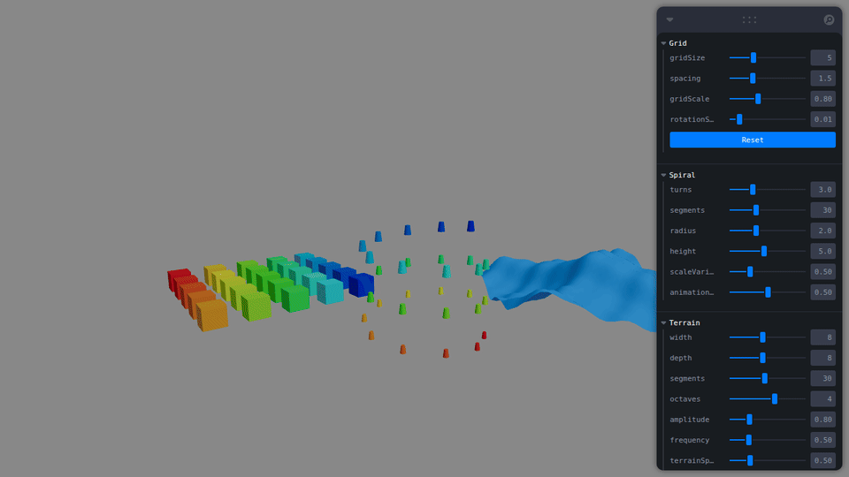
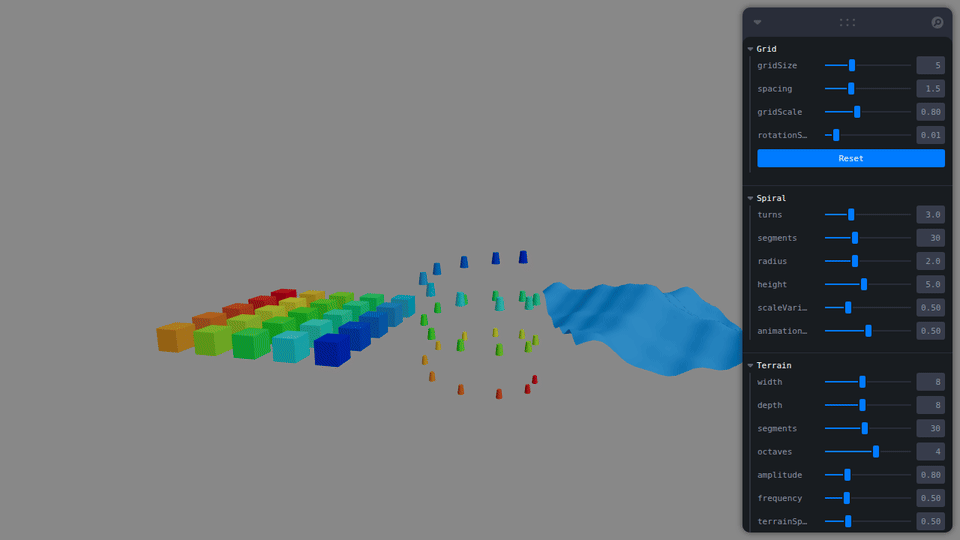
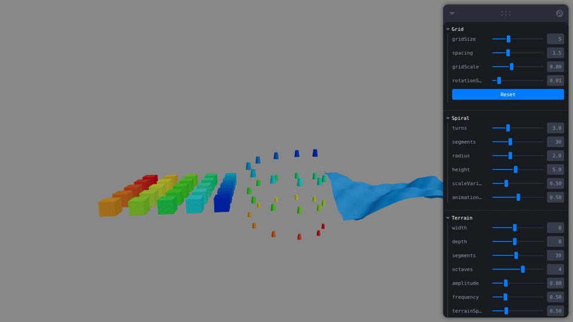
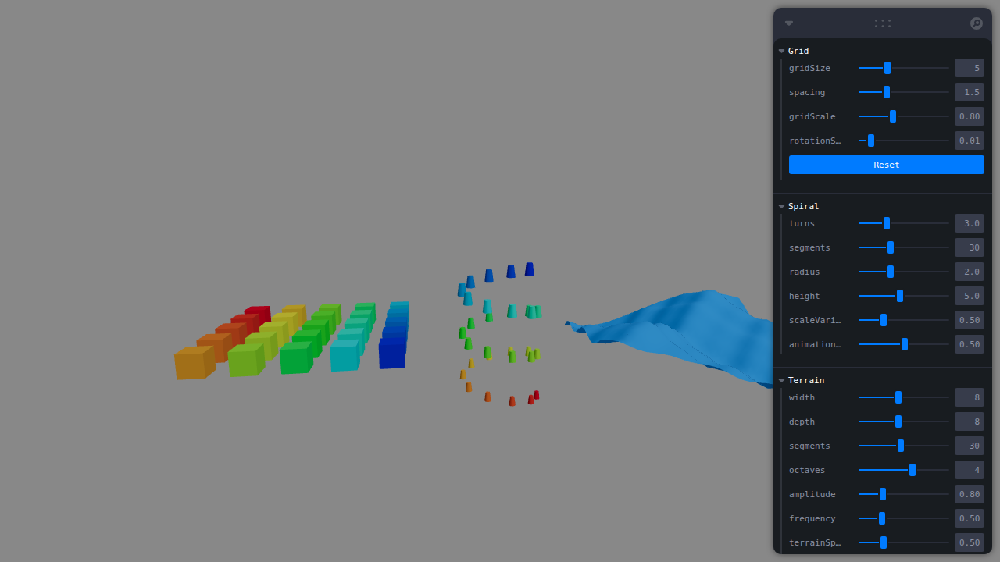

# Taller Modelado Procedural Basico

## Nombre del estudiante
Gabriel Anzola Tachak

## Fecha de entrega
2026-04-14

---

## Descripción breve

El modelado procedural es la técnica de generar geometría 3D desde algoritmos en lugar de crearla manualmente. Permite construir estructuras complejas cambiando parámetros, animar geometría en tiempo real y escalar sin esfuerzo el número de objetos.

Este taller implementa tres generadores en **React Three Fiber** sobre Three.js, cada uno explorando un mecanismo distinto:

1. **Grilla de cubos** — arrays y bucles para estructuras repetitivas
2. **Espiral de cilindros** — parametrización matemática con animación dinámica de radio
3. **Terreno fractal** — manipulación directa del buffer de vértices (`bufferGeometry.attributes.position.array`) con ruido fractal (fBm)

---

## Implementaciones

### 1. Grilla de cubos (`GridGenerator`)

Genera una matriz N×N de cubos usando dos bucles `for` anidados. Las posiciones se centran automáticamente en el origen. El grupo completo rota alrededor del eje Y con `useFrame()`, y el color de cada cubo varía según su índice mediante un gradiente rojo→azul.

Parámetros (panel **Grid**): tamaño de grilla, separación, escala y velocidad de rotación.

### 2. Espiral de cilindros (`SpiralGenerator`)

Calcula posiciones en una hélice paramétrica: para cada segmento `i`, el ángulo `θ = (i/N) × turns × 2π` determina las coordenadas x y z, mientras y crece linealmente. El radio de la hélice oscila con `Math.sin()` aplicado en `useFrame()`, produciendo una animación continua de expansión/contracción visible.

Parámetros (panel **Spiral**): vueltas, segmentos, radio, altura, variación de escala y velocidad de animación.

### 3. Terreno fractal con manipulación de vértices (`FractalTerrain`)

Crea un `PlaneGeometry` con muchos segmentos y, en cada frame, itera **directamente** sobre `bufferGeometry.attributes.position.array`. Para cada vértice (x, z) calcula un desplazamiento Y usando **Fractal Brownian Motion** (fBm): suma N octavas donde cada octava divide la amplitud a la mitad y duplica la frecuencia. El resultado es una superficie con estructura fractal auto-similar que se anima continuamente.

```
y = Σ(oct=0..N-1)  sin(x·freq·2^oct + t) · cos(z·freq·0.8·2^oct + t·0.7) · amp·0.5^oct
```

Parámetros (panel **Terrain**): ancho, profundidad, segmentos, octavas, amplitud, frecuencia, velocidad y wireframe.

---

## Resultados visuales

### Grilla rotando


Matriz 5×5 de cubos generada proceduralmente. Los cubos rotan de forma continua alrededor del eje Y; el color de cada cubo varía por posición.

### Espiral animada


Hélice de 30 cilindros que se expande y contrae dinámicamente. El radio oscila con una función seno, ilustrando cómo un parámetro recalcula toda la estructura en tiempo real.

### Terreno fractal (manipulación de vértices)


Plano deformado en cada frame vía `bufferGeometry.attributes.position.array`. Las 4 octavas del fBm producen la característica estructura fractal: ondas gruesas moduladas por detalles finos.

### Vista general (estática)


Instantánea con los tres generadores simultáneos: grilla (izquierda), espiral (centro) y terreno fractal (derecha).

---

## Código relevante

### Generación de posiciones en grilla

```js
// src/utils/geometryHelpers.js
export function createGridPositions(gridSize, spacing) {
  const positions = [];
  for (let x = 0; x < gridSize; x++) {
    for (let z = 0; z < gridSize; z++) {
      positions.push([
        x * spacing - (gridSize / 2) * spacing + spacing / 2,
        0,
        z * spacing - (gridSize / 2) * spacing + spacing / 2,
      ]);
    }
  }
  return positions;
}
```

### Parametrización de la espiral helicoidal

```js
// src/utils/geometryHelpers.js
export function createSpiralPositions(turns, segments, radius, height) {
  const items = [];
  for (let i = 0; i < segments; i++) {
    const t = i / segments;
    const angle = t * turns * Math.PI * 2;
    items.push({
      position: [radius * Math.cos(angle), t * height - height / 2, radius * Math.sin(angle)],
      t,
    });
  }
  return items;
}
```

### Manipulación directa del buffer de vértices (fBm fractal)

```js
// src/components/FractalTerrain.jsx — dentro de useFrame()
const posArray = geometry.attributes.position.array;

for (let i = 0; i < geometry.attributes.position.count; i++) {
  const x = posArray[i * 3];
  const z = posArray[i * 3 + 2];

  let y = 0, amp = amplitude, freq = frequency;
  for (let oct = 0; oct < octaves; oct++) {
    y += Math.sin(x * freq + time) * Math.cos(z * freq * 0.8 + time * 0.7) * amp;
    amp  *= 0.5;
    freq *= 2.0;
  }
  posArray[i * 3 + 1] = y;
}

geometry.attributes.position.needsUpdate = true;
geometry.computeVertexNormals();
```

---

## Prompts utilizados

Se usó IA generativa (Claude) para:

1. Diseñar la arquitectura de componentes y separar la lógica de generación en `geometryHelpers.js`.
2. Implementar el `FractalTerrain` con acceso directo al buffer de posiciones y la fórmula fBm.
3. Configurar el script `capture_gifs.mjs` con Playwright y ffmpeg para automatizar la captura de medios.

---

## Aprendizajes y dificultades

### Aprendizajes

- Los bucles anidados son la herramienta natural para grillas; cambiar `gridSize` regenera toda la estructura sin tocar más código.
- La parametrización trigonométrica transforma un índice lineal en una trayectoria helicoidal; modificar el radio en `useFrame` convierte esa ecuación en animación.
- `bufferGeometry.attributes.position.array` es un `Float32Array` plano donde cada vértice ocupa 3 posiciones (x, y, z). Manipularlo directamente es la forma más eficiente de deformar geometría en tiempo real, evitando recrear la geometría entera.
- El Fractal Brownian Motion (fBm) mediante suma de octavas produce auto-similitud: la misma "forma" aparece a diferentes escalas, que es la definición de fractal.
- `geometry.attributes.position.needsUpdate = true` y `computeVertexNormals()` son obligatorios después de modificar el buffer para que Three.js reenvíe los datos a la GPU y recalcule la iluminación correctamente.

### Dificultades

- La animación de la espiral con `animationSpeed = 0.01` era demasiado lenta para observarse (el ciclo completo tomaba ~109 s). Se ajustó el valor por defecto a 0.5, lo que produce ~1 ciclo visible en 5 segundos.
- La fórmula de ffmpeg para la paleta GIF fallaba sin la bandera `-update 1`, ya que intentaba tratar el archivo de paleta como una secuencia de imágenes.
