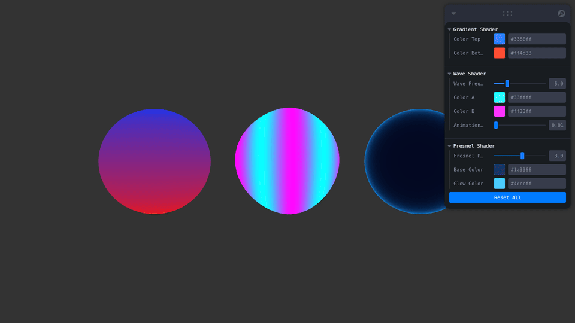
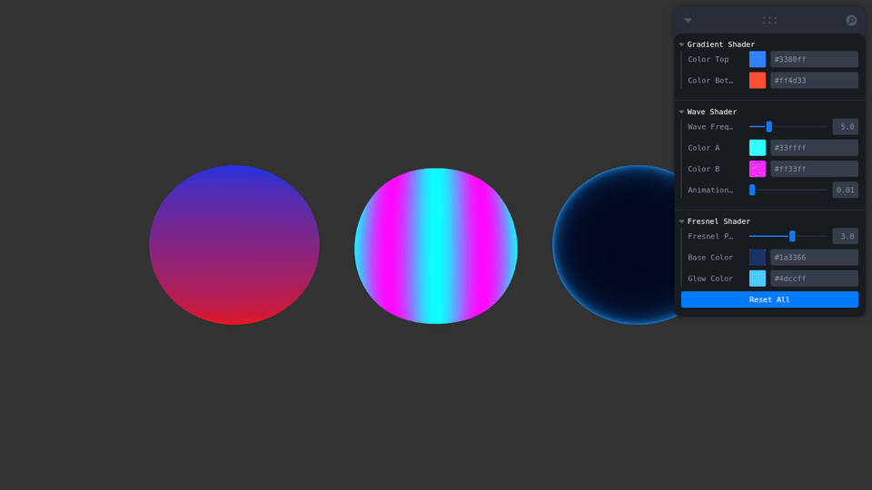
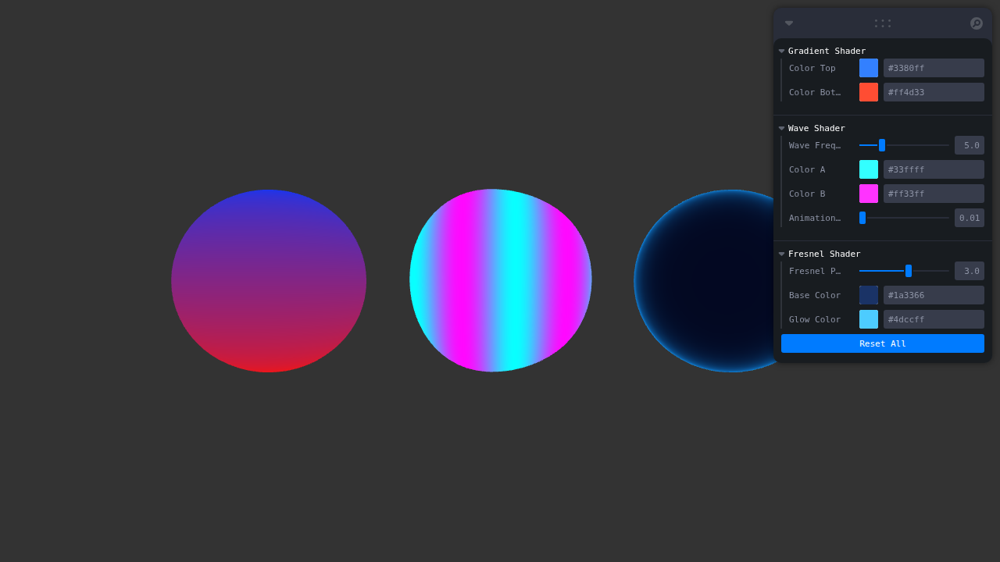

# Taller - Shaders Básicos: Primeros Efectos Visuales desde Código GLSL

## Nombre del estudiante
Gabo Tachak

## Fecha de entrega
2026-04-14

---

## Descripción breve

Los shaders son programas que corren directamente en la GPU y determinan cómo se renderizan los píxeles y vértices de una escena 3D. Son el núcleo de cualquier efecto visual moderno: desde gradientes simples hasta reflexiones físicamente correctas. En este taller se explora la escritura manual de shaders en GLSL (OpenGL Shading Language) integrados en una escena Three.js con React Three Fiber.

Un shader se divide en dos etapas obligatorias: el **vertex shader**, que procesa cada vértice y puede modificar su posición en el espacio, y el **fragment shader**, que determina el color final de cada píxel interpolado entre esos vértices. La comunicación entre ambas etapas se hace con variables `varying`, mientras que los parámetros externos (como el tiempo o colores editables) se pasan mediante `uniforms`.

Se implementaron tres shaders con técnicas distintas: gradiente de color basado en UVs, deformación de geometría con ondas animadas, y efecto Fresnel de bordes brillantes. Cada uno tiene controles en tiempo real mediante un panel Leva que permite modificar los uniforms sin recargar la escena.

---

## Implementaciones

### 1. Gradient Shader — Gradiente Vertical por UVs

El shader de gradiente usa las coordenadas UV (`vUv.y`) para mezclar dos colores entre la parte inferior y superior de la esfera. No hay animación; el efecto es completamente estático y controlado por dos color pickers.

- **Vertex:** pasa `uv` al fragment como `vUv`
- **Fragment:** `mix(colorBottom, colorTop, vUv.y)` — interpolación lineal según altura

Los colores `colorTop` y `colorBottom` son uniforms editables desde el panel.

### 2. Wave Shader — Ondas Animadas con Desplazamiento de Vértices

Este shader modifica la posición de cada vértice en el vertex shader usando funciones `sin()` sobre `x` e `y` del espacio local, desplazando `z` para crear una superficie ondulante. El uniform `uTime` se incrementa en cada frame con `useFrame()`, animando el movimiento.

- **Vertex:** `pos.z += sin(pos.x * 3.0 + uTime) * 0.2 + sin(pos.y * 2.0 + uTime * 0.7) * 0.15`
- **Fragment:** mapea la onda en el fragment para colorear según amplitud — `mix(uColorA, uColorB, wave)`

Controles disponibles: frecuencia de onda, dos colores, velocidad de animación.

### 3. Fresnel Shader — Bordes Brillantes Tipo Holográfico

El efecto Fresnel replica cómo los materiales reales se vuelven más reflectivos en ángulos rasantes. Se calcula con el producto punto entre la dirección de vista y la normal de la superficie: cuando ambos son casi perpendiculares (bordes), el valor se acerca a 1 y se aplica el color de brillo.

- **Vertex:** transforma la normal al espacio de cámara (`normalMatrix * normal`) y pasa posición en view-space
- **Fragment:** `fresnel = pow(1.0 - dot(viewDirection, vNormal), uFresnelPower)` → mezcla base y glow

La esfera rota automáticamente con `useFrame()` para que el efecto sea visible desde todos los ángulos. El parámetro `fresnelPower` controla qué tan abrupto es el borde brillante.

---

## Resultados Visuales

### Gradient Shader

Gradiente estático de rojo (abajo) a azul claro (arriba) sobre una esfera, interpolado por coordenadas UV.



---

### Wave Shader

Superficie esférica con deformación de vértices en tiempo real. Las ondas sinusoidales en `x` e `y` crean un efecto de ondulación continua con colores que transicionan entre cian y magenta.



---

### Fresnel Shader

Esfera con brillo en bordes tipo holográfico. A medida que rota, el anillo brillante de cian se desplaza siguiendo los ángulos rasantes respecto a la cámara.


---

### Vista general — los 3 shaders simultáneos

Las tres esferas side-by-side con el panel Leva de controles visible a la derecha.



---

## Código Relevante

### Estructura básica de un vertex shader

```glsl
// Recibe atributos por vértice (position, uv, normal son built-ins en Three.js)
varying vec2 vUv; // dato que se pasa al fragment shader (interpolado)

void main() {
    vUv = uv;
    // gl_Position es obligatorio — posición final en clip space
    gl_Position = projectionMatrix * modelViewMatrix * vec4(position, 1.0);
}
```

### Estructura básica de un fragment shader

```glsl
varying vec2 vUv; // recibe el valor interpolado del vertex shader

void main() {
    vec3 color = vec3(vUv.x, vUv.y, 0.5); // color basado en coordenadas UV
    // gl_FragColor es el color final del píxel
    gl_FragColor = vec4(color, 1.0);
}
```

### Pasar uniforms desde React al shader

```tsx
const uniforms = useMemo(() => ({
  uTime: { value: 0 },
  uColorA: { value: new THREE.Color('#33ffff') },
}), []);

// En JSX:
<shaderMaterial
  vertexShader={vertexShader}
  fragmentShader={fragmentShader}
  uniforms={uniforms}
/>
```

### Actualizar uniforms en el loop de animación

```tsx
const materialRef = useRef<THREE.ShaderMaterial>(null);

useFrame(() => {
  if (!materialRef.current) return;
  materialRef.current.uniforms.uTime.value += 0.01;
  materialRef.current.uniforms.uColorA.value.set(colorA); // actualiza desde prop
});
```

### Cálculo del efecto Fresnel en GLSL

```glsl
// Fragment shader — efecto Fresnel
varying vec3 vNormal;
varying vec3 vPosition;
uniform float uFresnelPower;
uniform vec3 uBaseColor;
uniform vec3 uGlowColor;

void main() {
    vec3 viewDirection = normalize(-vPosition); // dirección hacia la cámara
    float fresnel = pow(1.0 - dot(viewDirection, vNormal), uFresnelPower);
    vec3 finalColor = mix(uBaseColor, uGlowColor, fresnel);
    gl_FragColor = vec4(finalColor, 1.0);
}
```

---

## Prompts Utilizados

Se utilizó IA generativa para:
- Planificar la arquitectura del proyecto (estructura de carpetas, separación de componentes)
- Verificar la corrección de los cálculos GLSL (especialmente la transformación de normales con `normalMatrix`)
- Depurar el comportamiento de `useMemo` con uniforms que deben actualizarse por frame

---

## Aprendizajes y dificultades

### Aprendizajes

- **Vertex vs Fragment:** el vertex shader corre una vez por vértice (miles), el fragment una vez por píxel (millones). Es mucho más barato calcular en el vertex y pasar datos via `varying`.
- **Uniforms como puente:** permiten controlar el shader desde JavaScript sin recompilarlo. Son ideales para parámetros que cambian en tiempo de ejecución como colores, tiempo o intensidades.
- **`normalMatrix` es necesaria:** no se puede usar directamente la normal del mesh para cálculos de iluminación en view-space; hay que transformarla con `normalMatrix` para que sea correcta bajo escalados no uniformes.
- **UV mapping:** las coordenadas UV van de (0,0) en la esquina inferior izquierda a (1,1) en la superior derecha. `vUv.y` directamente da la altura normalizada — ideal para gradientes verticales sin cálculos extra.
- **`mix` y `smoothstep`:** son las funciones más usadas en fragment shaders para interpolaciones suaves. `mix(a, b, t)` es simplemente `a*(1-t) + b*t`.

### Dificultades

- **Actualización de uniforms con `useMemo`:** inicialmente los uniforms de colores no se actualizaban al cambiar los sliders porque `useMemo` solo crea el objeto una vez. La solución fue actualizar `.value` directamente dentro de `useFrame()` en lugar de recrear el objeto de uniforms.
- **WebGL headless en captura:** el navegador headless de Playwright no tiene GPU real, por lo que Three.js cae en el software renderer. Los shaders funcionan correctamente pero el rendimiento es menor. Las capturas muestran el resultado correcto.
