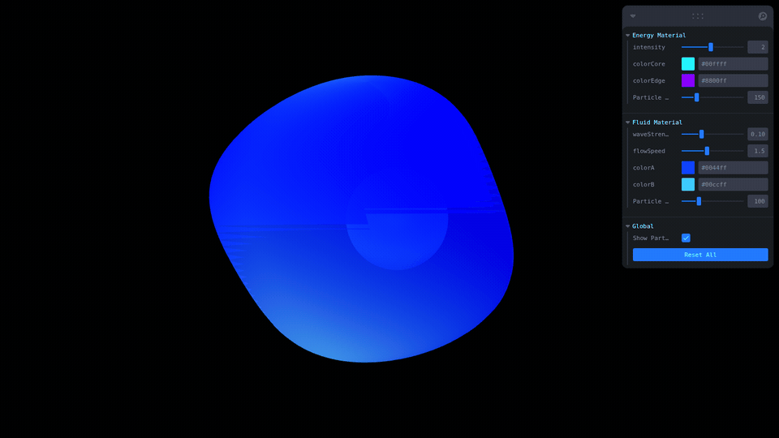
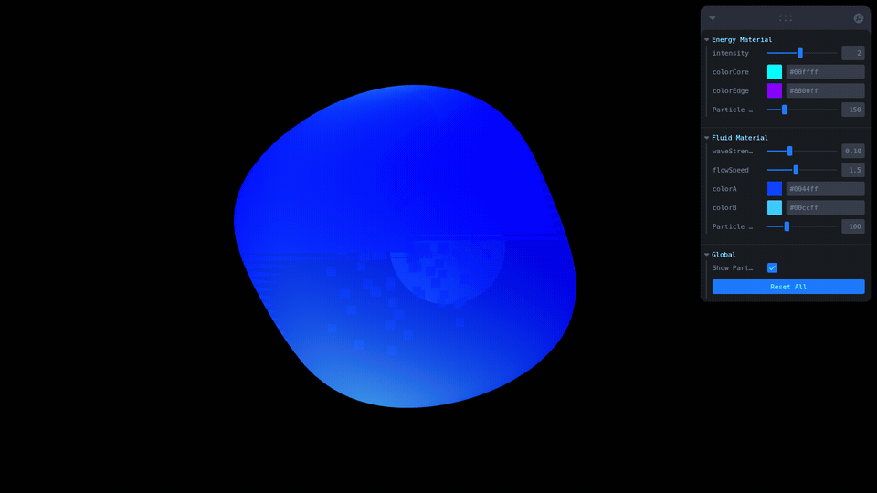
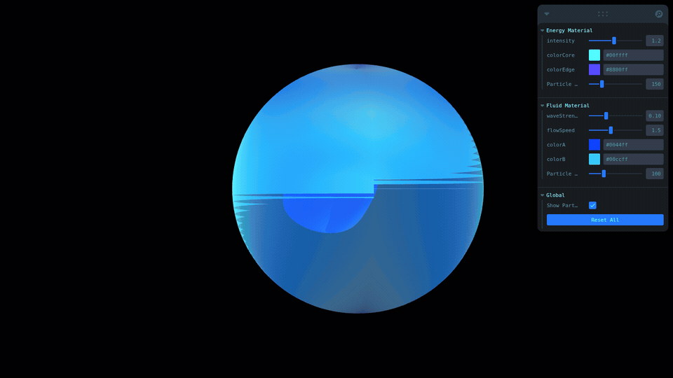
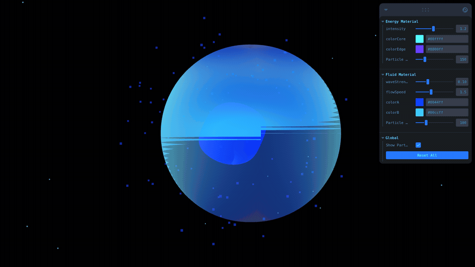
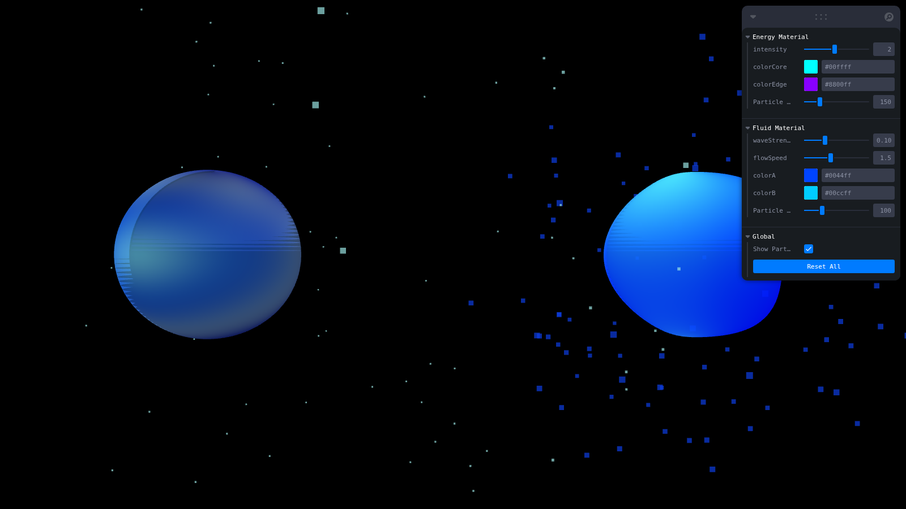

# Taller - Texturizado Creativo: Materiales Dinámicos con Shaders y Partículas

**Estudiante:** Gabo Tachak  
**Fecha:** 2026-04-15

---

## Descripción

Los **materiales dinámicos** son aquellos cuyas propiedades visuales pueden cambiar en tiempo de ejecución sin necesidad de recompilar los shaders. Esto se logra mediante **uniforms**: variables que el CPU envía a la GPU cada frame, permitiendo que el shader calcule su salida en función del tiempo, la posición del mouse, parámetros de usuario u otros estados del sistema. La interactividad resultante hace que la escena se sienta viva y reactiva.

La diferencia fundamental respecto a los materiales estáticos es que estos últimos tienen parámetros fijos definidos al momento de creación — el color, la rugosidad, la opacidad. No cambian durante la ejecución. Los materiales dinámicos, por contraste, pueden modificar su aspecto frame a frame: un glow que pulsa, ondas que se propagan, colores que responden al cursor. El costo en rendimiento es mínimo siempre que los uniforms sean simples escalares o vectores.

Los **sistemas de partículas** complementan los materiales al añadir una capa volumétrica que refuerza la identidad visual de cada material. Las partículas de energía (pequeñas, rápidas, vida corta) transmiten la sensación de electricidad alrededor de la esfera plasma. Las partículas de niebla (grandes, lentas, vida larga) refuerzan la fluidez acuosa del segundo material. Sin partículas, los materiales existirían en el vacío; con ellas, el conjunto se percibe como un fenómeno físico completo.

Este taller implementa dos materiales contrastantes: **Energy** (tipo plasma, responde al mouse) y **Fluid** (tipo agua, responde al tiempo). Ambos usan GLSL personalizado cargado vía Vite, React Three Fiber para la integración con React, y Leva para controles en tiempo real.

---

## Implementaciones

### Material Energy (Plasma)

El material de energía simula un plasma pulsante con glow radial y patrones concéntricos que reaccionan a la posición del mouse.

- **Vertex shader**: calcula la distancia entre la posición UV del vértice y la posición del mouse (en espacio normalizado 0–1). Usa esa distancia para aplicar un desplazamiento radial proporcional a `sin(uTime * 3.0)`, de modo que la superficie se contrae y expande de forma no uniforme según donde apunta el cursor.
- **Fragment shader**: genera un glow basado en la inversa de la distancia al mouse (`1.0 - dist`), un pulso temporal (`sin(uTime * 2.0)`), y anillos concéntricos animados. Los colores central y de borde se mezclan con `mix()` modulado por el glow y el pulso.
- **Partículas energéticas**: pequeñas (0.08), velocidad rápida (0.025), vida corta (1 s). Se regeneran continuamente desde el centro de la esfera y explotan hacia afuera, sugiriendo descargas eléctricas.

**Parámetros controlables (Leva):**
- `intensity` (0.5 – 2.0): brillo del efecto
- `colorCore` / `colorEdge`: colores central y de borde (pickers)
- `energyParticleCount` (50 – 500): cantidad de partículas

### Material Fluid (Agua)

El material fluido simula agua en movimiento mediante dos ondas perpendiculares en el vertex shader y un patrón de flujo turbulento en el fragment shader.

- **Vertex shader**: suma dos ondas sinusoidales en el eje Z — una horizontal (`sin(x * 5 + t)`) y otra vertical (`cos(y * 3 + t * 0.7)`) — escaladas por `uWaveStrength`. La superficie de la esfera ondula suavemente en tiempo real.
- **Fragment shader**: construye un patrón de flujo combinando senos en U y V con velocidades diferentes, más una componente de turbulencia (`sin(u+t) * sin(v+t*0.7)`). El resultado se usa como parámetro de mezcla entre dos colores y se refuerza con una luz especular simulada (`pow(flow, 2.0)`).
- **Partículas de niebla**: medianas (0.15), velocidad lenta (0.008), vida larga (3 s). Flotan desde el centro hacia el exterior describiendo una nube difusa alrededor de la esfera.

**Parámetros controlables (Leva):**
- `waveStrength` (0.01 – 0.3): amplitud de las ondas
- `flowSpeed` (0.5 – 3.0): velocidad del patrón de flujo
- `colorA` / `colorB`: colores del fluido (pickers)
- `fluidParticleCount` (30 – 300): cantidad de partículas

---

## Resultados Visuales

### Energy Material — glow pulsante y anillos concéntricos
  
El glow radial pulsa al ritmo de `uTime`. Los anillos concéntricos se desplazan hacia afuera continuamente, dando sensación de energía que irradia desde el centro.

### Energy Material — interacción con el mouse
  
Al mover el cursor sobre la esfera izquierda, el vertex shader detecta la proximidad y deforma la superficie radialmente. Los vértices más cercanos al mouse se desplazan con mayor amplitud.

### Fluid Material — animación ondulante
  
Las dos ondas perpendiculares en el vertex shader producen un movimiento continuo de la superficie. El patrón de flujo en el fragment shader refuerza la ilusión de agua en movimiento.

### Fluid Material — partículas de niebla
  
Las partículas lentas y de larga vida forman una nube dispersa alrededor de la esfera. La opacidad reducida (0.7) y el `depthWrite: false` permiten superposición translúcida.

### Vista general — ambos materiales lado a lado
  
La esfera izquierda (plasma, colores cian/púrpura) contrasta con la derecha (agua, azul/cian). El fondo negro maximiza la visibilidad de los efectos emisivos.

---

## Código Relevante

### Shader con uniforms dinámicos (Energy — fragment)

```glsl
uniform float uTime;
uniform float uIntensity;
uniform vec3 uColorCore;
uniform vec3 uColorEdge;
varying vec2 vUv;
varying float vDistance;

void main() {
    float pulse = sin(uTime * 2.0) * 0.5 + 0.5;
    float glow  = 1.0 - vDistance;

    float circles = sin(vDistance * 20.0 + uTime * 3.0) * 0.5 + 0.5;

    vec3 color = mix(uColorEdge, uColorCore, glow * pulse);
    color += circles * 0.3;

    float alpha = glow * pulse * uIntensity;
    gl_FragColor = vec4(color, alpha);
}
```

Los uniforms `uTime`, `uIntensity`, `uColorCore` y `uColorEdge` se actualizan desde React cada frame sin recompilar el shader. El resultado visual cambia en tiempo real.

### Actualizar uniforms en `useFrame()`

```typescript
// EnergyMaterial.tsx
useFrame((state) => {
  if (!materialRef.current) return;
  materialRef.current.uniforms.uTime.value = state.clock.elapsedTime;
  materialRef.current.uniforms.uMousePos.value = new THREE.Vector2(
    mouse.current.x * 0.5 + 0.5,
    mouse.current.y * 0.5 + 0.5
  );
  materialRef.current.uniforms.uIntensity.value = intensity;
  materialRef.current.uniforms.uColorCore.value = new THREE.Color(colorCore);
  materialRef.current.uniforms.uColorEdge.value = new THREE.Color(colorEdge);
});
```

`useFrame` se ejecuta una vez por frame de render. Asignar directamente a `.value` no provoca re-render de React ni recompilación del shader.

### Sistema de partículas — bucle de actualización

```typescript
// ParticleSystem.tsx
useFrame(() => {
  const positions = geometryRef.current.attributes.position.array as Float32Array;
  const ages = agesRef.current;

  for (let i = 0; i < count; i++) {
    const idx = i * 3;
    const age = (Date.now() - ages[i]) / (lifespan * 1000);

    if (age > 1.0) {
      // Regenerar en posición aleatoria dentro del radio de emisión
      const theta = Math.random() * Math.PI * 2;
      const phi   = Math.acos(2 * Math.random() - 1);
      const r     = Math.random() * emitRadius * 0.5;
      positions[idx]     = r * Math.sin(phi) * Math.cos(theta);
      positions[idx + 1] = r * Math.sin(phi) * Math.sin(theta);
      positions[idx + 2] = r * Math.cos(phi);
      ages[i] = Date.now();
    } else {
      // Mover hacia afuera
      const dx = positions[idx], dy = positions[idx + 1], dz = positions[idx + 2];
      const len = Math.sqrt(dx*dx + dy*dy + dz*dz) || 0.001;
      positions[idx]     += (dx / len) * speed;
      positions[idx + 1] += (dy / len) * speed;
      positions[idx + 2] += (dz / len) * speed;
    }
  }
  geometryRef.current.attributes.position.needsUpdate = true;
});
```

El reciclaje de partículas evita alocar memoria nueva. `needsUpdate = true` indica a Three.js que suba el buffer a GPU al siguiente render.

### Calcular posición del mouse en espacio 3D

```typescript
// Scene.tsx
const mouse = useRef(new THREE.Vector2());

useEffect(() => {
  const handleMouseMove = (e: MouseEvent) => {
    mouse.current.x = (e.clientX / window.innerWidth)  * 2 - 1;
    mouse.current.y = -(e.clientY / window.innerHeight) * 2 + 1;
  };
  window.addEventListener('mousemove', handleMouseMove);
  return () => window.removeEventListener('mousemove', handleMouseMove);
}, []);
```

Las coordenadas NDC (rango −1 a +1) se convierten a espacio normalizado UV (rango 0–1) dentro de `useFrame` antes de pasarlas como uniform: `mouse.x * 0.5 + 0.5`.

---

## Prompts de IA

Los siguientes prompts fueron utilizados durante el desarrollo:

1. `"Implementa un ShaderMaterial en React Three Fiber con uniforms para tiempo, posición del mouse e intensidad. El vertex shader debe deformar la esfera radialmente en función de la distancia al mouse."`
2. `"Crea un sistema de partículas genérico con React Three Fiber usando BufferGeometry y Points. Las partículas deben reciclarse cuando superan su lifespan y moverse radialmente hacia afuera."`
3. `"Escribe un fragment shader GLSL que simule agua con un patrón de flujo basado en senos y una componente de turbulencia, mezclando dos colores pasados como uniforms."`
4. `"Configura un script de captura con Playwright que grabe GIFs de una aplicación Vite corriendo en localhost:5173, incluyendo movimiento simulado del mouse."`

---

## Aprendizajes

- **Los uniforms permiten interactividad sin recompilar**: una vez compilado el shader, basta con modificar los valores de los uniforms en JavaScript para cambiar el resultado visual. No hay overhead de compilación por frame.
- **Técnicas de shaders para simular fenómenos naturales**: sumas de senos con frecuencias y fases diferentes generan patrones de ondas creíbles; la función `distance()` en GLSL permite efectos radiales eficientes; `mix()` facilita transiciones suaves entre colores.
- **Los sistemas de partículas como complemento visual**: las partículas no reemplazan al material sino que lo contextualizan. La sincronización de color y velocidad entre material y partículas es lo que hace que el conjunto sea coherente perceptualmente.
- **Importancia de la sincronización entre shader y partículas**: si las partículas de energía fueran lentas y grandes, la esfera plasma perdería credibilidad. El timing visual entre la deformación del shader y el movimiento de partículas refuerza la narrativa del efecto.
- **Vertex displacement vs fragment manipulation**: el vertex shader modifica la geometría real (posición en 3D); el fragment shader solo afecta el color del pixel proyectado. Para efectos de onda que deforman la silueta se necesita vertex displacement; para efectos de flujo interno basta con el fragment.

---

## Dificultades

- **Coordenadas mouse UV vs NDC**: el mouse en Three.js se reporta en NDC (−1 a +1) pero los UVs de la esfera están en 0–1. La conversión `mouse * 0.5 + 0.5` en `useFrame` resolvió la desincronización entre el punto donde apunta el mouse y donde el shader detectaba la deformación.
- **Partículas con longitud cero**: cuando una partícula se regenera exactamente en el origen, la normalización del vector de dirección producía `NaN`. Se resolvió con `|| 0.001` como fallback en el denominador.
- **Carga de GLSL en Vite**: Vite no maneja archivos `.glsl` por defecto. La solución fue importarlos con el sufijo `?raw` (`import src from './shader.glsl?raw'`) y configurar el plugin `vite-plugin-glsl` como alternativa para proyectos más grandes.
