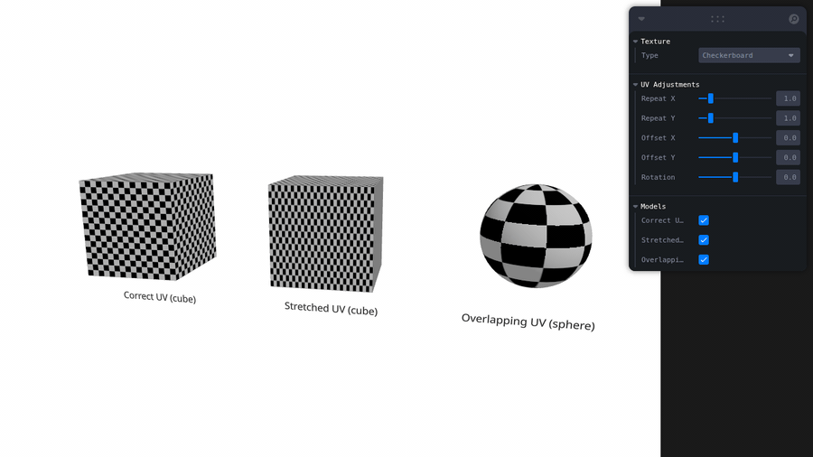
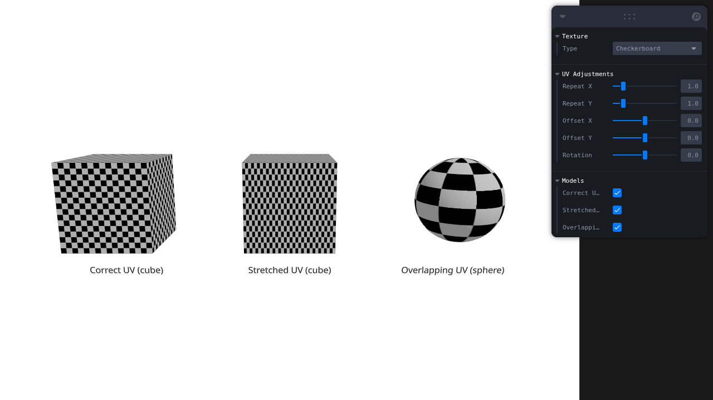

# Taller - UV Mapping: Texturas que Encajan Perfectamente

## Nombre del estudiante
Gabo Tachak

## Fecha de entrega
2026-04-15

---

## Descripción breve

El UV mapping es el proceso de proyectar una imagen 2D (textura) sobre la superficie de un modelo 3D. El nombre viene de los ejes U y V, que son las coordenadas bidimensionales del espacio de textura, equivalentes a X e Y pero reservados para evitar confusión con el espacio 3D. Sin un mapeo UV correcto, las texturas aparecen distorsionadas, estiradas o repetidas de formas no deseadas.

La diferencia clave entre coordenadas 3D (XYZ) y UV es que XYZ ubica cada vértice en el espacio del mundo, mientras que UV ubica ese mismo vértice en la imagen de textura. Cada vértice tiene una coordenada UV entre (0,0) y (1,1), donde (0,0) es la esquina inferior izquierda de la textura y (1,1) es la esquina superior derecha. La calidad del mapeo determina qué tan bien "encaja" la textura sobre la superficie.

Los problemas más comunes de UV mapping son: **stretching** (la textura aparece estirada porque las coordenadas UV no son proporcionales a la geometría), **overlapping** (múltiples partes de la malla comparten la misma región UV, produciendo seams y repeticiones inesperadas), y **seams** (líneas visibles en los bordes donde el UV unwrap fue cortado). Identificar estos problemas visualmente es la base del debugging de materiales en 3D.

Este taller explora tres casos de estudio usando Three.js: un cubo con UV correcto como referencia, un cubo con UV deliberadamente estirado, y una esfera con UV solapado. Usando texturas procedurales de diagnóstico (checkerboard, grilla y grilla numerada) y controles dinámicos de repeat/offset/rotation, se puede observar y analizar cada problema en tiempo real.

---

## Implementaciones

### Texturas Procedurales

Se implementaron tres generadores de textura en `textureGenerator.ts`, todas creadas sobre `<canvas>` y convertidas a `THREE.CanvasTexture`:

- **Checkerboard**: Patrón de cuadrados blancos y negros alternados (32×32 px por cuadrado sobre un canvas de 512×512). Usa `NearestFilter` para bordes nítidos. Es la textura ideal para detectar distorsión: si los cuadrados se ven rectangulares, hay stretching.
- **Grid**: Fondo blanco con líneas rojas cada 32 píxeles. Permite ver con precisión cómo se deforma la dirección y el espaciado de las líneas sobre la geometría.
- **Numbered Grid**: Grilla con dígitos del 0 al 9 en cada celda. Facilita rastrear qué región UV cubre cada parte de la superficie y detectar overlapping (el mismo número aparece en múltiples lugares).

Todas las texturas tienen `wrapS = wrapT = RepeatWrapping` para que los ajustes de `repeat` funcionen correctamente.

### Modelos

Se crearon tres geometrías proceduralmente en `modelHelpers.ts`, sin archivos `.glb` externos:

- **Cubo UV correcto** (`createBoxCorrectUV`): `THREE.BoxGeometry(2,2,2)` sin modificaciones. Three.js asigna UVs correctas por defecto: cada cara mapea limpiamente a su región en el espacio UV.
- **Cubo UV estirado** (`createBoxStretchedUV`): Igual que el anterior, pero se duplican todas las coordenadas U (`uvArray[i] *= 2.0`). El resultado es que la textura se comprime horizontalmente al doble, haciendo los cuadrados del checkerboard rectangulares.
- **Esfera UV solapado** (`createSphereOverlappingUV`): `THREE.SphereGeometry(1, 32, 32)` con todas las coordenadas UV reducidas a la mitad en ambos ejes (`*= 0.5`). La esfera usa solo el cuadrante inferior-izquierdo del espacio UV, causando que la textura se repita cuatro veces y dejando seams claramente visibles.

### Ajustes Dinámicos

El componente `ModelViewer.tsx` aplica transformaciones UV en tiempo real mediante un `useEffect` que se dispara cuando cambian `uvRepeat`, `uvOffset` o `uvRotation`:

```typescript
mat.map.repeat.set(uvRepeat[0], uvRepeat[1]);
mat.map.offset.set(uvOffset[0], uvOffset[1]);
mat.map.rotation = uvRotation;
mat.map.needsUpdate = true;
```

Cada modelo recibe un clon independiente de la textura (`texture.clone()`) para que sus transformaciones UV no interfieran entre sí. Los controles en el panel Leva permiten ajustar:

- **Repeat X/Y** (0.5 – 4.0, paso 0.5): cuántas veces se repite la textura
- **Offset X/Y** (−1.0 – 1.0, paso 0.1): desplazamiento del muestreo
- **Rotation** (−π – π, paso 0.1): rotación en radianes

---

## Resultados Visuales

### `checkerboard_texture_demo.gif`


Cubo con UV correcto rotando con textura checkerboard aplicada. Los cuadrados se ven perfectos y sin distorsión en todas las caras.

### `stretched_uv_problem.gif`


Cubo con UV estirado. Los cuadrados del checkerboard se ven alargados horizontalmente porque todas las coordenadas U se duplicaron.

### `overlapping_uv_issue.gif`


Esfera con UV solapado. La textura se repite cuatro veces sobre la superficie y los seams son visibles, consecuencia de mapear toda la esfera al cuadrante (0–0.5, 0–0.5) del espacio UV.

### `uv_adjustments_demo.gif`


Ajuste del slider de Repeat X de 1× a 4× en tiempo real. Se puede observar cómo la textura se multiplica sobre los tres modelos simultáneamente, cambiando la apariencia de forma inmediata.

### `all_models_comparison.png`


Los tres modelos side-by-side: cubo correcto (izquierda), cubo estirado (centro) y esfera solapada (derecha). La diferencia entre UV bien asignado y UV con problemas es inmediatamente evidente.

---

## Código Relevante

### Crear textura checkerboard en canvas

```typescript
export function createCheckerboardTexture(
  size = 512,
  squareSize = 32,
  color1 = '#FFFFFF',
  color2 = '#000000'
): THREE.Texture {
  const canvas = document.createElement('canvas');
  canvas.width = size;
  canvas.height = size;
  const ctx = canvas.getContext('2d')!;

  for (let y = 0; y < size; y += squareSize) {
    for (let x = 0; x < size; x += squareSize) {
      const isEven = (x / squareSize + y / squareSize) % 2 === 0;
      ctx.fillStyle = isEven ? color1 : color2;
      ctx.fillRect(x, y, squareSize, squareSize);
    }
  }

  const texture = new THREE.CanvasTexture(canvas);
  texture.magFilter = THREE.NearestFilter;
  texture.wrapS = THREE.RepeatWrapping;
  texture.wrapT = THREE.RepeatWrapping;
  return texture;
}
```

### Modificar el array UV de una geometría

```typescript
export function createBoxStretchedUV(): THREE.BufferGeometry {
  const geometry = new THREE.BoxGeometry(2, 2, 2);
  const uvAttribute = geometry.getAttribute('uv');
  const uvArray = uvAttribute.array as Float32Array;

  // Duplicar coordenada U → estira la textura horizontalmente
  for (let i = 0; i < uvArray.length; i += 2) {
    uvArray[i] *= 2.0;
  }

  uvAttribute.needsUpdate = true;
  return geometry;
}
```

### Aplicar repeat, offset y rotation a una textura

```typescript
useEffect(() => {
  const mesh = meshRef.current;
  if (!mesh) return;
  const mat = mesh.material as THREE.MeshStandardMaterial;
  if (!mat.map) return;

  mat.map.repeat.set(uvRepeat[0], uvRepeat[1]);
  mat.map.offset.set(uvOffset[0], uvOffset[1]);
  mat.map.rotation = uvRotation;
  mat.map.needsUpdate = true;
}, [uvRepeat, uvOffset, uvRotation]);
```

### Clonar textura para transformaciones UV independientes por modelo

```typescript
// En ModelViewer.tsx — evita que un modelo afecte el estado de textura de otro
const clonedTexture = texture.clone();
clonedTexture.needsUpdate = true;

return (
  <mesh ref={meshRef} geometry={geometry}>
    <meshStandardMaterial map={clonedTexture} />
  </mesh>
);
```

---

## Prompts de IA

- *"Implement the UV mapping taller following the todo.md spec: three procedural geometries with different UV problems, three canvas-based diagnostic textures, dynamic repeat/offset/rotation controls via Leva, and a texture preview panel."*
- *"Capture GIFs for the five required media files using Playwright: checkerboard on correct cube, stretched UV problem, overlapping UV on sphere, live UV adjustments demo, and a static comparison screenshot."*

---

## Aprendizajes y dificultades

### Aprendizajes

- **Diferencia entre coordenadas 3D y UV**: XYZ define la posición en el espacio; UV define qué punto de la imagen de textura corresponde a cada vértice. Son sistemas completamente independientes que se vinculan por la tabla de atributos de la malla.
- **Identificar problemas visualmente**: Una textura checkerboard es la herramienta de diagnóstico clásica porque cualquier distorsión se vuelve evidente cuando los cuadrados dejan de ser cuadrados. La grilla numerada ayuda a ver overlapping porque el mismo número aparece en regiones que no deberían compartir textura.
- **Stretching vs overlapping**: Son problemas distintos con causas distintas. El stretching viene de UVs no proporcionales a la geometría; el overlapping viene de múltiples polígonos compartiendo la misma región UV o de un rango UV comprimido.
- **repeat/offset como corrección rápida**: Aunque el UV unwrapping correcto se hace en el modelador 3D, `texture.repeat` y `texture.offset` permiten ajustar el muestreo en engine. Son útiles para alinear texturas tileable sin tocar la geometría.
- **Resolución de geometría y calidad UV**: Una esfera con pocos segmentos tendrá seams más pronunciados porque hay menos vértices para distribuir el espacio UV suavemente. Aumentar la subdivisión (32×32 en este caso) reduce la distorsión por cuantización de UVs.

---

### Dificultades

- **Transformaciones UV independientes por modelo**: Cuando varios modelos comparten la misma instancia de `THREE.Texture`, modificar `map.repeat` en uno afecta a todos porque apuntan al mismo objeto. La solución fue clonar la textura en `ModelViewer` con `texture.clone()` para que cada modelo tenga su propia copia del estado UV.
- **`wrapS`/`wrapT` en clones**: El clon de textura no hereda el modo de wrapping automáticamente en todos los contextos. Se verificó que las texturas procedurales declaran `wrapS = wrapT = THREE.RepeatWrapping` en el generador, antes de que se clonen, para que el comportamiento de repeat sea correcto.
