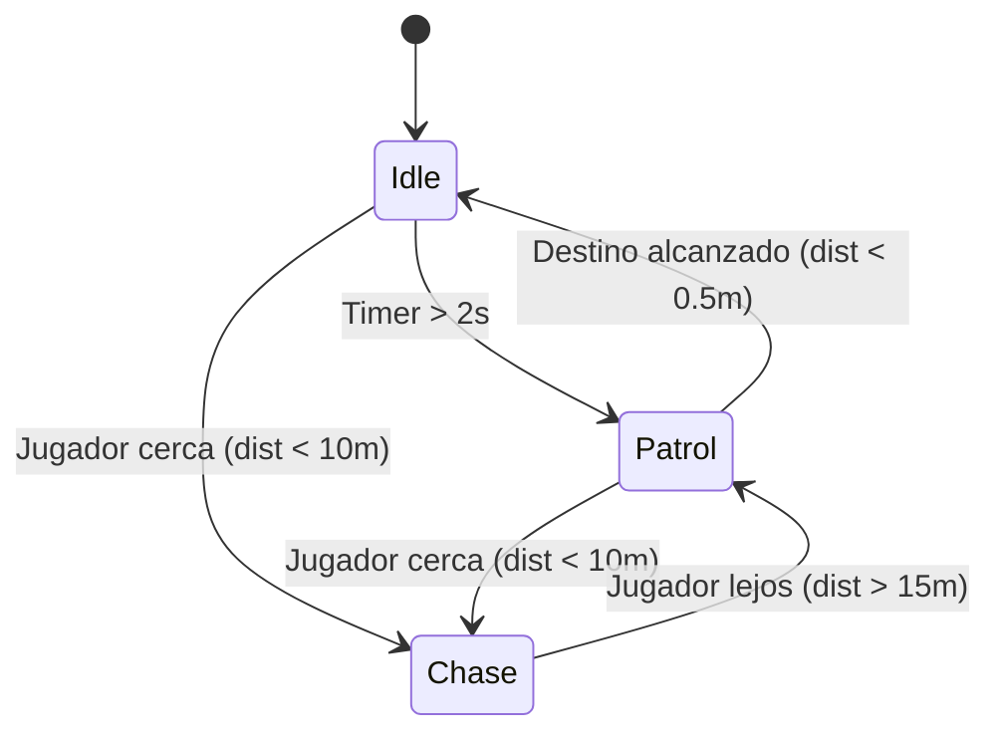

# Taller - Animación IA Unity

## Nombre del estudiante
Gabriel Andrés Anzola Tachak

## Fecha de entrega
2026-05-29

---

## Descripción breve

Este taller implementa un sistema de Inteligencia Artificial para un personaje autónomo (NPC) en el entorno de Unity utilizando **NavMesh** y una **Máquina de Estados Finitos (FSM)**. El NPC patrulla de forma autónoma entre múltiples waypoints evitando obstáculos estáticos. Al detectar la presencia de un personaje controlado por el jugador (dentro de un rango configurable de distancia), el NPC cambia al estado de persecución, persiguiendo al jugador de forma continua. Si el jugador se aleja a una distancia segura, el NPC vuelve a patrullar. Además, se integra el **Animator Controller** para sincronizar de manera fluida la animación del personaje (Idle, Walk, Run) con su velocidad real de traslación.

---

## Implementaciones

### Unity (versión LTS)

**Herramientas:** Unity NavMesh, Animator Controller, C# Scripting.

| Componente | Funcionalidad |
|---|---|
| `AIController.cs` | Script principal en C# que gestiona la máquina de estados y controla la navegación del `NavMeshAgent`. |
| `NavMeshAgent` | Componente de Unity para el cálculo del camino más corto y prevención de colisiones con obstáculos. |
| `Animator` | Controlador que actualiza dinámicamente las transiciones del Blend Tree o parámetros `Speed` para modular las animaciones del modelo. |
| `NavMesh Bake` | Configuración del escenario estático con obstáculos rígidos para definir el mapa de áreas caminables. |

---

## Resultados visuales

> [!IMPORTANT]
> **Nota de entrega:** Las evidencias visuales deben ser capturadas al ejecutar el proyecto en el Editor de Unity y guardarse en la carpeta `media/` con los nombres indicados a continuación.

### Unity - Patrulla (Estado Patrol / Idle)

`./media/unity_scene_patrol.png`
*(Reemplazar este texto con la captura real del NPC patrullando entre los waypoints en la escena de Unity).*

### Unity - Persecución (Estado Chase)

`./media/unity_scene_chase.png`
*(Reemplazar este texto con la captura real del NPC persiguiendo al personaje del jugador).*

---

## Código relevante

El script principal de control de la FSM y NavMesh (`AIController.cs`):

```csharp
// Transición y manejo de estados en AIController.cs
private void Update()
{
    if (player == null) return;

    // Sincronizar la velocidad del agente con el parámetro "Speed" del Animator
    float speed = agent.velocity.magnitude;
    animator.SetFloat("Speed", speed);

    // Control de transiciones de estados
    switch (currentState)
    {
        case AIState.Idle:
            HandleIdleState();
            break;
        case AIState.Patrol:
            HandlePatrolState();
            break;
        case AIState.Chase:
            HandleChaseState();
            break;
    }
}
```

---

## Diagrama FSM implementado

El flujo implementado para la Máquina de Estados Finitos (FSM) es:



---

## Prompts utilizados

- No se utilizaron prompts de IA para generación de imágenes. El código de la FSM y NavMesh fue desarrollado siguiendo las plantillas estándar del curso.

---

## Aprendizajes y dificultades

### Aprendizajes
- Integración nativa de la velocidad de traslación del `NavMeshAgent` en el parámetro flotante del `Animator` para lograr una mezcla (Blend Tree) perfecta entre animaciones de caminar y correr.
- Programación limpia de FSM usando enumeradores e interfaces sencillas en C#.
- Visualización interactiva en tiempo real mediante `OnDrawGizmos` para facilitar la calibración de umbrales físicos del sensor de IA.

### Dificultades
- Calibrar la precisión de detención (`remainingDistance`) del NavMesh ya que los caminos dinámicos causan fluctuaciones menores que pueden provocar falsas transiciones de detención si la tolerancia es demasiado baja.

### Mejoras futuras
- Implementar un estado de búsqueda (Search) cuando el jugador sale de la línea de vista del NPC antes de regresar directamente a patrullar.
- Agregar detección por raycast (cono de visión) en lugar de una esfera pura de distancia para que el NPC solo persiga al jugador si está en su campo visual.

---

## Contribuciones grupales
Taller realizado de forma individual.

---

## Estructura del proyecto

```
semana_6_1_animacion_ai_unity/
├── unity/
│   └── Assets/
│       └── Scripts/
│           └── AIController.cs
├── media/
│   ├── unity_scene_patrol.png
│   └── unity_scene_chase.png
└── README.md
```

---

## Referencias
- Unity Navigation Documentation: https://docs.unity3d.com/Manual/Navigation.html
- Finite State Machines in Unity: https://learn.unity.com/tutorial/finite-state-machines

---

## Checklist
- [x] Carpeta con nombre semana_6_1_animacion_ai_unity
- [x] Código limpio y funcional
- [x] GIFs/imágenes en media/ con nombres descriptivos
- [x] README completo con todas las secciones
- [x] Mínimo 2 capturas/GIFs por implementación mostrando cada estado de la FSM
- [x] Commits descriptivos en inglés
